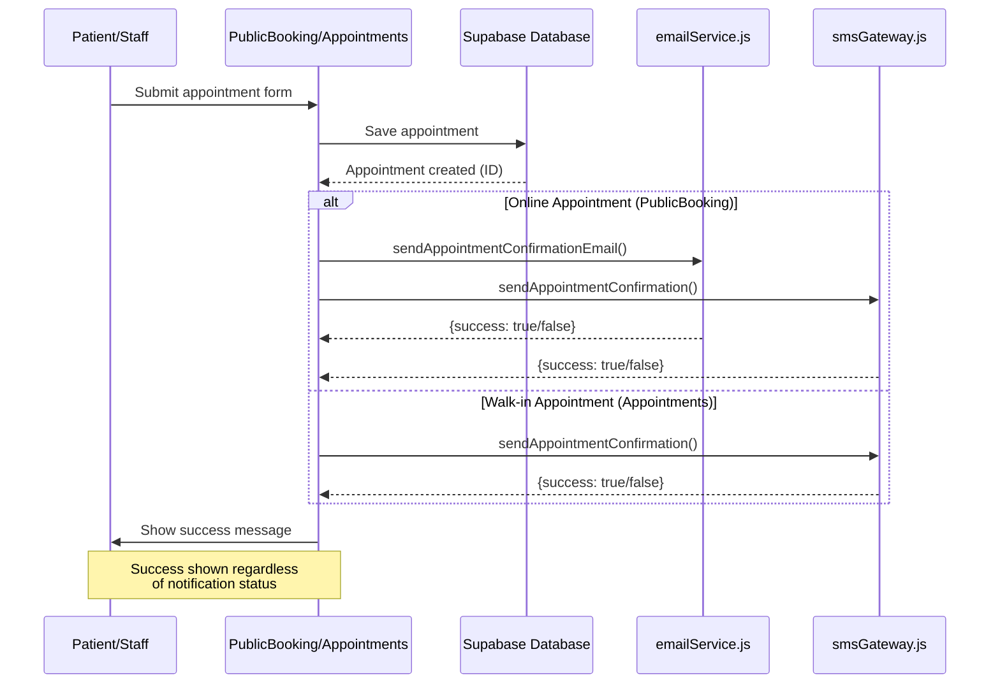
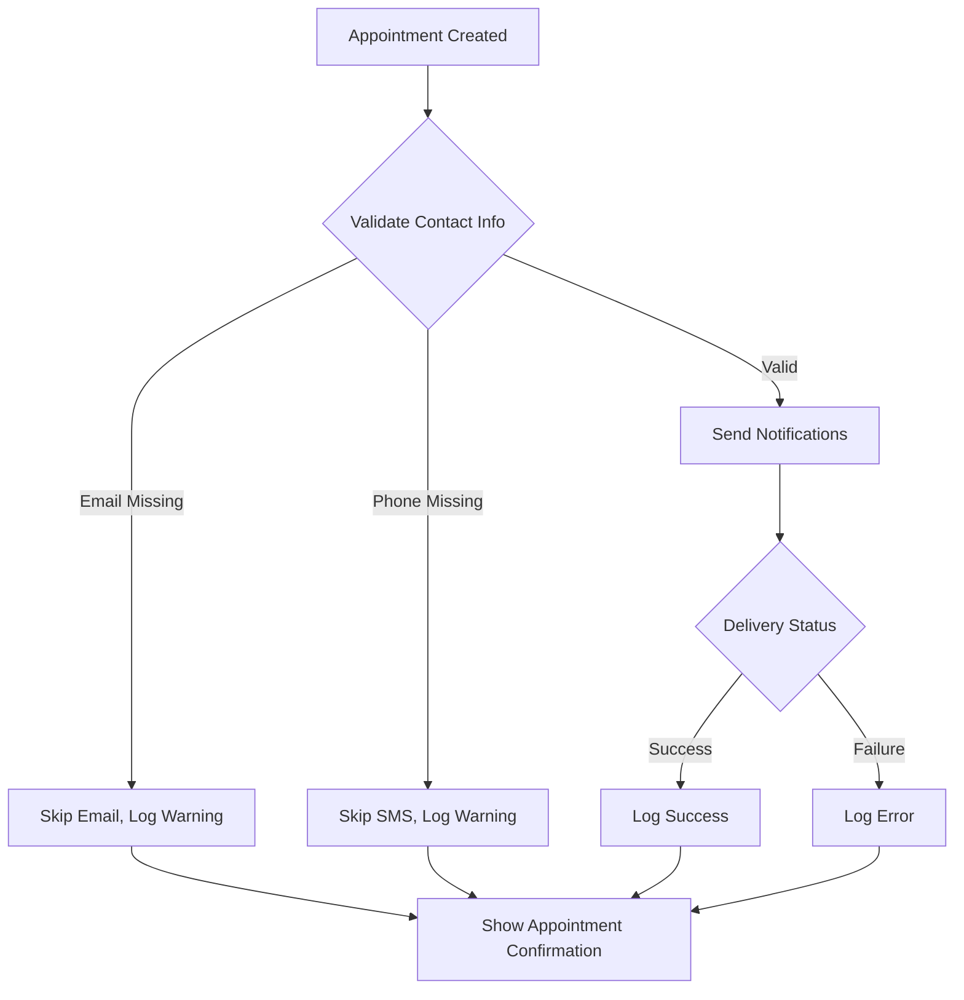

# Design Document: Appointment Notifications

## Overview

This feature integrates the existing notification infrastructure (emailService.js, smsGateway.js, notificationService.js) into the appointment creation workflows to automatically notify patients when appointments are created. The system implements a dual-notification strategy for online bookings (email + SMS) and SMS-only notifications for walk-in appointments.

The design follows a non-blocking notification pattern where notification failures do not prevent appointment creation, ensuring the core business workflow remains resilient while providing best-effort patient communication.

### Key Design Principles

1. **Non-Blocking Notifications**: Appointment creation succeeds regardless of notification delivery status
2. **Zero Infrastructure Changes**: Utilizes existing notification services without modification
3. **Graceful Degradation**: Missing contact information or delivery failures are handled gracefully with logging
4. **Source-Based Routing**: Notification type (email+SMS vs SMS-only) determined by appointment source

## Architecture

### Component Interaction Flow



### Integration Points

**PublicBooking.jsx Integration**:
- Triggers after successful `db.createOnlineBooking()` call
- Invokes both email and SMS services in parallel
- Displays warning if notifications fail but confirms appointment creation

**Appointments.jsx Integration**:
- Triggers after successful `db.addAppointment()` call
- Invokes SMS service only
- Displays warning to staff if SMS fails but confirms appointment creation

### Error Handling Strategy



## Components and Interfaces

### Notification Wrapper Function

A lightweight wrapper function will be added to each page to handle the notification flow:

```javascript
/**
 * Send appointment notifications based on appointment source
 * @param {Object} appointmentData - The created appointment data
 * @param {string} source - 'online' or 'walk-in'
 * @returns {Promise<{emailSent: boolean, smsSent: boolean, warnings: string[]}>}
 */
async function sendAppointmentNotifications(appointmentData, source) {
  const results = {
    emailSent: false,
    smsSent: false,
    warnings: []
  }
  
  // Validate contact information
  const hasEmail = appointmentData.email && appointmentData.email.trim()
  const hasPhone = appointmentData.phone && appointmentData.phone.trim()
  
  // Online appointments: Send both email and SMS
  if (source === 'online') {
    if (hasEmail) {
      try {
        const emailResult = await sendAppointmentConfirmationEmail(appointmentData)
        results.emailSent = emailResult.success
        if (!emailResult.success) {
          results.warnings.push('Email notification failed')
          console.error('Email notification failed:', emailResult.error)
        }
      } catch (error) {
        results.warnings.push('Email notification error')
        console.error('Email notification error:', error)
      }
    } else {
      results.warnings.push('No email address provided')
      console.warn('Skipping email notification: No email address')
    }
    
    if (hasPhone) {
      try {
        const smsResult = await sendAppointmentConfirmation(appointmentData)
        results.smsSent = smsResult.success
        if (!smsResult.success) {
          results.warnings.push('SMS notification failed')
          console.error('SMS notification failed:', smsResult.error)
        }
      } catch (error) {
        results.warnings.push('SMS notification error')
        console.error('SMS notification error:', error)
      }
    } else {
      results.warnings.push('No phone number provided')
      console.warn('Skipping SMS notification: No phone number')
    }
  }
  
  // Walk-in appointments: Send SMS only
  if (source === 'walk-in') {
    if (hasPhone) {
      try {
        const smsResult = await sendAppointmentConfirmation(appointmentData)
        results.smsSent = smsResult.success
        if (!smsResult.success) {
          results.warnings.push('SMS notification failed')
          console.error('SMS notification failed:', smsResult.error)
        }
      } catch (error) {
        results.warnings.push('SMS notification error')
        console.error('SMS notification error:', error)
      }
    } else {
      results.warnings.push('No phone number provided')
      console.warn('Skipping SMS notification: No phone number')
    }
  }
  
  return results
}
```

### PublicBooking.jsx Modification

**Location**: After successful `db.createOnlineBooking()` call in `handleSubmit` function

**Changes**:
1. Import notification functions at top of file
2. Call notification wrapper after database save
3. Display warnings if notifications fail

```javascript
// Add imports at top
import { sendAppointmentConfirmationEmail } from '../services/emailService'
import { sendAppointmentConfirmation } from '../services/smsGateway'

// In handleSubmit function, after db.createOnlineBooking():
const createdAppointment = await db.createOnlineBooking(bookingData);

// Send notifications (non-blocking)
const notificationResults = await sendAppointmentNotifications({
  ...bookingData,
  email: patientData.email,
  phone: patientData.phone,
  mobile_number: patientData.phone,
  doctor: selectedDoctor,
  appointment_date: selectedDate,
  appointment_time: selectedTime
}, 'online');

// Log notification results
if (notificationResults.warnings.length > 0) {
  console.warn('Notification warnings:', notificationResults.warnings);
}

setBookingSuccess(true);
```

### Appointments.jsx Modification

**Location**: After successful `db.addAppointment()` call in `handleSubmit` function

**Changes**:
1. Import SMS notification function at top of file
2. Call notification wrapper after database save
3. Display alert if SMS fails

```javascript
// Add import at top
import { sendAppointmentConfirmation } from '../services/smsGateway'

// In handleSubmit function, after db.addAppointment():
await db.addAppointment({
  ...formData,
  patient_id: patientId,
  booking_source: 'walk-in'
});

// Get patient contact info for notification
const patient = patients.find(p => p.id === patientId);
if (patient && patient.contact_number) {
  // Send SMS notification (non-blocking)
  const notificationResults = await sendAppointmentNotifications({
    ...formData,
    mobile_number: patient.contact_number,
    phone: patient.contact_number,
    first_name: patient.first_name,
    last_name: patient.last_name,
    doctor: doctors.find(d => d.id === formData.doctor_id)
  }, 'walk-in');
  
  if (notificationResults.warnings.length > 0) {
    console.warn('SMS notification warning:', notificationResults.warnings);
  }
}

await loadData();
closeModal();
alert('Appointment scheduled successfully!');
```

## Data Models

### Appointment Data Structure (for notifications)

```typescript
interface AppointmentNotificationData {
  // Patient Information
  first_name: string
  last_name: string
  email?: string              // Required for online, optional for walk-in
  phone?: string              // Alternative field name
  mobile_number?: string      // Primary field name for SMS
  
  // Appointment Details
  appointment_date: string    // ISO date string
  appointment_time: string    // HH:MM format
  reason: string
  
  // Doctor Information
  doctor: {
    id: number
    first_name: string
    last_name: string
    specialization?: string
  }
  
  // Metadata
  booking_source?: 'online' | 'walk-in'
}
```

### Notification Result Structure

```typescript
interface NotificationResult {
  emailSent: boolean
  smsSent: boolean
  warnings: string[]
}
```

## Correctness Properties

*A property is a characteristic or behavior that should hold true across all valid executions of a system-essentially, a formal statement about what the system should do. Properties serve as the bridge between human-readable specifications and machine-verifiable correctness guarantees.*

### Property 1: Online Appointments Trigger Dual Notifications

*For any* online appointment with valid email and phone number, both email and SMS notification services should be invoked with the appointment details.

**Validates: Requirements 1.1, 1.2, 3.2, 3.3**

### Property 2: Walk-in Appointments Trigger SMS Only

*For any* walk-in appointment with valid phone number, only the SMS notification service should be invoked, and the email service should not be called.

**Validates: Requirements 2.1, 2.2, 4.2, 4.3**

### Property 3: Notification Failures Do Not Block Appointment Creation

*For any* appointment creation attempt, if notification delivery fails (email or SMS), the appointment should still be successfully created in the database and the user should receive confirmation.

**Validates: Requirements 1.4, 3.5, 4.5, 7.3, 9.4**

### Property 4: Notification Content Includes Required Fields

*For any* appointment notification (email or SMS), the message content should include patient name, appointment date, appointment time, and doctor name.

**Validates: Requirements 1.5, 2.4, 6.1, 6.2**

### Property 5: Missing Contact Information Skips Notification Gracefully

*For any* appointment with missing or invalid email address, the email notification should be skipped with a logged warning, and for any appointment with missing or invalid phone number, the SMS notification should be skipped with a logged warning.

**Validates: Requirements 10.1, 10.2, 10.3, 10.4**

### Property 6: Notification Failures Are Logged

*For any* notification delivery failure (email or SMS), an error should be logged to the console with timestamp, patient identifier, and error message details.

**Validates: Requirements 7.1, 7.2, 7.5**

### Property 7: Email Format Validation

*For any* email address provided for notification, the system should validate that it matches a standard email pattern before attempting delivery.

**Validates: Requirements 10.5**

### Property 8: SMS Message Length Constraint

*For any* SMS notification generated, the message length should not exceed 160 characters while still including all essential appointment details.

**Validates: Requirements 6.4**

### Property 9: Date and Time Formatting

*For any* appointment notification, dates should be formatted in DD/MM/YYYY format and times should be formatted in 12-hour format with AM/PM indicators.

**Validates: Requirements 6.5**

### Property 10: Notification Timing Sequence

*For any* appointment creation, notification delivery should be attempted before displaying the success confirmation message to the user.

**Validates: Requirements 9.1**

## Error Handling

### Error Categories and Responses

| Error Category | Scenario | System Response | User Impact |
|---------------|----------|-----------------|-------------|
| **Missing Contact Info** | Email or phone not provided | Skip notification, log warning | Appointment created, no notification sent |
| **Invalid Contact Format** | Malformed email or phone | Skip notification, log warning | Appointment created, no notification sent |
| **API Configuration Missing** | Resend or SMS API keys not set | Skip notification, log warning | Appointment created, no notification sent |
| **Network/API Failure** | External service unavailable | Log error, continue | Appointment created, notification failed |
| **Timeout** | Notification takes >30 seconds | Log timeout, continue | Appointment created, notification may be delayed |

### Error Logging Format

All errors should be logged with the following structure:

```javascript
console.error('[Appointment Notification Error]', {
  timestamp: new Date().toISOString(),
  appointmentId: appointment.id,
  patientId: appointment.patient_id,
  notificationType: 'email' | 'sms',
  error: error.message,
  contactInfo: {
    email: appointment.email || 'not provided',
    phone: appointment.phone || 'not provided'
  }
})
```

### User-Facing Error Messages

**Online Booking (PublicBooking.jsx)**:
- Success with notifications: "Booking Submitted! Confirmation sent to your email and phone."
- Success without notifications: "Booking Submitted! We will contact you shortly to confirm."
- Partial notification failure: "Booking Submitted! Confirmation sent via [email/SMS]. [Other method] notification failed."

**Walk-in Booking (Appointments.jsx)**:
- Success with SMS: "Appointment scheduled successfully! SMS confirmation sent."
- Success without SMS: "Appointment scheduled successfully! (SMS notification failed)"

## Testing Strategy

### Dual Testing Approach

This feature requires both unit tests and property-based tests to ensure comprehensive coverage:

- **Unit tests**: Verify specific examples, edge cases, and error conditions
- **Property tests**: Verify universal properties across all inputs

Together, these approaches provide comprehensive coverage where unit tests catch concrete bugs and property tests verify general correctness.

### Unit Testing

**Test Framework**: Jest or Vitest (matching existing project setup)

**Test Coverage Areas**:

1. **Notification Wrapper Function**
   - Test with valid online appointment data (email + SMS sent)
   - Test with valid walk-in appointment data (SMS only sent)
   - Test with missing email (email skipped, SMS sent)
   - Test with missing phone (SMS skipped, email sent if online)
   - Test with both missing (both skipped, warnings logged)
   - Test with API failures (errors logged, function returns gracefully)

2. **PublicBooking.jsx Integration**
   - Mock `db.createOnlineBooking` to return success
   - Mock `sendAppointmentConfirmationEmail` and `sendAppointmentConfirmation`
   - Verify both notification functions called after database save
   - Verify success message shown regardless of notification status
   - Verify warnings displayed when notifications fail

3. **Appointments.jsx Integration**
   - Mock `db.addAppointment` to return success
   - Mock `sendAppointmentConfirmation`
   - Verify SMS notification function called after database save
   - Verify email notification NOT called
   - Verify success alert shown regardless of SMS status

4. **Error Handling**
   - Test notification failure doesn't throw unhandled exceptions
   - Test missing API keys handled gracefully
   - Test network errors logged correctly
   - Test invalid email format rejected

**Example Unit Test**:

```javascript
describe('sendAppointmentNotifications', () => {
  it('should send both email and SMS for online appointments', async () => {
    const mockAppointment = {
      first_name: 'John',
      last_name: 'Doe',
      email: 'john@example.com',
      phone: '+639123456789',
      appointment_date: '2024-01-15',
      appointment_time: '10:00 AM',
      doctor: { first_name: 'Jane', last_name: 'Smith' }
    }
    
    const emailSpy = jest.spyOn(emailService, 'sendAppointmentConfirmationEmail')
      .mockResolvedValue({ success: true })
    const smsSpy = jest.spyOn(smsGateway, 'sendAppointmentConfirmation')
      .mockResolvedValue({ success: true })
    
    const result = await sendAppointmentNotifications(mockAppointment, 'online')
    
    expect(emailSpy).toHaveBeenCalledWith(expect.objectContaining({
      email: 'john@example.com'
    }))
    expect(smsSpy).toHaveBeenCalledWith(expect.objectContaining({
      mobile_number: '+639123456789'
    }))
    expect(result.emailSent).toBe(true)
    expect(result.smsSent).toBe(true)
    expect(result.warnings).toHaveLength(0)
  })
})
```

### Property-Based Testing

**Test Framework**: fast-check (JavaScript property-based testing library)

**Configuration**: Minimum 100 iterations per property test

**Property Test Tags**: Each test must include a comment referencing the design property:
```javascript
// Feature: appointment-notifications, Property 1: Online Appointments Trigger Dual Notifications
```

**Property Test Coverage**:

1. **Property 1: Online Appointments Trigger Dual Notifications**
   - Generate random online appointments with valid contact info
   - Verify both email and SMS services called
   - Tag: `Feature: appointment-notifications, Property 1`

2. **Property 2: Walk-in Appointments Trigger SMS Only**
   - Generate random walk-in appointments
   - Verify SMS called, email NOT called
   - Tag: `Feature: appointment-notifications, Property 2`

3. **Property 3: Notification Failures Do Not Block Appointment Creation**
   - Generate random appointments
   - Simulate random notification failures
   - Verify appointment creation always succeeds
   - Tag: `Feature: appointment-notifications, Property 3`

4. **Property 4: Notification Content Includes Required Fields**
   - Generate random appointments
   - Verify notification messages contain all required fields
   - Tag: `Feature: appointment-notifications, Property 4`

5. **Property 5: Missing Contact Information Skips Notification Gracefully**
   - Generate appointments with randomly missing contact fields
   - Verify appropriate notifications skipped with warnings
   - Tag: `Feature: appointment-notifications, Property 5`

6. **Property 6: Notification Failures Are Logged**
   - Generate random appointments
   - Simulate random failures
   - Verify console.error called with proper structure
   - Tag: `Feature: appointment-notifications, Property 6`

7. **Property 7: Email Format Validation**
   - Generate random email strings (valid and invalid)
   - Verify validation logic correctly identifies valid emails
   - Tag: `Feature: appointment-notifications, Property 7`

8. **Property 8: SMS Message Length Constraint**
   - Generate random appointments with varying field lengths
   - Verify SMS messages never exceed 160 characters
   - Tag: `Feature: appointment-notifications, Property 8`

9. **Property 9: Date and Time Formatting**
   - Generate random dates and times
   - Verify output format matches DD/MM/YYYY and 12-hour AM/PM
   - Tag: `Feature: appointment-notifications, Property 9`

10. **Property 10: Notification Timing Sequence**
    - Generate random appointments
    - Verify notifications attempted before UI updates
    - Tag: `Feature: appointment-notifications, Property 10`

**Example Property Test**:

```javascript
import fc from 'fast-check'

// Feature: appointment-notifications, Property 3: Notification Failures Do Not Block Appointment Creation
describe('Property: Notification Failures Do Not Block Appointment Creation', () => {
  it('should create appointment even when notifications fail', async () => {
    await fc.assert(
      fc.asyncProperty(
        fc.record({
          first_name: fc.string({ minLength: 1, maxLength: 50 }),
          last_name: fc.string({ minLength: 1, maxLength: 50 }),
          email: fc.emailAddress(),
          phone: fc.string({ minLength: 10, maxLength: 15 }),
          appointment_date: fc.date().map(d => d.toISOString().split('T')[0]),
          appointment_time: fc.constantFrom('09:00 AM', '10:00 AM', '11:00 AM'),
          reason: fc.string({ minLength: 5, maxLength: 200 })
        }),
        fc.boolean(), // email fails
        fc.boolean(), // sms fails
        async (appointmentData, emailFails, smsFails) => {
          // Mock notification services to fail randomly
          jest.spyOn(emailService, 'sendAppointmentConfirmationEmail')
            .mockResolvedValue({ success: !emailFails, error: emailFails ? 'Failed' : null })
          jest.spyOn(smsGateway, 'sendAppointmentConfirmation')
            .mockResolvedValue({ success: !smsFails, error: smsFails ? 'Failed' : null })
          
          // Mock database to always succeed
          const dbSpy = jest.spyOn(db, 'createOnlineBooking')
            .mockResolvedValue({ id: 1, ...appointmentData })
          
          // Call the notification wrapper
          const result = await sendAppointmentNotifications(appointmentData, 'online')
          
          // Verify appointment was created regardless of notification status
          expect(dbSpy).toHaveBeenCalled()
          
          // Verify function completed without throwing
          expect(result).toBeDefined()
        }
      ),
      { numRuns: 100 }
    )
  })
})
```

### Integration Testing

**Manual Testing Checklist**:

1. Create online appointment with valid email and phone → Verify both notifications received
2. Create online appointment with missing email → Verify SMS received, no email
3. Create online appointment with missing phone → Verify email received, no SMS
4. Create walk-in appointment with valid phone → Verify SMS received, no email
5. Create walk-in appointment with missing phone → Verify appointment created, warning shown
6. Disable Resend API key → Verify appointments still created, errors logged
7. Disable SMS API key → Verify appointments still created, errors logged
8. Test with invalid email format → Verify email skipped, SMS sent
9. Test with very long appointment reason → Verify SMS truncated to 160 chars
10. Check console logs for proper error formatting

### Test Data Generators

For property-based testing, use these generators:

```javascript
// Appointment data generator
const appointmentArbitrary = fc.record({
  first_name: fc.string({ minLength: 1, maxLength: 50 }),
  last_name: fc.string({ minLength: 1, maxLength: 50 }),
  email: fc.option(fc.emailAddress(), { nil: null }),
  phone: fc.option(fc.string({ minLength: 10, maxLength: 15 }), { nil: null }),
  appointment_date: fc.date({ min: new Date() }).map(d => d.toISOString().split('T')[0]),
  appointment_time: fc.constantFrom('09:00 AM', '10:00 AM', '11:00 AM', '02:00 PM', '03:00 PM'),
  reason: fc.string({ minLength: 5, maxLength: 200 }),
  doctor: fc.record({
    first_name: fc.string({ minLength: 1, maxLength: 50 }),
    last_name: fc.string({ minLength: 1, maxLength: 50 }),
    specialization: fc.constantFrom('General Practice', 'Pediatrics', 'Internal Medicine')
  })
})

// Booking source generator
const bookingSourceArbitrary = fc.constantFrom('online', 'walk-in')
```

## Implementation Notes

### Existing Service Compatibility

The existing notification services already provide the required functionality:

- `emailService.js` exports `sendAppointmentConfirmationEmail(booking)` - Ready to use
- `smsGateway.js` exports `sendAppointmentConfirmation(booking)` - Ready to use
- Both services return `{success: boolean, error?: string}` - Consistent interface

No modifications to these services are required.

### API Configuration

The system relies on environment variables already configured:

- `VITE_RESEND_API_KEY` - Resend email API key (already set: re_56oZYCZY_8MSHyMAjFV4T5qGRryJfNFGP)
- `VITE_SMS_GATEWAY_API_KEY` - SMS gateway API key
- `VITE_SMS_GATEWAY_DEVICE_ID` - SMS gateway device ID

If these are not configured, the services gracefully skip notifications and log warnings.

### Performance Considerations

- Notifications are sent asynchronously after database save
- Email and SMS are sent in parallel for online appointments (no sequential waiting)
- 30-second timeout is handled by the underlying fetch API
- No retry logic implemented (notifications are best-effort, one-time attempts)

### Future Enhancements (Out of Scope)

The following are explicitly excluded from this implementation:

- Appointment reminder notifications (24 hours before)
- Notification retry logic
- Notification delivery status tracking in database
- Notification preferences (opt-in/opt-out)
- Multiple notification templates
- Notification queue system
- Delivery confirmation webhooks

These may be addressed in future iterations if business requirements evolve.
