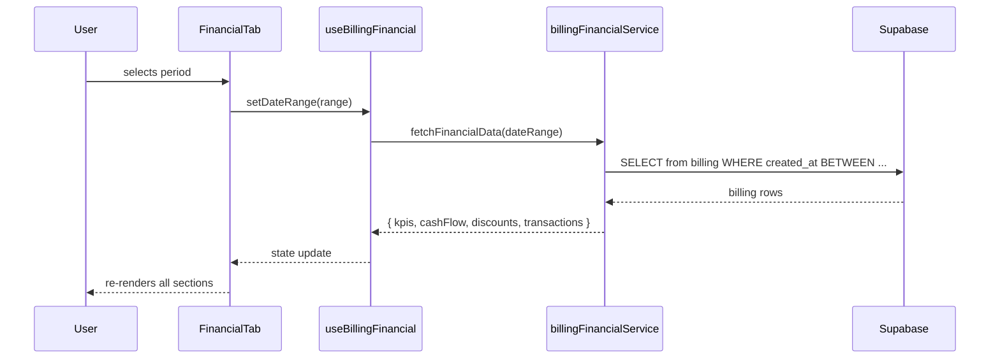

# Design Document: Billing Financial Tab

## Overview

The Billing Financial Tab is a new analytics panel added as a second tab inside the existing `Payments.jsx` page. It gives clinic staff a financial overview of billing activity for any selected time period — KPI cards, a cash-flow chart, a discount breakdown, and a filterable transaction table — all driven by a single Period Selector.

All data comes exclusively from the existing `billing` table in Supabase. No new database tables are required. The feature reuses the project's existing Recharts library, Tailwind CSS design system, and the `KPICard` component from `src/components/analytics/`.

---

## Architecture

The feature follows the same layered pattern already established in the project:

```
Payments.jsx (host page)
  └── FinancialTab.jsx          ← new tab panel
        ├── PeriodSelector.jsx  ← sticky date range control
        ├── FinancialKPIRow.jsx ← four KPI cards
        ├── CashFlowChart.jsx   ← stacked bar chart by payment method
        ├── DiscountSummary.jsx ← horizontal bar + stats panel
        └── TransactionTable.jsx← paginated, filterable, sortable table

src/services/billingFinancialService.js  ← all Supabase queries
src/hooks/useBillingFinancial.js         ← data fetching + state management
src/components/billing/                  ← all new components live here
```

### Data Flow



### Integration with Payments.jsx

The existing `Payments.jsx` will gain a tab bar at the top. The existing content becomes the "Transactions" tab; the new `FinancialTab` becomes the "Financial" tab. No existing functionality is modified.

```mermaid
graph TD
    A[Payments.jsx] --> B[Tab Bar: Transactions | Financial]
    B --> C[Existing Payments content]
    B --> D[FinancialTab - NEW]
```

---

## Components and Interfaces

### `FinancialTab.jsx`

Top-level container. Owns the `activeFilter` state (which chart segment is selected) and passes it down to `TransactionTable`.

```jsx
<FinancialTab />
// Props: none (reads data from useBillingFinancial hook)
```

### `PeriodSelector.jsx`

Sticky control bar with four preset buttons and a custom date range picker.

```jsx
<PeriodSelector
  activePeriod="monthly"          // 'daily' | 'weekly' | 'monthly' | 'yearly' | 'custom'
  dateRange={{ startDate, endDate }}
  onPeriodChange={(period) => void}
  onDateRangeChange={(range) => void}
/>
```

Period-to-date-range mapping (computed at selection time using the current date):

| Period  | startDate                        | endDate                          |
|---------|----------------------------------|----------------------------------|
| daily   | today                            | today                            |
| weekly  | Monday of current week           | Sunday of current week           |
| monthly | 1st of current month             | last day of current month        |
| yearly  | Jan 1 of current year            | Dec 31 of current year           |
| custom  | user-supplied start              | user-supplied end                |

Validation: if `startDate > endDate`, show inline error and block fetch.

### `FinancialKPIRow.jsx`

Renders four `KPICard` instances (reusing the existing component from `src/components/analytics/KPICard.jsx`).

| Card              | Value                                    | Format   |
|-------------------|------------------------------------------|----------|
| Total Revenue     | `sum(total_amount)`                      | currency |
| Total Transactions| `count(records)`                         | number   |
| Total Discounts   | `sum(discount_amount)`                   | currency |
| Net Revenue       | `total_revenue - total_discounts`        | currency |

Each card receives `value` (current period) and `previousValue` (previous period) so the existing `KPICard` trend logic handles the percentage change display automatically. When `previousValue === 0`, the card shows "N/A".

### `CashFlowChart.jsx`

Recharts `BarChart` (stacked) with one series per payment method.

```jsx
<CashFlowChart
  data={cashFlowData}           // [{ period, Cash, GCash, Maya, BankTransfer, Others }]
  activeSeries={activeFilter?.paymentMethod}
  onSeriesClick={(method) => void}
/>
```

Payment method normalization (applied in the service layer):

```
Cash         → "Cash"
GCash        → "GCash"
Maya         → "Maya"
Bank Transfer → "BankTransfer"
anything else → "Others"
```

X-axis grouping by period type:

| Period  | Bucket       |
|---------|--------------|
| daily   | hour (0–23)  |
| weekly  | day name     |
| monthly | day of month |
| yearly  | month name   |
| custom  | date (YYYY-MM-DD) |

Below the chart: a summary row showing total and percentage share per method.

### `DiscountSummary.jsx`

Two-column layout: horizontal `BarChart` on the left, stats panel on the right.

```jsx
<DiscountSummary
  data={discountData}           // [{ type, amount }]
  stats={discountStats}         // { total, count, average, highest }
  activeType={activeFilter?.discountType}
  onTypeClick={(type) => void}
/>
```

Discount type normalization (applied in the service layer):

```
"Senior Citizen"  → "Senior Citizen"
"PWD"             → "PWD"
"PhilHealth"      → "PhilHealth"
"HMO/Insurance"   → "HMO/Insurance"
"Employee/Staff"  → "Employee/Staff"
"Custom/Manual"   → "Custom/Manual"
null / ""         → excluded entirely (zero discount_amount also excluded)
anything else     → "Others"
```

Stats panel fields:
- Total discount amount
- Number of transactions with discounts
- Average discount per discounted transaction
- Highest single discount amount

### `TransactionTable.jsx`

Paginated, filterable, sortable table with CSV export.

```jsx
<TransactionTable
  records={transactions}        // raw billing rows for the period
  activeFilter={activeFilter}   // { paymentMethod?, discountType?, status? }
  onFilterChange={(filter) => void}
/>
```

Columns: Date/Time, Patient Name, Bill Amount, Discount Type, Discount Amount, Net Amount, Payment Method, Status.

Features:
- Page size: 10 (default), configurable to 25 / 50
- Multi-filter: Payment Method + Discount Type + Status applied simultaneously
- Sort: ascending/descending on any column
- Active filter indicator chips with individual clear buttons + "Clear All"
- CSV export of current filtered + sorted view

---

## Data Models

### Supabase Query (single query, all data fetched once per period)

```sql
SELECT
  b.id,
  b.created_at,
  b.total_amount,
  b.discount_amount,
  b.discount_type,
  b.payment_method,
  b.payment_status,
  p.first_name,
  p.last_name
FROM billing b
LEFT JOIN patients p ON b.patient_id = p.id
WHERE b.created_at >= :startDate
  AND b.created_at <= :endDate || 'T23:59:59'
ORDER BY b.created_at DESC
```

The service fetches this once and derives all KPIs, chart data, and table rows from the in-memory result set — no separate queries per section.

### Derived Data Shapes

**KPI object:**
```js
{
  totalRevenue:      { current: number, previous: number },
  totalTransactions: { current: number, previous: number },
  totalDiscounts:    { current: number, previous: number },
  netRevenue:        { current: number, previous: number }
}
```

**Cash flow data (array of time buckets):**
```js
[
  { period: "Mon", Cash: 1200, GCash: 800, Maya: 0, BankTransfer: 500, Others: 0 },
  ...
]
```

**Discount data:**
```js
{
  chartData: [{ type: "Senior Citizen", amount: 3200 }, ...],
  stats: { total: 5400, count: 12, average: 450, highest: 1200 }
}
```

**Transaction row:**
```js
{
  id: string,
  dateTime: string,       // ISO timestamp
  patientName: string,
  billAmount: number,     // total_amount
  discountType: string,
  discountAmount: number,
  netAmount: number,      // total_amount - discount_amount
  paymentMethod: string,  // normalized
  status: string
}
```

### Previous Period Calculation

```js
function getPreviousPeriod(startDate, endDate) {
  const duration = endDate - startDate  // milliseconds
  return {
    startDate: new Date(startDate - duration - 1day),
    endDate:   new Date(startDate - 1day)
  }
}
```

---

## Correctness Properties

*A property is a characteristic or behavior that should hold true across all valid executions of a system — essentially, a formal statement about what the system should do. Properties serve as the bridge between human-readable specifications and machine-verifiable correctness guarantees.*

### Property 1: Period date range correctness

*For any* period type (daily, weekly, monthly, yearly) and any current date, the `computeDateRange(period, currentDate)` function should return a `{ startDate, endDate }` pair where:
- daily: startDate === endDate === currentDate
- weekly: startDate is the Monday of currentDate's week, endDate is the Sunday
- monthly: startDate is the 1st of currentDate's month, endDate is the last day
- yearly: startDate is Jan 1, endDate is Dec 31 of currentDate's year

**Validates: Requirements 1.5, 1.6, 1.7, 1.8**

---

### Property 2: Invalid date range blocks fetch

*For any* custom date range where `startDate > endDate`, calling `validateDateRange(startDate, endDate)` should return an error result and the data fetch should not be invoked.

**Validates: Requirement 1.9**

---

### Property 3: KPI Total Revenue equals sum of total_amount

*For any* array of billing records, `computeKPIs(records).totalRevenue` should equal `records.reduce((sum, r) => sum + r.total_amount, 0)`.

**Validates: Requirement 2.2**

---

### Property 4: KPI Total Transactions equals record count

*For any* array of billing records, `computeKPIs(records).totalTransactions` should equal `records.length`.

**Validates: Requirement 2.3**

---

### Property 5: KPI Total Discounts equals sum of discount_amount

*For any* array of billing records, `computeKPIs(records).totalDiscounts` should equal `records.reduce((sum, r) => sum + (r.discount_amount || 0), 0)`.

**Validates: Requirement 2.4**

---

### Property 6: Net Revenue invariant

*For any* array of billing records, `computeKPIs(records).netRevenue` should equal `computeKPIs(records).totalRevenue - computeKPIs(records).totalDiscounts`.

**Validates: Requirement 2.10**

---

### Property 7: KPI percentage change calculation

*For any* current value `c` and previous value `p` where `p > 0`, `computePercentageChange(c, p)` should equal `((c - p) / p) * 100`. When `p === 0`, the result should be `null` (displayed as "N/A").

**Validates: Requirements 2.6, 2.9**

---

### Property 8: Trend indicator sign matches change direction

*For any* percentage change value, if the value is positive the trend indicator should be "up" (green), if negative it should be "down" (red), and if zero it should be "neutral".

**Validates: Requirements 2.7, 2.8**

---

### Property 9: Unknown payment method maps to Others

*For any* billing record whose `payment_method` is not one of `["Cash", "GCash", "Maya", "Bank Transfer"]`, `normalizePaymentMethod(record.payment_method)` should return `"Others"`.

**Validates: Requirement 3.3**

---

### Property 10: Payment method totals sum to total revenue

*For any* array of billing records, the sum of all per-method totals in `buildCashFlowData(records)` should equal `computeKPIs(records).totalRevenue`.

**Validates: Requirement 3.11**

---

### Property 11: Cash flow grouping produces correct time buckets

*For any* array of billing records and period type, every record in `buildCashFlowData(records, periodType)` should appear in exactly one time bucket, and the bucket key should match the expected granularity (hour for daily, day-name for weekly, day-of-month for monthly, month-name for yearly, date string for custom).

**Validates: Requirements 3.4, 3.5, 3.6, 3.7, 3.8**

---

### Property 12: Unknown discount type maps to Others

*For any* billing record whose `discount_type` is not one of the seven defined categories and is not null/empty, `normalizeDiscountType(record.discount_type)` should return `"Others"`.

**Validates: Requirement 4.3**

---

### Property 13: Discount stats panel values are mathematically correct

*For any* array of billing records with non-zero discounts, `computeDiscountStats(records)` should satisfy:
- `stats.total === sum(r.discount_amount for r where r.discount_amount > 0)`
- `stats.count === count(r where r.discount_amount > 0)`
- `stats.average === stats.total / stats.count`
- `stats.highest === max(r.discount_amount)`

**Validates: Requirement 4.5**

---

### Property 14: Discount type totals sum to total discounts

*For any* array of billing records, the sum of all per-type amounts in `buildDiscountChartData(records)` should equal `computeKPIs(records).totalDiscounts`.

**Validates: Requirement 4.7**

---

### Property 15: Table pagination shows at most page_size records

*For any* array of records and page size `n`, `paginate(records, page, n)` should return an array of length `min(n, records.length - page * n)`.

**Validates: Requirement 5.3**

---

### Property 16: Table multi-filter returns only matching records

*For any* array of records and filter object `{ paymentMethod?, discountType?, status? }`, every record in `applyFilters(records, filter)` should satisfy all non-null filter conditions simultaneously.

**Validates: Requirement 5.4**

---

### Property 17: Table sort produces correctly ordered results

*For any* array of records, column key, and sort direction, `sortRecords(records, column, direction)` should return a permutation of the input where adjacent elements satisfy the ordering relation for that column and direction.

**Validates: Requirement 5.5**

---

### Property 18: CSV export round-trip

*For any* array of filtered transaction rows, serializing with `exportToCSV(rows)` and then parsing the resulting CSV string should produce an array of objects with equivalent field values for all columns.

**Validates: Requirement 5.11**

---

### Property 19: Filter toggle removes active filter

*For any* active filter value `f`, calling `toggleFilter(f)` when `f` is already the active filter should result in the active filter being `null` (no filter applied).

**Validates: Requirement 6.4**

---

## Error Handling

| Scenario | Behavior |
|---|---|
| Supabase query fails | Show error banner with retry button; keep previous data visible with stale indicator |
| Empty result set | Show zero KPIs, empty charts with "No data for this period" message, empty table |
| `startDate > endDate` (custom range) | Inline validation error on the date picker; no fetch triggered |
| Individual record missing `patient` join | Display "Unknown Patient" in the table |
| `total_amount` or `discount_amount` is null | Treat as 0 in all calculations |
| Unrecognized `payment_method` | Normalize to "Others" |
| Unrecognized `discount_type` | Normalize to "Others" |
| Zero `discount_amount` or null `discount_type` | Exclude from discount chart entirely |

---

## Testing Strategy

### Unit Tests

Focus on pure functions in `billingFinancialService.js` and utility helpers:

- `computeDateRange(period, date)` — verify each period type with known dates
- `computeKPIs(records)` — verify with hand-crafted record arrays
- `computePercentageChange(current, previous)` — including zero-previous edge case
- `normalizePaymentMethod(value)` — known values and unknown values
- `normalizeDiscountType(value)` — known values, null, empty string, unknown
- `buildCashFlowData(records, periodType)` — verify bucket keys and totals
- `buildDiscountChartData(records)` — verify type grouping and exclusions
- `computeDiscountStats(records)` — verify all four stats
- `applyFilters(records, filter)` — single filter, multi-filter, no filter
- `sortRecords(records, column, direction)` — each column, both directions
- `paginate(records, page, size)` — first page, last page, beyond last page
- `exportToCSV(rows)` — verify column headers and value escaping

### Property-Based Tests

Use **fast-check** (already compatible with Vite/Vitest) for property-based testing. Each test should run a minimum of **100 iterations**.

Tag format: `// Feature: billing-financial-tab, Property N: <property_text>`

| Property | Test Description |
|---|---|
| P1: Period date range correctness | Generate random dates; verify `computeDateRange` output for each period type |
| P2: Invalid date range blocks fetch | Generate pairs where start > end; verify `validateDateRange` returns error |
| P3: KPI Total Revenue | Generate random billing arrays; verify `sum(total_amount)` matches KPI |
| P4: KPI Total Transactions | Generate random billing arrays; verify `count` matches KPI |
| P5: KPI Total Discounts | Generate random billing arrays; verify `sum(discount_amount)` matches KPI |
| P6: Net Revenue invariant | Generate random billing arrays; verify `netRevenue = totalRevenue - totalDiscounts` |
| P7: Percentage change | Generate random (current, previous) pairs; verify formula |
| P8: Trend sign | Generate random change values; verify indicator direction |
| P9: Unknown payment method → Others | Generate random non-standard strings; verify normalization |
| P10: Method totals sum to total revenue | Generate random billing arrays; verify sum invariant |
| P11: Cash flow grouping | Generate random records + period type; verify bucket assignment |
| P12: Unknown discount type → Others | Generate random non-standard strings; verify normalization |
| P13: Discount stats correctness | Generate random billing arrays; verify all four stats |
| P14: Discount totals sum to total discounts | Generate random billing arrays; verify sum invariant |
| P15: Pagination size | Generate random arrays and page sizes; verify page length |
| P16: Multi-filter correctness | Generate random records and filter combos; verify all results match filter |
| P17: Sort correctness | Generate random records; verify sort order for each column |
| P18: CSV round-trip | Generate random transaction rows; serialize then parse; verify equivalence |
| P19: Filter toggle | Generate random filter values; verify toggle removes active filter |

### Integration Tests

- Render `FinancialTab` with a mocked `billingFinancialService` returning known data; assert KPI values, chart data shapes, and table rows are correct.
- Simulate clicking a chart bar segment; assert `TransactionTable` receives the correct `activeFilter`.
- Simulate clicking the same segment again; assert filter is cleared.
- Simulate period change; assert `billingFinancialService.fetchFinancialData` is called with the correct date range.
