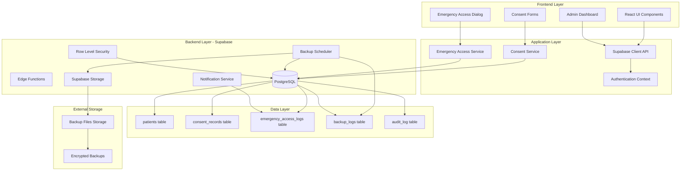
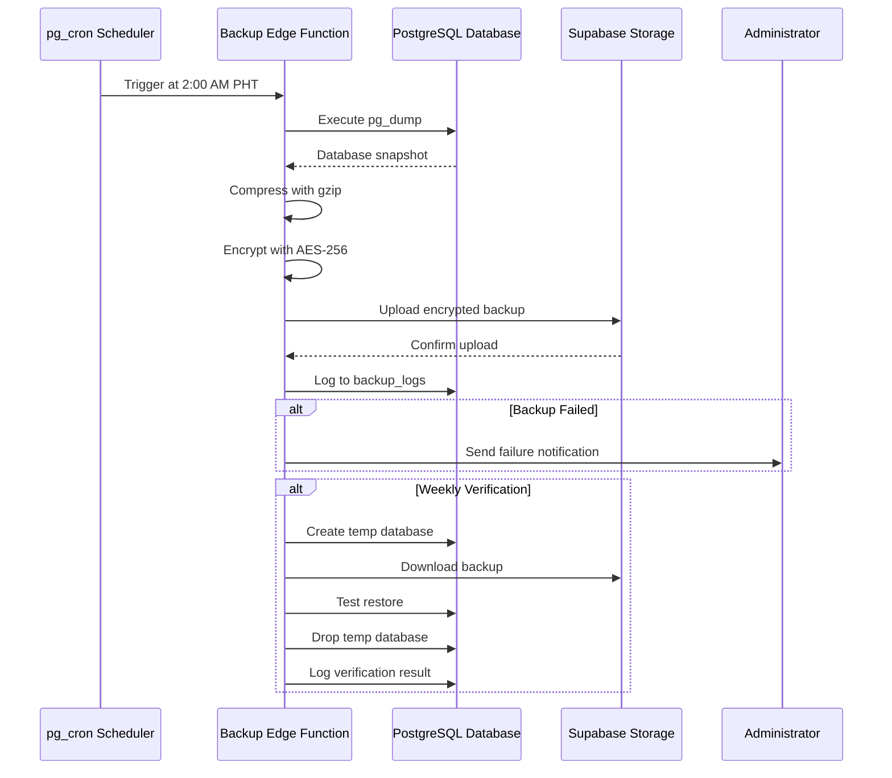
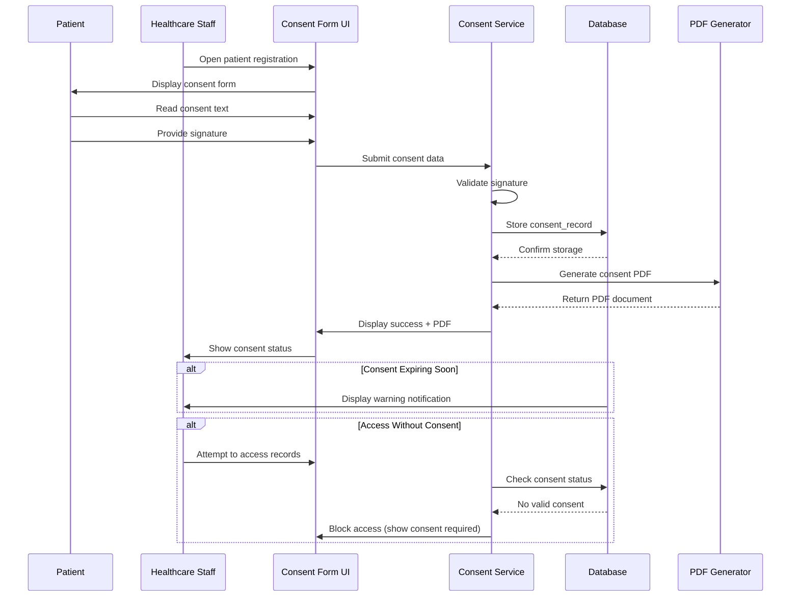
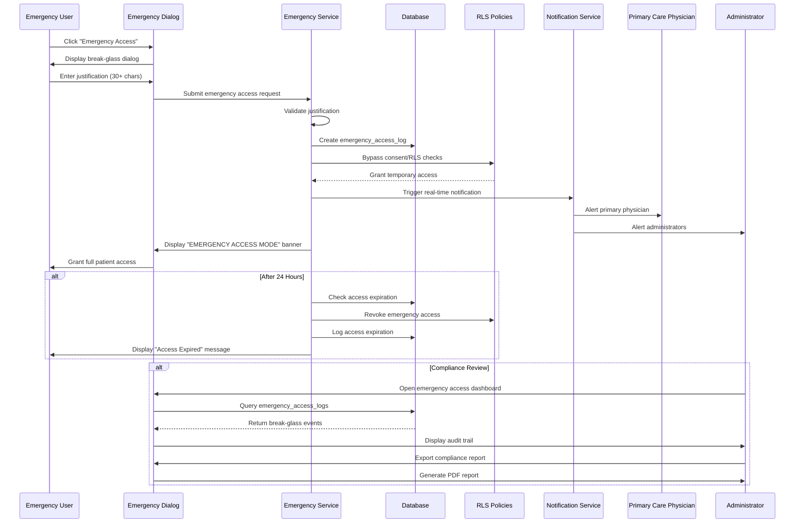
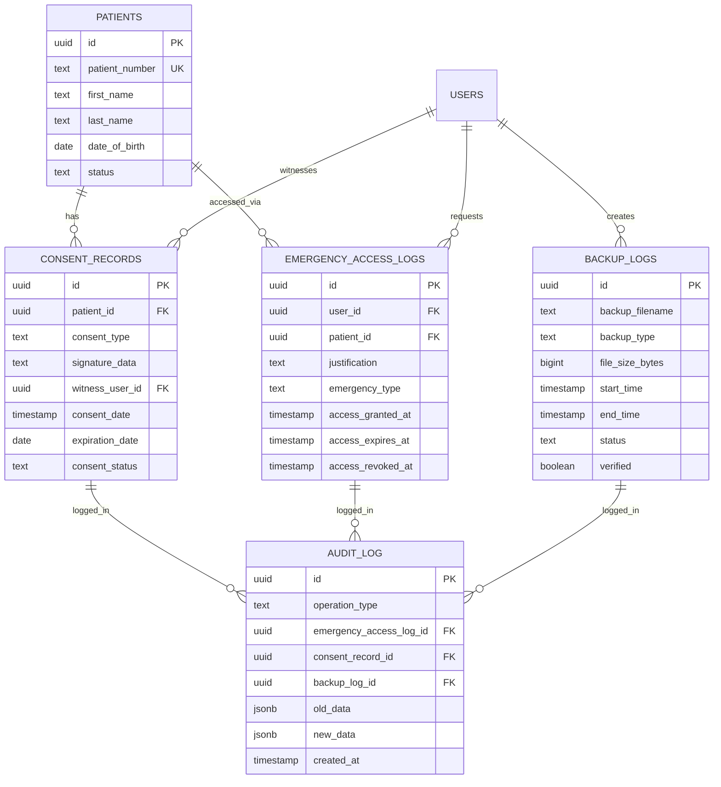

# Design Document: Clinical Safety Trio

## Overview

This design document specifies the technical implementation for three critical clinical safety features in the RCMC EMR system: Automated Backup System, Patient Consent Management, and Emergency Access Override. These features address the highest-priority clinical safety gaps identified in the system audit, focusing on data protection, legal compliance, and emergency care capabilities.

### System Context

**Current Architecture:**
- Frontend: React 18 + Vite + Tailwind CSS
- Backend: Supabase (PostgreSQL + Auth + Storage + Edge Functions)
- Deployment: Cloudflare Pages
- Database: 36.76 MB used (7.35% of 500 MB free tier, 430 MB available)
- Security: Row Level Security (RLS) policies, role-based access control

**Design Goals:**
1. Protect patient data against loss, corruption, or accidental deletion
2. Ensure Data Privacy Act (Philippines) compliance through digital consent tracking
3. Enable emergency care access while maintaining comprehensive audit trails
4. Minimize workflow disruption for healthcare providers
5. Operate within Supabase free tier constraints

**Implementation Priority:**
1. Automated Backup System (1 day) - Immediate data protection
2. Emergency Access Override (1-2 days) - Critical safety feature
3. Patient Consent Management (3 days) - Legal compliance

## Architecture

### High-Level Architecture



### Component Architecture

**1. Automated Backup System**
- Supabase Edge Function (scheduled via pg_cron)
- PostgreSQL pg_dump for database snapshots
- Supabase Storage for backup file storage
- AES-256 encryption for backup files
- Backup verification service (weekly test restores)

**2. Patient Consent Management**
- React signature canvas component
- Consent form generator (multi-language support)
- PDF generation service
- Consent validation middleware
- Expiration tracking and notification system

**3. Emergency Access Override**
- Break-glass dialog component
- Real-time notification system (Supabase Realtime)
- Audit trail logging
- Access expiration scheduler
- Compliance reporting dashboard

### Data Flow Diagrams

**Backup System Flow:**


**Consent Management Flow:**


**Emergency Access Flow:**


## Components and Interfaces

### 1. Automated Backup System

#### 1.1 Backup Edge Function

**File:** `supabase/functions/backup-scheduler/index.ts`

```typescript
interface BackupConfig {
  scheduleTime: string; // "02:00:00+08" (2 AM Philippine Time)
  retentionPolicy: {
    daily: number;    // 30 days
    weekly: number;   // 90 days
    monthly: number;  // 365 days
  };
  compressionLevel: number; // gzip compression level (1-9)
  encryptionAlgorithm: string; // "AES-256-CBC"
}

interface BackupResult {
  backupId: string;
  filename: string;
  fileSize: number;
  startTime: Date;
  endTime: Date;
  status: 'success' | 'failed';
  errorMessage?: string;
}
```

**Key Functions:**
- `executeBackup()`: Orchestrates backup process
- `dumpDatabase()`: Executes pg_dump command
- `compressBackup()`: Applies gzip compression
- `encryptBackup()`: Encrypts with AES-256
- `uploadToStorage()`: Stores in Supabase Storage
- `logBackupOperation()`: Records to backup_logs table
- `sendFailureAlert()`: Notifies admins on failure
- `cleanupOldBackups()`: Enforces retention policy

#### 1.2 Backup Verification Service

**File:** `supabase/functions/backup-verifier/index.ts`

```typescript
interface VerificationResult {
  verificationId: string;
  backupId: string;
  testDatabaseName: string;
  restoreSuccessful: boolean;
  dataIntegrityCheck: boolean;
  verificationTime: Date;
  errorDetails?: string;
}
```

**Key Functions:**
- `selectBackupForVerification()`: Chooses weekly backup to test
- `createTemporaryDatabase()`: Creates isolated test environment
- `restoreBackup()`: Performs test restore
- `verifyDataIntegrity()`: Checks table counts and constraints
- `cleanupTemporaryDatabase()`: Removes test database
- `logVerificationResult()`: Records verification outcome

#### 1.3 Backup Management UI

**File:** `src/pages/BackupManagement.jsx`

```typescript
interface BackupListItem {
  id: string;
  filename: string;
  fileSize: number;
  createdAt: Date;
  status: 'success' | 'failed' | 'verifying';
  verified: boolean;
  retentionType: 'daily' | 'weekly' | 'monthly';
}

interface BackupDashboard {
  successRate: number;
  lastBackupTime: Date;
  totalBackupSize: number;
  nextScheduledBackup: Date;
  recentBackups: BackupListItem[];
}
```

**UI Components:**
- Backup status dashboard
- Manual backup trigger button
- Backup history table with filters
- Retention policy configuration
- Disaster recovery documentation viewer
- Backup download interface (admin only)

### 2. Patient Consent Management

#### 2.1 Consent Form Component

**File:** `src/components/consent/ConsentForm.jsx`

```typescript
interface ConsentFormData {
  patientId: string;
  consentType: 'general_treatment' | 'data_sharing' | 'research_participation' | 'emergency_contact';
  consentText: string;
  language: 'en' | 'fil';
  signatureData: string; // base64-encoded PNG
  witnessUserId: string;
  consentDate: Date;
}

interface ConsentFormProps {
  patientId: string;
  onConsentGranted: (consent: ConsentRecord) => void;
  onConsentDenied: () => void;
  prefilledData?: Partial<ConsentFormData>;
}
```

**UI Components:**
- Multi-language consent text display
- Signature canvas (react-signature-canvas)
- Witness information capture
- Consent type selector
- Clear/reset signature button
- Submit and cancel actions

#### 2.2 Consent Service

**File:** `src/services/consentService.js`

```typescript
interface ConsentRecord {
  id: string;
  patientId: string;
  consentType: string;
  signatureData: string;
  consentText: string;
  language: string;
  witnessUserId: string;
  consentDate: Date;
  expirationDate: Date;
  consentStatus: 'active' | 'withdrawn' | 'expired';
  withdrawalDate?: Date;
  withdrawalReason?: string;
}

class ConsentService {
  async createConsent(formData: ConsentFormData): Promise<ConsentRecord>;
  async withdrawConsent(consentId: string, reason: string): Promise<void>;
  async checkConsentStatus(patientId: string, consentType: string): Promise<ConsentStatus>;
  async getPatientConsents(patientId: string): Promise<ConsentRecord[]>;
  async renewConsent(consentId: string, newSignature: string): Promise<ConsentRecord>;
  async generateConsentPDF(consentId: string): Promise<Blob>;
  async getExpiringConsents(daysUntilExpiration: number): Promise<ConsentRecord[]>;
}
```

#### 2.3 Consent Validation Middleware

**File:** `src/middleware/consentValidation.js`

```typescript
interface ConsentValidationResult {
  hasValidConsent: boolean;
  requiredConsentTypes: string[];
  missingConsents: string[];
  expiringConsents: ConsentRecord[];
  canProceed: boolean;
  emergencyOverride: boolean;
}

async function validatePatientAccess(
  patientId: string,
  accessType: 'read' | 'write',
  userId: string
): Promise<ConsentValidationResult>;
```

**Validation Rules:**
- Check for active general_treatment consent (required for all access)
- Verify consent not expired
- Allow emergency override bypass
- Log consent checks to audit trail

#### 2.4 Consent PDF Generator

**File:** `src/utils/consentPdfGenerator.js`

```typescript
interface ConsentPDFOptions {
  consentRecord: ConsentRecord;
  patientInfo: PatientInfo;
  witnessInfo: UserProfile;
  includeSignature: boolean;
  includeWatermark: boolean;
}

async function generateConsentPDF(options: ConsentPDFOptions): Promise<Blob>;
```

**PDF Contents:**
- Clinic header and logo
- Patient information
- Consent type and text (bilingual)
- Signature image
- Witness information
- Timestamp and consent ID
- QR code for verification

### 3. Emergency Access Override

#### 3.1 Emergency Access Dialog

**File:** `src/components/emergency/EmergencyAccessDialog.jsx`

```typescript
interface EmergencyAccessRequest {
  patientId: string;
  userId: string;
  justification: string; // minimum 30 characters
  emergencyType: 'life_threatening' | 'urgent_care' | 'critical_condition';
  requestedAt: Date;
}

interface EmergencyAccessDialogProps {
  patientId: string;
  patientName: string;
  onAccessGranted: (accessLog: EmergencyAccessLog) => void;
  onAccessDenied: () => void;
}
```

**UI Components:**
- Emergency situation description
- Justification text area (30+ char validation)
- Emergency type selector
- Warning message about audit trail
- Confirm and cancel buttons
- Real-time character counter

#### 3.2 Emergency Access Service

**File:** `src/services/emergencyAccessService.js`

```typescript
interface EmergencyAccessLog {
  id: string;
  userId: string;
  patientId: string;
  justification: string;
  emergencyType: string;
  accessGrantedAt: Date;
  accessExpiresAt: Date;
  accessRevokedAt?: Date;
  accessDuration: number; // in seconds
  dataAccessed: string[]; // tables accessed
  actionsPerformed: string[]; // operations performed
}

class EmergencyAccessService {
  async requestEmergencyAccess(request: EmergencyAccessRequest): Promise<EmergencyAccessLog>;
  async checkEmergencyAccess(userId: string, patientId: string): Promise<boolean>;
  async revokeEmergencyAccess(accessLogId: string): Promise<void>;
  async getActiveEmergencyAccess(userId: string): Promise<EmergencyAccessLog[]>;
  async getEmergencyAccessHistory(filters: AccessFilters): Promise<EmergencyAccessLog[]>;
  async sendEmergencyNotifications(accessLog: EmergencyAccessLog): Promise<void>;
  async generateComplianceReport(dateRange: DateRange): Promise<Blob>;
}
```

#### 3.3 Emergency Access Banner

**File:** `src/components/emergency/EmergencyAccessBanner.jsx`

```typescript
interface EmergencyAccessBannerProps {
  accessLog: EmergencyAccessLog;
  patientName: string;
  onRevokeAccess: () => void;
}
```

**UI Features:**
- Prominent red banner across top of screen
- "EMERGENCY ACCESS MODE" text
- Patient name and access expiration countdown
- Revoke access button
- Audit trail indicator

#### 3.4 Emergency Access Dashboard

**File:** `src/pages/EmergencyAccessDashboard.jsx`

```typescript
interface EmergencyAccessDashboardData {
  totalBreakGlassEvents: number;
  eventsByUser: Map<string, number>;
  eventsByEmergencyType: Map<string, number>;
  averageAccessDuration: number;
  recentEvents: EmergencyAccessLog[];
  suspiciousPatterns: SuspiciousActivity[];
}

interface SuspiciousActivity {
  userId: string;
  userName: string;
  eventCount: number;
  timeWindow: string;
  flagReason: string;
}
```

**Dashboard Features:**
- Break-glass event statistics
- Filterable event history table
- User activity breakdown
- Emergency type distribution chart
- Suspicious pattern alerts
- Compliance report export

#### 3.5 RLS Policy Bypass Mechanism

**Database Function:** `emr.check_emergency_access()`

```sql
CREATE OR REPLACE FUNCTION emr.check_emergency_access(
  p_user_id UUID,
  p_patient_id UUID
) RETURNS BOOLEAN AS $$
DECLARE
  has_active_access BOOLEAN;
BEGIN
  SELECT EXISTS (
    SELECT 1 FROM emr.emergency_access_logs
    WHERE user_id = p_user_id
    AND patient_id = p_patient_id
    AND access_granted_at <= NOW()
    AND access_expires_at > NOW()
    AND access_revoked_at IS NULL
  ) INTO has_active_access;
  
  RETURN has_active_access;
END;
$$ LANGUAGE plpgsql SECURITY DEFINER;
```

**Modified RLS Policies:**
```sql
-- Example: Modified patients table RLS policy
CREATE POLICY "Allow emergency access to patients"
  ON emr.patients FOR SELECT
  TO authenticated
  USING (
    -- Normal access rules
    true
    OR
    -- Emergency access bypass
    emr.check_emergency_access(auth.uid(), id)
  );
```

## Data Models

### Database Schema

#### 1. backup_logs Table

```sql
CREATE TABLE emr.backup_logs (
  id UUID PRIMARY KEY DEFAULT uuid_generate_v4(),
  backup_filename TEXT NOT NULL,
  backup_type TEXT NOT NULL CHECK (backup_type IN ('daily', 'weekly', 'monthly', 'manual')),
  file_size_bytes BIGINT NOT NULL,
  start_time TIMESTAMP WITH TIME ZONE NOT NULL,
  end_time TIMESTAMP WITH TIME ZONE,
  duration_seconds INTEGER,
  status TEXT NOT NULL CHECK (status IN ('in_progress', 'success', 'failed')),
  error_message TEXT,
  storage_path TEXT NOT NULL,
  compression_ratio NUMERIC(5,2),
  encrypted BOOLEAN DEFAULT true,
  verified BOOLEAN DEFAULT false,
  verification_date TIMESTAMP WITH TIME ZONE,
  retention_until DATE NOT NULL,
  created_by UUID REFERENCES auth.users(id),
  created_at TIMESTAMP WITH TIME ZONE DEFAULT NOW()
);

CREATE INDEX idx_backup_logs_status ON emr.backup_logs(status);
CREATE INDEX idx_backup_logs_created_at ON emr.backup_logs(created_at DESC);
CREATE INDEX idx_backup_logs_backup_type ON emr.backup_logs(backup_type);
CREATE INDEX idx_backup_logs_retention ON emr.backup_logs(retention_until);
```

#### 2. consent_records Table

```sql
CREATE TABLE emr.consent_records (
  id UUID PRIMARY KEY DEFAULT uuid_generate_v4(),
  patient_id UUID NOT NULL REFERENCES emr.patients(id) ON DELETE CASCADE,
  consent_type TEXT NOT NULL CHECK (consent_type IN (
    'general_treatment',
    'data_sharing',
    'research_participation',
    'emergency_contact'
  )),
  consent_text TEXT NOT NULL,
  language TEXT NOT NULL CHECK (language IN ('en', 'fil')),
  signature_data TEXT NOT NULL, -- base64-encoded PNG, max 50KB
  witness_user_id UUID NOT NULL REFERENCES auth.users(id),
  consent_date TIMESTAMP WITH TIME ZONE NOT NULL DEFAULT NOW(),
  expiration_date DATE NOT NULL,
  consent_status TEXT NOT NULL DEFAULT 'active' CHECK (consent_status IN (
    'active',
    'withdrawn',
    'expired'
  )),
  withdrawal_date TIMESTAMP WITH TIME ZONE,
  withdrawal_reason TEXT,
  pdf_storage_path TEXT,
  created_at TIMESTAMP WITH TIME ZONE DEFAULT NOW(),
  updated_at TIMESTAMP WITH TIME ZONE DEFAULT NOW(),
  
  -- Ensure only one active consent per type per patient
  CONSTRAINT unique_active_consent UNIQUE (patient_id, consent_type, consent_status)
    WHERE consent_status = 'active'
);

CREATE INDEX idx_consent_patient ON emr.consent_records(patient_id);
CREATE INDEX idx_consent_status ON emr.consent_records(consent_status);
CREATE INDEX idx_consent_expiration ON emr.consent_records(expiration_date);
CREATE INDEX idx_consent_type ON emr.consent_records(consent_type);

-- Trigger to update consent_status when expired
CREATE OR REPLACE FUNCTION emr.update_expired_consents()
RETURNS TRIGGER AS $$
BEGIN
  UPDATE emr.consent_records
  SET consent_status = 'expired'
  WHERE expiration_date < CURRENT_DATE
  AND consent_status = 'active';
  RETURN NULL;
END;
$$ LANGUAGE plpgsql;

CREATE TRIGGER check_expired_consents
  AFTER INSERT OR UPDATE ON emr.consent_records
  FOR EACH STATEMENT
  EXECUTE FUNCTION emr.update_expired_consents();
```

#### 3. emergency_access_logs Table

```sql
CREATE TABLE emr.emergency_access_logs (
  id UUID PRIMARY KEY DEFAULT uuid_generate_v4(),
  user_id UUID NOT NULL REFERENCES auth.users(id),
  patient_id UUID NOT NULL REFERENCES emr.patients(id) ON DELETE CASCADE,
  justification TEXT NOT NULL CHECK (LENGTH(justification) >= 30),
  emergency_type TEXT NOT NULL CHECK (emergency_type IN (
    'life_threatening',
    'urgent_care',
    'critical_condition'
  )),
  access_granted_at TIMESTAMP WITH TIME ZONE NOT NULL DEFAULT NOW(),
  access_expires_at TIMESTAMP WITH TIME ZONE NOT NULL,
  access_revoked_at TIMESTAMP WITH TIME ZONE,
  revocation_reason TEXT,
  access_duration_seconds INTEGER,
  data_accessed JSONB DEFAULT '[]', -- Array of table names accessed
  actions_performed JSONB DEFAULT '[]', -- Array of operations performed
  primary_physician_notified BOOLEAN DEFAULT false,
  admin_notified BOOLEAN DEFAULT false,
  compliance_reviewed BOOLEAN DEFAULT false,
  compliance_review_date TIMESTAMP WITH TIME ZONE,
  compliance_reviewer_id UUID REFERENCES auth.users(id),
  created_at TIMESTAMP WITH TIME ZONE DEFAULT NOW()
);

CREATE INDEX idx_emergency_access_user ON emr.emergency_access_logs(user_id);
CREATE INDEX idx_emergency_access_patient ON emr.emergency_access_logs(patient_id);
CREATE INDEX idx_emergency_access_granted ON emr.emergency_access_logs(access_granted_at DESC);
CREATE INDEX idx_emergency_access_active ON emr.emergency_access_logs(access_expires_at)
  WHERE access_revoked_at IS NULL AND access_expires_at > NOW();

-- Trigger to calculate access duration on revocation
CREATE OR REPLACE FUNCTION emr.calculate_access_duration()
RETURNS TRIGGER AS $$
BEGIN
  IF NEW.access_revoked_at IS NOT NULL AND OLD.access_revoked_at IS NULL THEN
    NEW.access_duration_seconds := EXTRACT(EPOCH FROM (NEW.access_revoked_at - NEW.access_granted_at));
  END IF;
  RETURN NEW;
END;
$$ LANGUAGE plpgsql;

CREATE TRIGGER update_access_duration
  BEFORE UPDATE ON emr.emergency_access_logs
  FOR EACH ROW
  EXECUTE FUNCTION emr.calculate_access_duration();

-- Constraint: Maximum 5 concurrent emergency access sessions per user
CREATE OR REPLACE FUNCTION emr.check_concurrent_emergency_access()
RETURNS TRIGGER AS $$
DECLARE
  active_count INTEGER;
BEGIN
  SELECT COUNT(*) INTO active_count
  FROM emr.emergency_access_logs
  WHERE user_id = NEW.user_id
  AND access_expires_at > NOW()
  AND access_revoked_at IS NULL;
  
  IF active_count >= 5 THEN
    RAISE EXCEPTION 'Maximum concurrent emergency access sessions (5) reached for user';
  END IF;
  
  RETURN NEW;
END;
$$ LANGUAGE plpgsql;

CREATE TRIGGER enforce_concurrent_access_limit
  BEFORE INSERT ON emr.emergency_access_logs
  FOR EACH ROW
  EXECUTE FUNCTION emr.check_concurrent_emergency_access();
```

#### 4. Enhanced audit_log Table

```sql
-- Add new columns to existing audit_log table
ALTER TABLE emr.audit_log ADD COLUMN IF NOT EXISTS
  operation_type TEXT CHECK (operation_type IN (
    'backup_created',
    'backup_failed',
    'backup_verified',
    'consent_granted',
    'consent_withdrawn',
    'consent_expired',
    'emergency_access_granted',
    'emergency_access_revoked',
    'emergency_access_expired',
    'data_access',
    'data_modification'
  ));

ALTER TABLE emr.audit_log ADD COLUMN IF NOT EXISTS
  emergency_access_log_id UUID REFERENCES emr.emergency_access_logs(id);

ALTER TABLE emr.audit_log ADD COLUMN IF NOT EXISTS
  consent_record_id UUID REFERENCES emr.consent_records(id);

ALTER TABLE emr.audit_log ADD COLUMN IF NOT EXISTS
  backup_log_id UUID REFERENCES emr.backup_logs(id);

CREATE INDEX idx_audit_log_operation_type ON emr.audit_log(operation_type);
CREATE INDEX idx_audit_log_emergency_access ON emr.audit_log(emergency_access_log_id);
CREATE INDEX idx_audit_log_consent ON emr.audit_log(consent_record_id);
```

### Data Relationships



### Data Validation Rules

**Consent Records:**
- Signature data must be base64-encoded PNG, max 50KB
- Justification text minimum 30 characters
- Expiration date must be future date (default: 1 year from consent_date)
- Only one active consent per type per patient
- Consent text must be non-empty
- Language must be 'en' or 'fil'

**Emergency Access Logs:**
- Justification minimum 30 characters
- Access expires at = access granted at + 24 hours
- Maximum 5 concurrent active sessions per user
- Maximum 10 emergency access requests per user per day (rate limiting)
- Emergency type must be valid enum value

**Backup Logs:**
- File size must be > 0
- End time must be >= start time
- Duration calculated automatically
- Retention until date calculated based on backup type:
  - daily: created_at + 30 days
  - weekly: created_at + 90 days
  - monthly: created_at + 365 days
- Storage path must be valid Supabase Storage path


## Correctness Properties

*A property is a characteristic or behavior that should hold true across all valid executions of a system—essentially, a formal statement about what the system should do. Properties serve as the bridge between human-readable specifications and machine-verifiable correctness guarantees.*

### Property Reflection

After analyzing all acceptance criteria, I identified the following redundancies:
- Property 1.11 (backup encryption) is identical to 6.1 - consolidated into single property
- Properties 4.1, 4.2, 4.3 all test audit logging - can be combined into comprehensive audit trail property
- Multiple properties test field presence in records - consolidated where they test the same pattern

### Automated Backup System Properties

### Property 1: Backup Filename Format Consistency

*For any* successful backup operation, the generated filename SHALL match the format `rcmc_emr_backup_YYYY-MM-DD_HH-MM-SS.sql` where YYYY-MM-DD represents the backup date and HH-MM-SS represents the backup time in 24-hour format.

**Validates: Requirements 1.2**

### Property 2: Backup Retention Policy Calculation

*For any* backup created with a given backup_type (daily, weekly, monthly), the retention_until date SHALL be calculated as:
- daily: created_at + 30 days
- weekly: created_at + 90 days  
- monthly: created_at + 365 days

**Validates: Requirements 1.3**

### Property 3: Backup Compression Application

*For any* backup file created, the file SHALL be compressed using gzip and the compression_ratio SHALL be recorded as (original_size - compressed_size) / original_size.

**Validates: Requirements 1.6**

### Property 4: Backup Operation Logging Completeness

*For any* backup operation (successful or failed), a record SHALL be created in backup_logs table containing start_time, end_time, file_size_bytes, status, and backup_filename fields, and duration_seconds SHALL equal EXTRACT(EPOCH FROM (end_time - start_time)).

**Validates: Requirements 1.10**

### Property 5: Backup File Encryption

*For any* backup file created, the encrypted field SHALL be set to true and the file SHALL be encrypted using AES-256-CBC algorithm before storage.

**Validates: Requirements 1.11, 6.1**

### Patient Consent Management Properties

### Property 6: Consent Record Field Completeness

*For any* consent record created, the record SHALL contain non-null values for patient_id, consent_type, signature_data, consent_text, language, witness_user_id, consent_date, expiration_date, and consent_status fields.

**Validates: Requirements 2.4**

### Property 7: Consent Withdrawal Status Update

*For any* active consent that is withdrawn, the consent_status SHALL be updated to "withdrawn" and withdrawal_date SHALL be set to the current timestamp.

**Validates: Requirements 2.5**

### Property 8: Consent-Based Access Control

*For any* patient without an active general_treatment consent (where consent_status = 'active' AND expiration_date >= CURRENT_DATE), access to Patient_Data SHALL be blocked UNLESS an active emergency_access_log exists for that user and patient.

**Validates: Requirements 2.6**

### Property 9: Consent PDF Generation Completeness

*For any* consent record, the generated PDF SHALL contain patient information, consent type, consent text, signature image, witness information, timestamp, and consent ID.

**Validates: Requirements 2.8**

### Property 10: Consent Expiration Date Calculation

*For any* consent record created without an explicit expiration_date, the expiration_date SHALL be set to consent_date + 365 days (1 year default).

**Validates: Requirements 2.9**

### Property 11: Consent Expiration Warning Detection

*For any* consent record where expiration_date is between CURRENT_DATE and CURRENT_DATE + 30 days AND consent_status = 'active', the system SHALL flag the consent as "expiring soon" for notification purposes.

**Validates: Requirements 2.10**

### Property 12: Signature Data Validation

*For any* signature data submitted, the data SHALL be validated as base64-encoded PNG format AND the decoded file size SHALL be <= 50KB, otherwise the submission SHALL be rejected.

**Validates: Requirements 2.11**

### Emergency Access Override Properties

### Property 13: Emergency Access Justification Validation

*For any* emergency access request, if the justification text length is < 30 characters, the request SHALL be rejected with a validation error.

**Validates: Requirements 3.2**

### Property 14: Emergency Access Audit Log Creation

*For any* emergency access granted, an audit log entry SHALL be created in emergency_access_logs table containing user_id, patient_id, justification, emergency_type, access_granted_at, and access_expires_at fields.

**Validates: Requirements 3.4**

### Property 15: Emergency Access Expiration Time Calculation

*For any* emergency access granted at time T, the access_expires_at SHALL be set to T + 24 hours.

**Validates: Requirements 3.7**

### Property 16: Emergency Access Role Authorization

*For any* emergency access request, if the requesting user's role is NOT in ('doctor', 'nurse', 'emergency_staff'), the request SHALL be rejected with an authorization error.

**Validates: Requirements 3.9**

### Property 17: Emergency Access Concurrent Session Limit

*For any* user attempting to create emergency access, if the user already has 5 or more active emergency access sessions (where access_expires_at > NOW() AND access_revoked_at IS NULL), the request SHALL be rejected with a "maximum concurrent sessions exceeded" error.

**Validates: Requirements 3.12**

### Integration and Audit Trail Properties

### Property 18: Comprehensive Audit Trail Logging

*For any* operation of type backup_created, backup_failed, consent_granted, consent_withdrawn, emergency_access_granted, or emergency_access_revoked, an entry SHALL be created in audit_log table with operation_type, user_id, created_at, and the appropriate foreign key reference (backup_log_id, consent_record_id, or emergency_access_log_id).

**Validates: Requirements 4.1, 4.2, 4.3**

### Property 19: Audit Log Immutability

*For any* existing audit_log entry, attempts to UPDATE or DELETE the entry SHALL fail with a database constraint violation error.

**Validates: Requirements 4.4**

### Security and Data Protection Properties

### Property 20: Emergency Access Rate Limiting

*For any* user, if the user has made 10 or more emergency access requests in the current calendar day (00:00:00 to 23:59:59), additional requests SHALL be rejected with a "rate limit exceeded" error.

**Validates: Requirements 6.3**

### Reporting and Compliance Properties

### Property 21: Consent Coverage Calculation

*For any* set of active patients and their consent records, the consent coverage percentage SHALL be calculated as (count of patients with active general_treatment consent / total count of active patients) * 100, where active consent means consent_status = 'active' AND expiration_date >= CURRENT_DATE.

**Validates: Requirements 7.4**

## Error Handling

### Backup System Error Handling

**Backup Execution Errors:**
- **Database Connection Failure**: Retry up to 3 times with exponential backoff (1s, 2s, 4s), then log failure and send admin alert
- **Insufficient Storage Space**: Check available storage before backup, fail gracefully with clear error message
- **pg_dump Command Failure**: Capture stderr output, log detailed error, send admin alert with error details
- **Encryption Failure**: Roll back backup file creation, log error, alert admins
- **Upload to Storage Failure**: Retry upload up to 3 times, keep local copy if all retries fail, alert admins

**Backup Verification Errors:**
- **Restore Failure**: Log detailed error, mark backup as unverified, alert admins
- **Data Integrity Check Failure**: Log which tables/constraints failed, mark backup as corrupted, alert admins
- **Temporary Database Creation Failure**: Skip verification, schedule retry, log warning

**Error Recovery:**
- All backup errors logged to backup_logs table with detailed error_message
- Failed backups retained for forensic analysis (not auto-deleted)
- Automatic retry of failed backups after 1 hour (max 3 retries per day)
- Admin dashboard shows all failed backups with error details

### Consent Management Error Handling

**Consent Creation Errors:**
- **Invalid Signature Data**: Return 400 Bad Request with message "Signature must be base64-encoded PNG under 50KB"
- **Missing Required Fields**: Return 400 Bad Request with list of missing fields
- **Patient Not Found**: Return 404 Not Found with message "Patient ID not found"
- **Witness User Not Found**: Return 404 Not Found with message "Witness user ID not found"
- **Duplicate Active Consent**: Return 409 Conflict with message "Active consent of this type already exists for patient"

**Consent Validation Errors:**
- **Expired Consent**: Return 403 Forbidden with message "Patient consent has expired, renewal required"
- **Withdrawn Consent**: Return 403 Forbidden with message "Patient has withdrawn consent"
- **Missing Consent**: Return 403 Forbidden with message "Patient consent required for this operation"
- **Emergency Override Available**: Include in error response that emergency access is available

**PDF Generation Errors:**
- **Template Not Found**: Log error, return 500 Internal Server Error, alert admins
- **Signature Image Decode Failure**: Return 400 Bad Request with message "Invalid signature data format"
- **PDF Library Error**: Log error, return 500 Internal Server Error, provide fallback text-based consent document

**Error Recovery:**
- Failed consent creations do not create partial records (atomic transactions)
- Signature validation happens before database insertion
- PDF generation failures do not prevent consent record creation (PDF can be regenerated later)
- All consent errors logged to audit_log for compliance tracking

### Emergency Access Error Handling

**Emergency Access Request Errors:**
- **Insufficient Justification**: Return 400 Bad Request with message "Justification must be at least 30 characters"
- **Unauthorized Role**: Return 403 Forbidden with message "Your role is not authorized for emergency access"
- **Concurrent Session Limit**: Return 429 Too Many Requests with message "Maximum 5 concurrent emergency access sessions reached"
- **Rate Limit Exceeded**: Return 429 Too Many Requests with message "Daily emergency access limit (10) exceeded"
- **Patient Not Found**: Return 404 Not Found with message "Patient ID not found"

**Emergency Access Expiration Errors:**
- **Already Expired**: Return 410 Gone with message "Emergency access has expired"
- **Already Revoked**: Return 410 Gone with message "Emergency access has been revoked"
- **Expiration Job Failure**: Log error, retry expiration after 5 minutes, alert admins if repeated failures

**Notification Errors:**
- **Primary Physician Not Found**: Log warning, continue with admin notification only
- **Notification Service Failure**: Log error, continue with access grant (notification is not blocking), retry notification asynchronously
- **Email/SMS Delivery Failure**: Log failure, mark notification as failed in database, retry up to 3 times

**Error Recovery:**
- Emergency access grants are atomic (either fully granted or fully rejected)
- Notification failures do not prevent access grant (patient safety priority)
- Failed notifications logged and retried asynchronously
- All emergency access errors logged to audit_log with full context
- Suspicious patterns (repeated failures, unusual timing) flagged for admin review

### Cross-Cutting Error Handling

**Database Errors:**
- **Connection Timeout**: Retry with exponential backoff, return 503 Service Unavailable if all retries fail
- **Constraint Violation**: Return 400 Bad Request with specific constraint violation message
- **Deadlock**: Automatic retry up to 3 times, return 409 Conflict if deadlock persists
- **RLS Policy Violation**: Return 403 Forbidden with message "Access denied by security policy"

**Authentication/Authorization Errors:**
- **Unauthenticated Request**: Return 401 Unauthorized with message "Authentication required"
- **Insufficient Permissions**: Return 403 Forbidden with message "Insufficient permissions for this operation"
- **Session Expired**: Return 401 Unauthorized with message "Session expired, please login again"

**Validation Errors:**
- All validation errors return 400 Bad Request with detailed field-level error messages
- Validation happens before any database operations (fail fast)
- Client-side validation mirrors server-side validation for better UX

**Rate Limiting Errors:**
- Return 429 Too Many Requests with Retry-After header
- Include current rate limit status in response
- Log rate limit violations for abuse detection

## Testing Strategy

### Dual Testing Approach

This feature will employ both unit testing and property-based testing to ensure comprehensive coverage:

**Unit Tests**: Verify specific examples, edge cases, error conditions, and integration points
**Property Tests**: Verify universal properties across all inputs through randomized testing

Together, these approaches provide comprehensive coverage where unit tests catch concrete bugs and property tests verify general correctness across the input space.

### Property-Based Testing Configuration

**Library Selection:**
- **JavaScript/Node.js**: fast-check (https://github.com/dubzzz/fast-check)
- Mature, well-maintained library with excellent TypeScript support
- Supports complex data generation including dates, UUIDs, strings with constraints
- Built-in shrinking for minimal failing examples

**Test Configuration:**
- Minimum 100 iterations per property test (due to randomization)
- Each property test tagged with comment referencing design document property
- Tag format: `// Feature: clinical-safety-trio, Property {number}: {property_text}`

**Example Property Test Structure:**

```javascript
import fc from 'fast-check';
import { describe, it, expect } from 'vitest';

describe('Backup System Properties', () => {
  it('Property 1: Backup Filename Format Consistency', () => {
    // Feature: clinical-safety-trio, Property 1: Backup filename format consistency
    fc.assert(
      fc.property(
        fc.date(), // Random backup date
        (backupDate) => {
          const filename = generateBackupFilename(backupDate);
          const pattern = /^rcmc_emr_backup_\d{4}-\d{2}-\d{2}_\d{2}-\d{2}-\d{2}\.sql$/;
          expect(filename).toMatch(pattern);
        }
      ),
      { numRuns: 100 }
    );
  });
});
```

### Unit Testing Strategy

**Backup System Unit Tests:**
1. Test backup execution with mocked pg_dump
2. Test compression with sample data
3. Test encryption with known plaintext
4. Test upload to storage with mocked Supabase client
5. Test failure notification with mocked notification service
6. Test retention policy cleanup with various backup ages
7. Test manual backup trigger
8. Test backup verification with mocked restore
9. Edge cases: empty database, very large database, concurrent backups
10. Error cases: storage full, network failure, encryption key missing

**Consent Management Unit Tests:**
1. Test consent form rendering with sample patient data
2. Test signature capture with mock canvas data
3. Test consent creation with valid data
4. Test consent withdrawal workflow
5. Test consent validation with various consent states
6. Test PDF generation with sample consent
7. Test expiration warning detection
8. Test multi-language consent text retrieval
9. Edge cases: signature exactly 50KB, consent expiring today, multiple consent types
10. Error cases: invalid signature format, missing witness, duplicate consent

**Emergency Access Unit Tests:**
1. Test emergency access dialog display
2. Test justification validation (29 chars, 30 chars, 31 chars)
3. Test access grant with valid justification
4. Test audit log creation
5. Test notification sending
6. Test access expiration after 24 hours
7. Test concurrent session limit (4 sessions, 5 sessions, 6 sessions)
8. Test rate limiting (9 requests, 10 requests, 11 requests)
9. Test role authorization for each role
10. Test RLS policy bypass
11. Test compliance report generation
12. Edge cases: access expiring in 1 second, exactly 5 concurrent sessions
13. Error cases: invalid patient ID, unauthorized role, rate limit exceeded

**Integration Tests:**
1. Test full backup workflow from trigger to storage
2. Test patient registration with consent capture
3. Test emergency access with consent bypass
4. Test audit trail integration across all three features
5. Test notification system integration
6. Test RLS policy interaction with emergency access
7. Test backup restoration in test environment
8. Test consent expiration job
9. Test emergency access expiration job

### Test Data Generation

**Property Test Generators:**

```javascript
// Backup data generator
const backupDataArb = fc.record({
  backupType: fc.constantFrom('daily', 'weekly', 'monthly'),
  createdAt: fc.date(),
  fileSize: fc.integer({ min: 1000000, max: 100000000 }), // 1MB to 100MB
  status: fc.constantFrom('success', 'failed'),
});

// Consent data generator
const consentDataArb = fc.record({
  patientId: fc.uuid(),
  consentType: fc.constantFrom('general_treatment', 'data_sharing', 'research_participation', 'emergency_contact'),
  signatureData: fc.base64String({ minLength: 1000, maxLength: 50000 }),
  language: fc.constantFrom('en', 'fil'),
  witnessUserId: fc.uuid(),
  consentDate: fc.date(),
});

// Emergency access data generator
const emergencyAccessArb = fc.record({
  userId: fc.uuid(),
  patientId: fc.uuid(),
  justification: fc.string({ minLength: 30, maxLength: 500 }),
  emergencyType: fc.constantFrom('life_threatening', 'urgent_care', 'critical_condition'),
  accessGrantedAt: fc.date(),
});
```

### Test Coverage Goals

**Code Coverage Targets:**
- Line coverage: 90%+
- Branch coverage: 85%+
- Function coverage: 95%+

**Property Coverage:**
- All 21 correctness properties implemented as property tests
- Each property test runs minimum 100 iterations
- Property tests cover both success and failure paths

**Integration Coverage:**
- All critical user workflows tested end-to-end
- All error handling paths tested
- All notification triggers tested
- All audit logging tested

### Testing Timeline

**Day 1 (Backup System):**
- Write unit tests for backup execution (2 hours)
- Write property tests for Properties 1-5 (2 hours)
- Write integration tests for backup workflow (1 hour)
- Test backup failure scenarios (1 hour)

**Day 2-3 (Emergency Access):**
- Write unit tests for emergency access (3 hours)
- Write property tests for Properties 13-17 (2 hours)
- Write integration tests for emergency workflow (2 hours)
- Test RLS policy bypass (1 hour)

**Day 4-6 (Consent Management):**
- Write unit tests for consent forms (4 hours)
- Write property tests for Properties 6-12 (3 hours)
- Write integration tests for consent workflow (3 hours)
- Test PDF generation (2 hours)

**Day 7 (Integration & Audit):**
- Write property tests for Properties 18-21 (2 hours)
- Write cross-feature integration tests (3 hours)
- Test audit trail completeness (2 hours)
- Performance testing (1 hour)

### Continuous Testing

**Pre-commit Hooks:**
- Run all unit tests
- Run linting and type checking
- Verify no console.log statements

**CI/CD Pipeline:**
- Run full test suite on every push
- Run property tests with 1000 iterations (10x normal)
- Generate coverage reports
- Fail build if coverage drops below targets
- Run integration tests against test database

**Manual Testing Checklist:**
- Test backup restoration in staging environment
- Test consent PDF generation with real signature
- Test emergency access notifications with real email/SMS
- Test all error messages for clarity
- Test UI responsiveness on mobile devices
- Test accessibility with screen reader
- Test multi-language consent forms

### Test Documentation

Each test file will include:
- Purpose and scope comment at top
- Property number reference for property tests
- Requirement number reference for unit tests
- Setup and teardown procedures
- Mock data descriptions
- Expected behavior documentation

Example:
```javascript
/**
 * Backup System Property Tests
 * 
 * Tests Properties 1-5 from design document
 * Validates backup filename format, retention policy, compression, logging, and encryption
 * 
 * Uses fast-check for property-based testing with 100 iterations per property
 */
```

