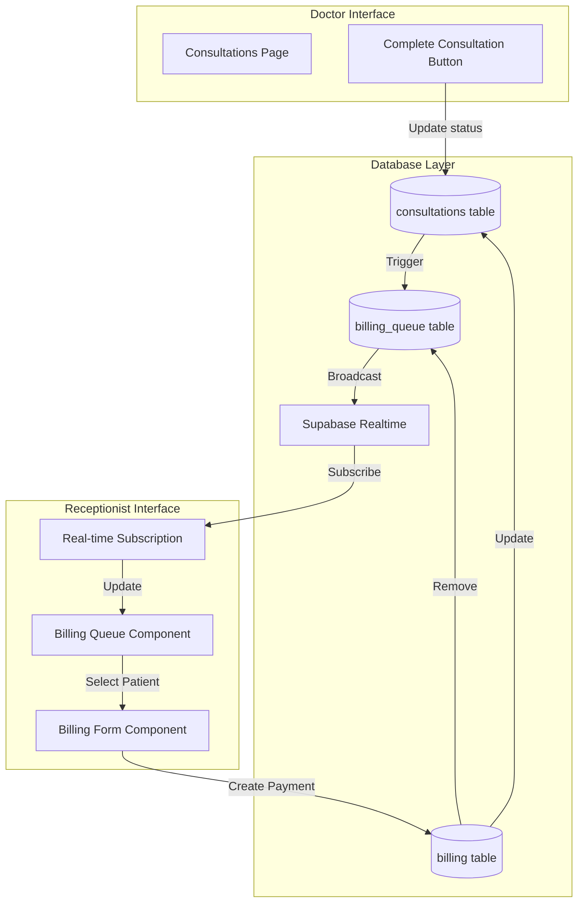

# Design Document: Consultation to Billing Handoff

## Overview

This design establishes an automated workflow that seamlessly transfers patient information from the consultation module to the billing module when a doctor completes a consultation. The system leverages Supabase real-time subscriptions to provide instant updates to receptionists, eliminating manual data entry and reducing patient wait times.

### Key Design Goals

1. **Zero Manual Transfer**: Automate the complete handoff process without receptionist intervention
2. **Real-Time Updates**: Deliver billing queue updates within 2 seconds using Supabase subscriptions
3. **Data Integrity**: Maintain referential integrity between consultations, billing, and payment records
4. **Concurrent Access**: Support multiple receptionists processing billing simultaneously with optimistic locking
5. **Error Recovery**: Provide clear error handling and retry mechanisms for failed operations

### Technology Stack

- **Frontend**: React with Vite
- **Backend**: Supabase (PostgreSQL + Real-time subscriptions)
- **State Management**: React Context API
- **Real-time**: Supabase Realtime channels
- **Database**: PostgreSQL with Row Level Security (RLS)

## Architecture

### System Components



### Data Flow

1. **Consultation Completion**:
   - Doctor clicks "Complete Consultation"
   - Frontend updates consultation status to "pending_billing"
   - Database trigger creates billing_queue entry
   - Supabase broadcasts change via Realtime

2. **Billing Queue Update**:
   - Receptionist's browser receives real-time notification
   - Billing queue component re-renders with new patient
   - Visual notification alerts receptionist

3. **Payment Processing**:
   - Receptionist selects patient from queue
   - System displays consultation details
   - Receptionist enters payment information
   - Transaction updates both billing and consultations tables
   - Patient removed from billing queue

### Concurrency Model

The system uses optimistic locking with a `processing_by` field in the billing_queue table:

- When receptionist opens billing form, record is marked with their user_id
- Other receptionists see the patient as "in progress"
- Lock automatically releases after 5 minutes of inactivity
- Lock releases immediately when payment completes or is cancelled

## Components and Interfaces

### Database Schema Changes

#### 1. Modify consultations table

```sql
-- Add status and completion tracking
ALTER TABLE emr.consultations 
ADD COLUMN status TEXT DEFAULT 'in_progress' 
  CHECK (status IN ('in_progress', 'pending_billing', 'billed', 'cancelled')),
ADD COLUMN completed_at TIMESTAMP WITH TIME ZONE,
ADD COLUMN completed_by UUID REFERENCES auth.users(id);

CREATE INDEX idx_consultations_status ON emr.consultations(status);
CREATE INDEX idx_consultations_completed_at ON emr.consultations(completed_at);
```

#### 2. Create billing_queue table

```sql
-- New table to track patients awaiting billing
CREATE TABLE emr.billing_queue (
  id UUID PRIMARY KEY DEFAULT uuid_generate_v4(),
  consultation_id UUID NOT NULL REFERENCES emr.consultations(id) ON DELETE CASCADE,
  patient_id UUID NOT NULL REFERENCES emr.patients(id) ON DELETE CASCADE,
  doctor_id UUID NOT NULL REFERENCES emr.doctors(id),
  consultation_date TIMESTAMP WITH TIME ZONE NOT NULL,
  completed_at TIMESTAMP WITH TIME ZONE NOT NULL,
  processing_by UUID REFERENCES auth.users(id),
  processing_started_at TIMESTAMP WITH TIME ZONE,
  created_at TIMESTAMP WITH TIME ZONE DEFAULT NOW(),
  UNIQUE(consultation_id)
);

CREATE INDEX idx_billing_queue_patient ON emr.billing_queue(patient_id);
CREATE INDEX idx_billing_queue_completed_at ON emr.billing_queue(completed_at DESC);
CREATE INDEX idx_billing_queue_processing ON emr.billing_queue(processing_by);

-- Enable RLS
ALTER TABLE emr.billing_queue ENABLE ROW LEVEL SECURITY;

-- Policy: All authenticated users can read billing queue
CREATE POLICY "All authenticated users can read billing queue"
  ON emr.billing_queue FOR SELECT
  TO authenticated
  USING (true);

-- Policy: Receptionists and admins can update billing queue
CREATE POLICY "Receptionists and admins can update billing queue"
  ON emr.billing_queue FOR UPDATE
  TO authenticated
  USING (
    EXISTS (
      SELECT 1 FROM emr.user_profiles
      WHERE id = auth.uid() AND role IN ('admin', 'receptionist')
    )
  );

-- Policy: System can insert into billing queue (via trigger)
CREATE POLICY "System can insert into billing queue"
  ON emr.billing_queue FOR INSERT
  TO authenticated
  WITH CHECK (true);

-- Policy: System can delete from billing queue
CREATE POLICY "System can delete from billing queue"
  ON emr.billing_queue FOR DELETE
  TO authenticated
  USING (
    EXISTS (
      SELECT 1 FROM emr.user_profiles
      WHERE id = auth.uid() AND role IN ('admin', 'receptionist')
    )
  );
```

#### 3. Modify billing table

```sql
-- Add consultation reference and timestamps
ALTER TABLE emr.billing 
ADD COLUMN consultation_id UUID REFERENCES emr.consultations(id),
ADD COLUMN billed_at TIMESTAMP WITH TIME ZONE,
ADD COLUMN billed_by UUID REFERENCES auth.users(id);

CREATE INDEX idx_billing_consultation ON emr.billing(consultation_id);
```

#### 4. Create database trigger

```sql
-- Function to automatically create billing queue entry
CREATE OR REPLACE FUNCTION emr.create_billing_queue_entry()
RETURNS TRIGGER AS $$
BEGIN
  -- Only create queue entry when status changes to pending_billing
  IF NEW.status = 'pending_billing' AND (OLD.status IS NULL OR OLD.status != 'pending_billing') THEN
    INSERT INTO emr.billing_queue (
      consultation_id,
      patient_id,
      doctor_id,
      consultation_date,
      completed_at
    ) VALUES (
      NEW.id,
      NEW.patient_id,
      NEW.doctor_id,
      NEW.consultation_date,
      NEW.completed_at
    )
    ON CONFLICT (consultation_id) DO NOTHING;
  END IF;
  
  RETURN NEW;
END;
$$ LANGUAGE plpgsql;

-- Trigger on consultations table
CREATE TRIGGER trigger_create_billing_queue
  AFTER INSERT OR UPDATE ON emr.consultations
  FOR EACH ROW
  EXECUTE FUNCTION emr.create_billing_queue_entry();
```

#### 5. Create function to release stale locks

```sql
-- Function to release locks older than 5 minutes
CREATE OR REPLACE FUNCTION emr.release_stale_billing_locks()
RETURNS INTEGER AS $$
DECLARE
  released_count INTEGER;
BEGIN
  UPDATE emr.billing_queue
  SET processing_by = NULL,
      processing_started_at = NULL
  WHERE processing_by IS NOT NULL
    AND processing_started_at < NOW() - INTERVAL '5 minutes';
  
  GET DIAGNOSTICS released_count = ROW_COUNT;
  RETURN released_count;
END;
$$ LANGUAGE plpgsql;
```

### Frontend Components

#### 1. BillingQueueContext

```javascript
// src/context/BillingQueueContext.jsx
import { createContext, useContext, useState, useEffect } from 'react'
import { supabase } from '../lib/supabase'
import { useAuth } from './AuthContext'

const BillingQueueContext = createContext()

export function BillingQueueProvider({ children }) {
  const [queue, setQueue] = useState([])
  const [loading, setLoading] = useState(true)
  const [connectionStatus, setConnectionStatus] = useState('connected')
  const { user } = useAuth()

  // Fetch initial queue
  useEffect(() => {
    fetchQueue()
  }, [])

  // Subscribe to real-time updates
  useEffect(() => {
    const channel = supabase
      .channel('billing_queue_changes')
      .on(
        'postgres_changes',
        {
          event: '*',
          schema: 'emr',
          table: 'billing_queue'
        },
        (payload) => {
          handleRealtimeUpdate(payload)
        }
      )
      .subscribe((status) => {
        if (status === 'SUBSCRIBED') {
          setConnectionStatus('connected')
        } else if (status === 'CLOSED') {
          setConnectionStatus('disconnected')
        }
      })

    return () => {
      supabase.removeChannel(channel)
    }
  }, [])

  // Release stale locks periodically
  useEffect(() => {
    const interval = setInterval(async () => {
      await supabase.rpc('release_stale_billing_locks')
      fetchQueue() // Refresh queue after releasing locks
    }, 60000) // Every minute

    return () => clearInterval(interval)
  }, [])

  const fetchQueue = async () => {
    try {
      const { data, error } = await supabase
        .from('billing_queue')
        .select(`
          *,
          patient:patients(id, first_name, last_name, patient_number, contact_number),
          doctor:doctors(id, first_name, last_name),
          consultation:consultations(chief_complaint, diagnosis, prescription, notes)
        `)
        .order('completed_at', { ascending: false })

      if (error) throw error
      setQueue(data || [])
    } catch (error) {
      console.error('Error fetching billing queue:', error)
    } finally {
      setLoading(false)
    }
  }

  const handleRealtimeUpdate = (payload) => {
    if (payload.eventType === 'INSERT') {
      fetchQueue() // Refresh entire queue
      showNotification('New patient ready for billing')
    } else if (payload.eventType === 'UPDATE') {
      fetchQueue()
    } else if (payload.eventType === 'DELETE') {
      setQueue(prev => prev.filter(item => item.id !== payload.old.id))
    }
  }

  const lockPatient = async (queueId) => {
    try {
      const { data, error } = await supabase
        .from('billing_queue')
        .update({
          processing_by: user.id,
          processing_started_at: new Date().toISOString()
        })
        .eq('id', queueId)
        .is('processing_by', null) // Only lock if not already locked
        .select()
        .single()

      if (error) throw error
      return data
    } catch (error) {
      console.error('Error locking patient:', error)
      return null
    }
  }

  const unlockPatient = async (queueId) => {
    try {
      const { error } = await supabase
        .from('billing_queue')
        .update({
          processing_by: null,
          processing_started_at: null
        })
        .eq('id', queueId)
        .eq('processing_by', user.id) // Only unlock if locked by current user

      if (error) throw error
    } catch (error) {
      console.error('Error unlocking patient:', error)
    }
  }

  const removeFromQueue = async (consultationId) => {
    try {
      const { error } = await supabase
        .from('billing_queue')
        .delete()
        .eq('consultation_id', consultationId)

      if (error) throw error
    } catch (error) {
      console.error('Error removing from queue:', error)
      throw error
    }
  }

  const showNotification = (message) => {
    // Integration with NotificationContext
    if ('Notification' in window && Notification.permission === 'granted') {
      new Notification('RCMC EMR', { body: message })
    }
  }

  return (
    <BillingQueueContext.Provider
      value={{
        queue,
        loading,
        connectionStatus,
        lockPatient,
        unlockPatient,
        removeFromQueue,
        refreshQueue: fetchQueue
      }}
    >
      {children}
    </BillingQueueContext.Provider>
  )
}

export const useBillingQueue = () => useContext(BillingQueueContext)
```

#### 2. BillingQueue Component

```javascript
// src/components/BillingQueue.jsx
import { useState } from 'react'
import { useBillingQueue } from '../context/BillingQueueContext'
import { Search, Clock, AlertCircle } from 'lucide-react'

export function BillingQueue({ onSelectPatient }) {
  const { queue, loading, connectionStatus } = useBillingQueue()
  const [searchTerm, setSearchTerm] = useState('')

  const filteredQueue = queue.filter(item => {
    if (!searchTerm) return true
    const search = searchTerm.toLowerCase()
    return (
      item.patient?.first_name?.toLowerCase().includes(search) ||
      item.patient?.last_name?.toLowerCase().includes(search) ||
      item.patient?.patient_number?.toLowerCase().includes(search)
    )
  })

  const formatTime = (timestamp) => {
    const date = new Date(timestamp)
    return date.toLocaleTimeString('en-US', { 
      hour: '2-digit', 
      minute: '2-digit' 
    })
  }

  if (loading) {
    return <div className="p-4">Loading billing queue...</div>
  }

  return (
    <div className="bg-white rounded-lg shadow">
      {/* Connection Status Warning */}
      {connectionStatus !== 'connected' && (
        <div className="bg-yellow-50 border-l-4 border-yellow-400 p-4">
          <div className="flex items-center">
            <AlertCircle className="h-5 w-5 text-yellow-400 mr-2" />
            <p className="text-sm text-yellow-700">
              Connection lost. Queue may not update automatically.
            </p>
          </div>
        </div>
      )}

      {/* Header */}
      <div className="p-4 border-b">
        <div className="flex items-center justify-between mb-4">
          <h2 className="text-lg font-semibold">
            Billing Queue ({filteredQueue.length})
          </h2>
        </div>

        {/* Search */}
        <div className="relative">
          <Search className="absolute left-3 top-1/2 transform -translate-y-1/2 h-5 w-5 text-gray-400" />
          <input
            type="text"
            placeholder="Search by name or patient number..."
            value={searchTerm}
            onChange={(e) => setSearchTerm(e.target.value)}
            className="w-full pl-10 pr-4 py-2 border rounded-lg focus:ring-2 focus:ring-teal-500"
          />
        </div>
      </div>

      {/* Queue List */}
      <div className="divide-y max-h-[600px] overflow-y-auto">
        {filteredQueue.length === 0 ? (
          <div className="p-8 text-center text-gray-500">
            {searchTerm ? 'No patients found' : 'No patients in billing queue'}
          </div>
        ) : (
          filteredQueue.map((item) => (
            <div
              key={item.id}
              className={`p-4 hover:bg-gray-50 cursor-pointer transition ${
                item.processing_by ? 'opacity-50' : ''
              }`}
              onClick={() => !item.processing_by && onSelectPatient(item)}
            >
              <div className="flex items-start justify-between">
                <div className="flex-1">
                  <div className="flex items-center gap-2">
                    <h3 className="font-medium">
                      {item.patient?.first_name} {item.patient?.last_name}
                    </h3>
                    {item.processing_by && (
                      <span className="px-2 py-1 text-xs bg-yellow-100 text-yellow-800 rounded">
                        In Progress
                      </span>
                    )}
                  </div>
                  <p className="text-sm text-gray-600">
                    {item.patient?.patient_number}
                  </p>
                  <p className="text-sm text-gray-500 mt-1">
                    Dr. {item.doctor?.first_name} {item.doctor?.last_name}
                  </p>
                </div>
                <div className="text-right">
                  <div className="flex items-center text-sm text-gray-500">
                    <Clock className="h-4 w-4 mr-1" />
                    {formatTime(item.completed_at)}
                  </div>
                </div>
              </div>
            </div>
          ))
        )}
      </div>
    </div>
  )
}
```

#### 3. Enhanced Consultations Page

```javascript
// Additions to src/pages/Consultations.jsx

const completeConsultation = async (consultationId) => {
  try {
    setLoading(true)
    
    const { data, error } = await supabase
      .from('consultations')
      .update({
        status: 'pending_billing',
        completed_at: new Date().toISOString(),
        completed_by: user.id
      })
      .eq('id', consultationId)
      .select()
      .single()

    if (error) throw error

    // Show success message
    showNotification('Consultation completed. Patient sent to billing.')
    
    // Refresh consultations list
    await fetchConsultations()
  } catch (error) {
    console.error('Error completing consultation:', error)
    showError('Failed to complete consultation. Please try again.')
  } finally {
    setLoading(false)
  }
}

// Button in consultation card
<button
  onClick={() => completeConsultation(consultation.id)}
  disabled={consultation.status !== 'in_progress'}
  className={`px-4 py-2 rounded-lg ${
    consultation.status === 'in_progress'
      ? 'bg-teal-600 text-white hover:bg-teal-700'
      : 'bg-gray-300 text-gray-500 cursor-not-allowed'
  }`}
>
  {consultation.status === 'pending_billing' ? 'Sent to Billing' : 'Complete Consultation'}
</button>
```

#### 4. Enhanced Billing Page

```javascript
// src/pages/Billing.jsx - Integration with BillingQueue

import { useState } from 'react'
import { BillingQueue } from '../components/BillingQueue'
import { useBillingQueue } from '../context/BillingQueueContext'
import { supabase } from '../lib/supabase'

export function Billing() {
  const [selectedPatient, setSelectedPatient] = useState(null)
  const [billingForm, setBillingForm] = useState({
    items: [],
    subtotal: 0,
    discount: 0,
    total_amount: 0,
    payment_method: 'Cash'
  })
  const { lockPatient, unlockPatient, removeFromQueue } = useBillingQueue()

  const handleSelectPatient = async (queueItem) => {
    // Try to lock the patient
    const locked = await lockPatient(queueItem.id)
    
    if (!locked) {
      alert('This patient is currently being processed by another receptionist.')
      return
    }

    setSelectedPatient(queueItem)
    
    // Pre-populate billing form if consultation has billable items
    // This would be based on consultation.prescription or other fields
  }

  const handleCancelBilling = async () => {
    if (selectedPatient) {
      await unlockPatient(selectedPatient.id)
    }
    setSelectedPatient(null)
    setBillingForm({
      items: [],
      subtotal: 0,
      discount: 0,
      total_amount: 0,
      payment_method: 'Cash'
    })
  }

  const handleCompleteBilling = async () => {
    try {
      // Start transaction
      const { data: billing, error: billingError } = await supabase
        .from('billing')
        .insert([{
          patient_id: selectedPatient.patient_id,
          consultation_id: selectedPatient.consultation_id,
          items: billingForm.items,
          subtotal: billingForm.subtotal,
          discount: billingForm.discount,
          total_amount: billingForm.total_amount,
          amount_paid: billingForm.total_amount,
          balance: 0,
          payment_status: 'Paid',
          payment_method: billingForm.payment_method,
          billed_at: new Date().toISOString(),
          billed_by: user.id
        }])
        .select()
        .single()

      if (billingError) throw billingError

      // Update consultation status
      const { error: consultationError } = await supabase
        .from('consultations')
        .update({ status: 'billed' })
        .eq('id', selectedPatient.consultation_id)

      if (consultationError) throw consultationError

      // Remove from billing queue
      await removeFromQueue(selectedPatient.consultation_id)

      // Show success and reset
      alert('Payment completed successfully!')
      handleCancelBilling()
    } catch (error) {
      console.error('Error completing billing:', error)
      alert('Failed to complete billing. Please try again.')
    }
  }

  return (
    <div className="p-6">
      <h1 className="text-2xl font-bold mb-6">Billing</h1>
      
      <div className="grid grid-cols-1 lg:grid-cols-3 gap-6">
        {/* Billing Queue */}
        <div className="lg:col-span-1">
          <BillingQueue onSelectPatient={handleSelectPatient} />
        </div>

        {/* Billing Form */}
        <div className="lg:col-span-2">
          {selectedPatient ? (
            <div className="bg-white rounded-lg shadow p-6">
              <h2 className="text-lg font-semibold mb-4">
                Process Payment - {selectedPatient.patient?.first_name} {selectedPatient.patient?.last_name}
              </h2>
              
              {/* Consultation Details */}
              <div className="mb-6 p-4 bg-gray-50 rounded-lg">
                <h3 className="font-medium mb-2">Consultation Details</h3>
                <p className="text-sm text-gray-600">
                  <strong>Doctor:</strong> Dr. {selectedPatient.doctor?.first_name} {selectedPatient.doctor?.last_name}
                </p>
                <p className="text-sm text-gray-600">
                  <strong>Chief Complaint:</strong> {selectedPatient.consultation?.chief_complaint}
                </p>
                <p className="text-sm text-gray-600">
                  <strong>Diagnosis:</strong> {selectedPatient.consultation?.diagnosis}
                </p>
              </div>

              {/* Billing Form Fields */}
              {/* ... billing form implementation ... */}

              {/* Actions */}
              <div className="flex gap-4 mt-6">
                <button
                  onClick={handleCompleteBilling}
                  className="flex-1 bg-teal-600 text-white py-2 rounded-lg hover:bg-teal-700"
                >
                  Complete Payment
                </button>
                <button
                  onClick={handleCancelBilling}
                  className="px-6 bg-gray-200 text-gray-700 py-2 rounded-lg hover:bg-gray-300"
                >
                  Cancel
                </button>
              </div>
            </div>
          ) : (
            <div className="bg-white rounded-lg shadow p-12 text-center text-gray-500">
              Select a patient from the billing queue to process payment
            </div>
          )}
        </div>
      </div>
    </div>
  )
}
```

### API Endpoints (Supabase Functions)

All database operations use Supabase client library. No custom API endpoints needed beyond the database functions already defined in the schema.

## Data Models

### Consultation Model (Enhanced)

```typescript
interface Consultation {
  id: string
  patient_id: string
  doctor_id: string
  appointment_id?: string
  consultation_date: string
  chief_complaint: string
  vital_signs: object
  diagnosis: string
  prescription?: string
  lab_orders?: string[]
  follow_up_date?: string
  notes?: string
  status: 'in_progress' | 'pending_billing' | 'billed' | 'cancelled'
  completed_at?: string
  completed_by?: string
  created_at: string
  created_by: string
}
```

### BillingQueue Model

```typescript
interface BillingQueue {
  id: string
  consultation_id: string
  patient_id: string
  doctor_id: string
  consultation_date: string
  completed_at: string
  processing_by?: string
  processing_started_at?: string
  created_at: string
  
  // Joined data
  patient?: Patient
  doctor?: Doctor
  consultation?: Consultation
}
```

### Billing Model (Enhanced)

```typescript
interface Billing {
  id: string
  patient_id: string
  consultation_id?: string
  bill_date: string
  items: BillingItem[]
  subtotal: number
  discount: number
  total_amount: number
  amount_paid: number
  balance: number
  payment_status: 'Unpaid' | 'Partial' | 'Paid'
  payment_method?: string
  notes?: string
  billed_at?: string
  billed_by?: string
  created_at: string
  created_by: string
}

interface BillingItem {
  name: string
  description?: string
  quantity: number
  unit_price: number
  amount: number
  type?: 'service' | 'medicine' | 'supply'
}
```


## Correctness Properties

A property is a characteristic or behavior that should hold true across all valid executions of a system—essentially, a formal statement about what the system should do. Properties serve as the bridge between human-readable specifications and machine-verifiable correctness guarantees.

### Property Reflection

After analyzing all acceptance criteria, I identified several areas of redundancy:

- Properties 1.1, 1.2, and 1.3 all relate to consultation completion and can be combined into a single comprehensive property about the complete consultation operation
- Properties 2.1 and 5.1 both verify the relationship between consultations and billing queue entries - these are the same property stated differently
- Properties 2.2 and 2.5 both verify that billing queue entries contain required fields - can be combined
- Properties 4.1 and 4.2 both relate to the billing completion workflow - can be combined
- Properties 6.1 and 6.2 both test search filtering - the real-time aspect is a UI concern, the core property is about filtering correctness
- Properties 7.2, 7.3, and 7.4 all verify that consultation details are displayed - can be combined into one property about complete consultation data visibility

### Property 1: Consultation Completion State Transition

For any consultation with status "in_progress", when the complete consultation action is triggered, the consultation status should become "pending_billing", the completed_at timestamp should be set to a non-null value, and this change should be persisted to the database.

**Validates: Requirements 1.1, 1.2, 1.3**

### Property 2: Consultation Completion Idempotence

For any consultation, completing it multiple times should have the same effect as completing it once - the status should remain "pending_billing" and the completed_at timestamp should not change.

**Validates: Requirements 1.4**

### Property 3: Completed Consultation Button State

For any consultation with status "pending_billing" or "billed", the complete consultation button should be disabled.

**Validates: Requirements 1.5**

### Property 4: Billing Queue Entry Creation

For any consultation that transitions to status "pending_billing", a corresponding entry should exist in the billing_queue table with matching consultation_id, patient_id, and doctor_id.

**Validates: Requirements 2.1, 2.5, 5.1**

### Property 5: Billing Queue Data Completeness

For any billing queue entry, it should contain patient full name, consultation date, consultation time, patient_id, consultation_id, and doctor_id.

**Validates: Requirements 2.2, 2.5**

### Property 6: Billing Queue Ordering

For any set of billing queue entries, they should be ordered by completed_at timestamp in descending order (most recent first).

**Validates: Requirements 2.3**

### Property 7: Billing Queue Completeness

For any set of consultations that are completed, all should appear in the billing queue without data loss.

**Validates: Requirements 2.4**

### Property 8: Billing Queue Sort Stability

For any billing queue with existing entries, when a new entry is added, the relative order of existing entries should be preserved.

**Validates: Requirements 3.4**

### Property 9: Payment Completion State Transition

For any consultation with status "pending_billing", when payment is completed, the consultation status should become "billed" and the corresponding billing_queue entry should be removed.

**Validates: Requirements 4.1, 4.2**

### Property 10: Billing Record Completeness

For any billing record created, it should contain payment amount, payment method, payment timestamp, and consultation_id linking to the original consultation.

**Validates: Requirements 4.3, 4.4**

### Property 11: Consultation-Payment Referential Integrity

For any billing record, the referenced consultation_id should point to an existing, valid consultation record.

**Validates: Requirements 5.2**

### Property 12: Consultation Deletion Protection

For any consultation that has associated payment records, attempting to delete it should fail or be prevented.

**Validates: Requirements 5.3**

### Property 13: Consultation Cancellation Workflow

For any consultation with status "pending_billing", when cancelled, the status should become "cancelled" and the corresponding billing_queue entry should be removed.

**Validates: Requirements 5.4**

### Property 14: Billing Queue Search Filtering

For any search term and billing queue, the filtered results should only include entries where the patient's first name, last name, or patient number contains the search term (case-insensitive).

**Validates: Requirements 6.1, 6.2**

### Property 15: Billing Queue Count Accuracy

For any billing queue state, the displayed count should equal the actual number of entries in the queue.

**Validates: Requirements 6.3**

### Property 16: Billing Queue Patient Identifiers

For any billing queue entry, it should display patient ID, patient number, or contact number in addition to the patient name.

**Validates: Requirements 6.4**

### Property 17: Search Filter Clearing Preserves Order

For any billing queue, applying a search filter and then clearing it should restore the original sort order.

**Validates: Requirements 6.5**

### Property 18: Consultation Details Visibility

For any selected patient from the billing queue, the displayed consultation details should include doctor name, chief complaint, diagnosis, prescription (if present), and notes.

**Validates: Requirements 7.2, 7.3, 7.4**

### Property 19: Billing Amount Pre-population

For any consultation with billable items (prescriptions or services), when selected for billing, the billing form should be pre-populated with the calculated amount based on those items.

**Validates: Requirements 7.5**

### Property 20: Payment Failure Preserves Queue State

For any payment attempt that fails, the consultation status should remain "pending_billing" and the patient should remain in the billing queue.

**Validates: Requirements 8.2**

### Property 21: Failed Payment Logging

For any failed payment attempt, a log entry should be created containing the timestamp, error details, and consultation_id.

**Validates: Requirements 8.4**

### Property 22: Consultation Validation Before Billing

For any consultation missing required data (patient_id, doctor_id, diagnosis), attempting to process billing should fail with a validation error.

**Validates: Requirements 8.5**

### Property 23: Recently Billed Data Completeness

For any entry in the recently billed section, it should display patient name, billing time, payment amount, and payment method.

**Validates: Requirements 9.2**

### Property 24: Recently Billed List Updates

For any new payment completion, the recently billed list should include the new entry and maintain the last 20 entries ordered by billing time descending.

**Validates: Requirements 9.4**

### Property 25: Historical Billing Search

For any search term (patient name) or date range, the historical billing search should return only billing records matching the criteria.

**Validates: Requirements 9.5**

### Property 26: Billing Queue Consistency Across Users

For any two receptionists viewing the billing queue simultaneously, they should see the same set of pending patients (excluding processing status).

**Validates: Requirements 10.1**

### Property 27: Patient Locking Mutual Exclusion

For any patient in the billing queue, only one receptionist should be able to acquire the lock (set processing_by) at any given time.

**Validates: Requirements 10.2, 10.3**

### Property 28: Stale Lock Automatic Release

For any billing queue entry with processing_by set and processing_started_at older than 5 minutes, the lock should be automatically released (processing_by set to null).

**Validates: Requirements 10.5**

## Error Handling

### Error Categories

1. **Database Errors**
   - Connection failures
   - Query timeouts
   - Constraint violations
   - Transaction rollbacks

2. **Validation Errors**
   - Missing required consultation data
   - Invalid payment amounts
   - Duplicate completion attempts

3. **Concurrency Errors**
   - Lock acquisition failures
   - Stale data conflicts
   - Race conditions in queue updates

4. **Real-time Subscription Errors**
   - Connection drops
   - Subscription failures
   - Message delivery delays

### Error Handling Strategies

#### 1. Database Connection Loss

```javascript
// Monitor connection status
const handleConnectionError = () => {
  setConnectionStatus('disconnected')
  showWarning('Connection lost. Attempting to reconnect...')
  
  // Attempt reconnection
  const reconnectInterval = setInterval(async () => {
    const { error } = await supabase.from('billing_queue').select('count')
    if (!error) {
      setConnectionStatus('connected')
      clearInterval(reconnectInterval)
      refreshQueue()
      showSuccess('Connection restored')
    }
  }, 5000)
}
```

#### 2. Payment Processing Failure

```javascript
const handlePaymentError = async (error, queueItem) => {
  // Log the error
  await supabase.from('error_log').insert({
    error_type: 'payment_failure',
    consultation_id: queueItem.consultation_id,
    error_message: error.message,
    timestamp: new Date().toISOString()
  })
  
  // Keep patient in queue
  // Status remains pending_billing
  
  // Show user-friendly error
  showError('Payment processing failed. Please verify the information and try again.')
  
  // Enable retry button
  setRetryEnabled(true)
}
```

#### 3. Lock Acquisition Failure

```javascript
const handleLockFailure = (patientName) => {
  showWarning(
    `${patientName} is currently being processed by another receptionist. ` +
    'Please select a different patient or wait for them to finish.'
  )
}
```

#### 4. Validation Errors

```javascript
const validateConsultation = (consultation) => {
  const errors = []
  
  if (!consultation.patient_id) {
    errors.push('Patient information is missing')
  }
  
  if (!consultation.doctor_id) {
    errors.push('Doctor information is missing')
  }
  
  if (!consultation.diagnosis) {
    errors.push('Diagnosis is required before billing')
  }
  
  if (errors.length > 0) {
    showError('Cannot process billing:\n' + errors.join('\n'))
    return false
  }
  
  return true
}
```

#### 5. Real-time Subscription Failure

```javascript
const handleSubscriptionError = (error) => {
  console.error('Subscription error:', error)
  
  // Fall back to polling
  const pollingInterval = setInterval(async () => {
    await refreshQueue()
  }, 10000) // Poll every 10 seconds
  
  // Try to resubscribe
  setTimeout(() => {
    clearInterval(pollingInterval)
    setupRealtimeSubscription()
  }, 30000) // Retry after 30 seconds
}
```

### Error Recovery Mechanisms

1. **Automatic Retry**: Failed operations automatically retry with exponential backoff
2. **Manual Retry**: Users can manually retry failed operations via UI button
3. **Graceful Degradation**: System falls back to polling when real-time fails
4. **Data Persistence**: All state changes are persisted before UI updates
5. **Transaction Rollback**: Failed multi-step operations rollback completely

## Testing Strategy

### Dual Testing Approach

This feature requires both unit tests and property-based tests for comprehensive coverage:

- **Unit tests**: Verify specific examples, edge cases, and error conditions
- **Property tests**: Verify universal properties across all inputs using randomized data

### Property-Based Testing

We will use **fast-check** (JavaScript property-based testing library) to implement the correctness properties defined above.

#### Configuration

- Minimum 100 iterations per property test
- Each test tagged with feature name and property number
- Tag format: `Feature: consultation-to-billing-handoff, Property {number}: {property_text}`

#### Example Property Test

```javascript
import fc from 'fast-check'
import { describe, it, expect } from 'vitest'

describe('Feature: consultation-to-billing-handoff', () => {
  it('Property 1: Consultation Completion State Transition', async () => {
    await fc.assert(
      fc.asyncProperty(
        fc.record({
          id: fc.uuid(),
          patient_id: fc.uuid(),
          doctor_id: fc.uuid(),
          status: fc.constant('in_progress'),
          diagnosis: fc.string({ minLength: 1 }),
          chief_complaint: fc.string({ minLength: 1 })
        }),
        async (consultation) => {
          // Setup: Insert consultation
          await supabase.from('consultations').insert(consultation)
          
          // Action: Complete consultation
          const { data } = await supabase
            .from('consultations')
            .update({
              status: 'pending_billing',
              completed_at: new Date().toISOString()
            })
            .eq('id', consultation.id)
            .select()
            .single()
          
          // Assert: Status changed and timestamp set
          expect(data.status).toBe('pending_billing')
          expect(data.completed_at).not.toBeNull()
          
          // Verify persistence
          const { data: persisted } = await supabase
            .from('consultations')
            .select('status, completed_at')
            .eq('id', consultation.id)
            .single()
          
          expect(persisted.status).toBe('pending_billing')
          expect(persisted.completed_at).not.toBeNull()
          
          // Cleanup
          await supabase.from('consultations').delete().eq('id', consultation.id)
        }
      ),
      { numRuns: 100 }
    )
  })
  
  it('Property 4: Billing Queue Entry Creation', async () => {
    await fc.assert(
      fc.asyncProperty(
        fc.record({
          id: fc.uuid(),
          patient_id: fc.uuid(),
          doctor_id: fc.uuid(),
          status: fc.constant('in_progress'),
          diagnosis: fc.string({ minLength: 1 }),
          chief_complaint: fc.string({ minLength: 1 })
        }),
        async (consultation) => {
          // Setup: Insert consultation
          await supabase.from('consultations').insert(consultation)
          
          // Action: Complete consultation (triggers billing queue creation)
          await supabase
            .from('consultations')
            .update({
              status: 'pending_billing',
              completed_at: new Date().toISOString()
            })
            .eq('id', consultation.id)
          
          // Wait for trigger to execute
          await new Promise(resolve => setTimeout(resolve, 100))
          
          // Assert: Billing queue entry exists
          const { data: queueEntry } = await supabase
            .from('billing_queue')
            .select('*')
            .eq('consultation_id', consultation.id)
            .single()
          
          expect(queueEntry).not.toBeNull()
          expect(queueEntry.consultation_id).toBe(consultation.id)
          expect(queueEntry.patient_id).toBe(consultation.patient_id)
          expect(queueEntry.doctor_id).toBe(consultation.doctor_id)
          
          // Cleanup
          await supabase.from('billing_queue').delete().eq('consultation_id', consultation.id)
          await supabase.from('consultations').delete().eq('id', consultation.id)
        }
      ),
      { numRuns: 100 }
    )
  })
})
```

### Unit Testing

Unit tests focus on specific scenarios and edge cases:

#### 1. Consultation Completion

```javascript
describe('Consultation Completion', () => {
  it('should complete a consultation successfully', async () => {
    const consultation = await createTestConsultation()
    
    await completeConsultation(consultation.id)
    
    const updated = await getConsultation(consultation.id)
    expect(updated.status).toBe('pending_billing')
    expect(updated.completed_at).toBeDefined()
  })
  
  it('should not allow completing an already billed consultation', async () => {
    const consultation = await createTestConsultation({ status: 'billed' })
    
    await expect(completeConsultation(consultation.id)).rejects.toThrow()
  })
})
```

#### 2. Billing Queue Operations

```javascript
describe('Billing Queue', () => {
  it('should lock patient for processing', async () => {
    const queueItem = await createTestQueueItem()
    
    const locked = await lockPatient(queueItem.id, user1.id)
    
    expect(locked.processing_by).toBe(user1.id)
    expect(locked.processing_started_at).toBeDefined()
  })
  
  it('should prevent double locking', async () => {
    const queueItem = await createTestQueueItem()
    await lockPatient(queueItem.id, user1.id)
    
    const secondLock = await lockPatient(queueItem.id, user2.id)
    
    expect(secondLock).toBeNull()
  })
  
  it('should release stale locks after 5 minutes', async () => {
    const queueItem = await createTestQueueItem()
    await lockPatient(queueItem.id, user1.id)
    
    // Simulate 5 minutes passing
    await supabase
      .from('billing_queue')
      .update({
        processing_started_at: new Date(Date.now() - 6 * 60 * 1000).toISOString()
      })
      .eq('id', queueItem.id)
    
    await releaseStaleL ocks()
    
    const updated = await getQueueItem(queueItem.id)
    expect(updated.processing_by).toBeNull()
  })
})
```

#### 3. Payment Processing

```javascript
describe('Payment Processing', () => {
  it('should complete payment and update consultation status', async () => {
    const queueItem = await createTestQueueItem()
    
    await completePayment({
      consultation_id: queueItem.consultation_id,
      amount: 500,
      payment_method: 'Cash'
    })
    
    const consultation = await getConsultation(queueItem.consultation_id)
    expect(consultation.status).toBe('billed')
    
    const queueExists = await getQueueItem(queueItem.id)
    expect(queueExists).toBeNull()
  })
  
  it('should keep patient in queue if payment fails', async () => {
    const queueItem = await createTestQueueItem()
    
    // Simulate payment failure
    await expect(
      completePayment({
        consultation_id: queueItem.consultation_id,
        amount: -100 // Invalid amount
      })
    ).rejects.toThrow()
    
    const consultation = await getConsultation(queueItem.consultation_id)
    expect(consultation.status).toBe('pending_billing')
    
    const queueExists = await getQueueItem(queueItem.id)
    expect(queueExists).not.toBeNull()
  })
})
```

#### 4. Real-time Subscriptions

```javascript
describe('Real-time Updates', () => {
  it('should receive queue updates in real-time', async (done) => {
    const subscription = subscribeToQueue((payload) => {
      expect(payload.eventType).toBe('INSERT')
      expect(payload.new).toBeDefined()
      done()
    })
    
    // Trigger update
    await createTestQueueItem()
    
    // Cleanup
    setTimeout(() => subscription.unsubscribe(), 1000)
  })
})
```

### Integration Testing

Integration tests verify the complete workflow:

```javascript
describe('Consultation to Billing Handoff Integration', () => {
  it('should complete full workflow from consultation to payment', async () => {
    // 1. Create consultation
    const consultation = await createTestConsultation()
    
    // 2. Complete consultation
    await completeConsultation(consultation.id)
    
    // 3. Verify billing queue entry
    const queueItem = await getQueueItemByConsultation(consultation.id)
    expect(queueItem).toBeDefined()
    
    // 4. Lock patient
    const locked = await lockPatient(queueItem.id, user.id)
    expect(locked).toBeDefined()
    
    // 5. Complete payment
    await completePayment({
      consultation_id: consultation.id,
      patient_id: consultation.patient_id,
      amount: 500,
      payment_method: 'Cash'
    })
    
    // 6. Verify consultation status
    const updated = await getConsultation(consultation.id)
    expect(updated.status).toBe('billed')
    
    // 7. Verify queue removal
    const queueExists = await getQueueItemByConsultation(consultation.id)
    expect(queueExists).toBeNull()
    
    // 8. Verify billing record
    const billing = await getBillingByConsultation(consultation.id)
    expect(billing).toBeDefined()
    expect(billing.payment_status).toBe('Paid')
  })
})
```

### Test Data Generators

For property-based testing, we need generators for domain objects:

```javascript
// Generators for fast-check
const consultationArb = fc.record({
  id: fc.uuid(),
  patient_id: fc.uuid(),
  doctor_id: fc.uuid(),
  consultation_date: fc.date(),
  chief_complaint: fc.string({ minLength: 5, maxLength: 200 }),
  diagnosis: fc.string({ minLength: 5, maxLength: 500 }),
  prescription: fc.option(fc.string({ minLength: 10, maxLength: 1000 })),
  status: fc.constantFrom('in_progress', 'pending_billing', 'billed', 'cancelled'),
  notes: fc.option(fc.string({ maxLength: 2000 }))
})

const billingQueueArb = fc.record({
  id: fc.uuid(),
  consultation_id: fc.uuid(),
  patient_id: fc.uuid(),
  doctor_id: fc.uuid(),
  consultation_date: fc.date(),
  completed_at: fc.date(),
  processing_by: fc.option(fc.uuid()),
  processing_started_at: fc.option(fc.date())
})

const billingArb = fc.record({
  id: fc.uuid(),
  patient_id: fc.uuid(),
  consultation_id: fc.uuid(),
  total_amount: fc.float({ min: 0, max: 100000 }),
  payment_method: fc.constantFrom('Cash', 'Credit Card', 'Debit Card', 'Insurance'),
  payment_status: fc.constantFrom('Unpaid', 'Partial', 'Paid')
})
```

### Test Coverage Goals

- **Unit Test Coverage**: Minimum 80% code coverage
- **Property Test Coverage**: All 28 correctness properties implemented
- **Integration Test Coverage**: Complete workflow scenarios
- **Edge Case Coverage**: Error conditions, boundary values, concurrent access

### Continuous Testing

- Tests run automatically on every commit
- Property tests run with 100 iterations in CI/CD
- Integration tests run against test database
- Performance tests verify real-time update latency (<2 seconds)
