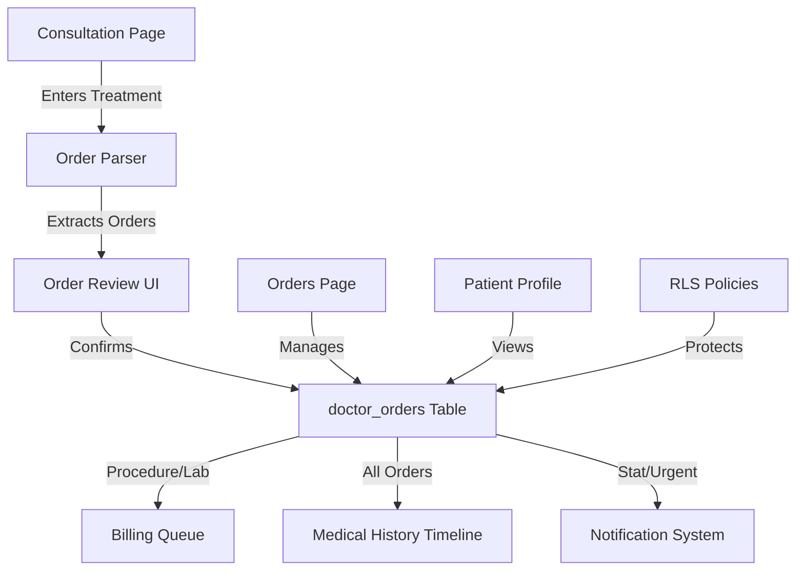

# Design Document: Doctor's Orders Feature

## Overview

The Doctor's Orders feature transforms unstructured treatment instructions from SOAP notes into structured, trackable medical orders. This system extracts orders from the `soap_treatment` field in consultations, stores them in a dedicated `doctor_orders` table, and integrates them into the medical history timeline for complete patient care documentation.

### Key Design Decisions

1. **Non-Invasive Extraction**: The system reads from `soap_treatment` without modifying existing consultation workflows
2. **Opt-In Review**: Physicians review and confirm extracted orders before database persistence
3. **Three Access Points**: Orders accessible via integrated consultation view, dedicated Orders page, and patient profile tabs
4. **Billing Integration**: Procedure and lab test orders automatically flow to billing queue
5. **Immutable Audit Trail**: Orders cannot be deleted or modified after creation; corrections require cancellation and new order creation

### Technology Stack

- **Frontend**: React with existing component patterns (modal-based forms, table views)
- **Backend**: Supabase PostgreSQL with Row Level Security
- **Real-time**: Supabase real-time subscriptions for order status updates
- **Parsing**: Client-side keyword-based parser with regex patterns
- **Notifications**: Integration with existing NotificationContext

## Architecture

### System Components



### Data Flow

1. **Order Creation Flow**:
   - Physician enters treatment text in SOAP note
   - Parser identifies order patterns in real-time
   - UI displays extracted orders for review
   - Physician confirms, edits, or removes orders
   - On consultation save, orders persist to database
   - Triggers fire for billing queue and notifications

2. **Order Management Flow**:
   - Care team views orders on Orders page
   - Status updates (pending → in_progress → completed)
   - Completed orders record timestamp and user
   - Real-time updates propagate to all viewers

3. **Integration Flow**:
   - Medical history timeline queries orders alongside consultations
   - Billing queue receives procedure/lab orders
   - Notifications dispatch for stat/urgent priorities

## Components and Interfaces

### Database Schema

#### doctor_orders Table

```sql
CREATE TABLE emr.doctor_orders (
  id UUID PRIMARY KEY DEFAULT uuid_generate_v4(),
  appointment_id UUID REFERENCES emr.appointments(id),
  patient_id UUID NOT NULL REFERENCES emr.patients(id) ON DELETE CASCADE,
  order_type TEXT NOT NULL CHECK (order_type IN ('medication', 'procedure', 'lab_test', 'diet', 'activity_restriction')),
  order_details TEXT NOT NULL,
  status TEXT NOT NULL DEFAULT 'pending' CHECK (status IN ('pending', 'in_progress', 'completed', 'cancelled')),
  priority TEXT NOT NULL DEFAULT 'routine' CHECK (priority IN ('routine', 'urgent', 'stat')),
  created_by UUID NOT NULL REFERENCES auth.users(id),
  created_at TIMESTAMP WITH TIME ZONE DEFAULT NOW(),
  completed_by UUID REFERENCES auth.users(id),
  completed_at TIMESTAMP WITH TIME ZONE,
  cancelled_by UUID REFERENCES auth.users(id),
  cancelled_at TIMESTAMP WITH TIME ZONE,
  notes TEXT
);

CREATE INDEX idx_doctor_orders_patient ON emr.doctor_orders(patient_id);
CREATE INDEX idx_doctor_orders_appointment ON emr.doctor_orders(appointment_id);
CREATE INDEX idx_doctor_orders_status ON emr.doctor_orders(status);
CREATE INDEX idx_doctor_orders_priority ON emr.doctor_orders(priority);
CREATE INDEX idx_doctor_orders_type ON emr.doctor_orders(order_type);
CREATE INDEX idx_doctor_orders_created_at ON emr.doctor_orders(created_at DESC);
```

#### Billing Queue Integration

Modify existing `billing_queue` table to support order linkage:

```sql
ALTER TABLE emr.billing_queue 
ADD COLUMN order_id UUID REFERENCES emr.doctor_orders(id);

CREATE INDEX idx_billing_queue_order ON emr.billing_queue(order_id);
```

### Frontend Components

#### 1. OrderParser Utility

**Location**: `src/utils/orderParser.js`

**Responsibilities**:
- Parse treatment text for order patterns
- Classify orders by type
- Extract priority indicators
- Format orders for display

**Interface**:
```javascript
export function parseOrders(treatmentText) {
  // Returns: Array<{type, details, priority, confidence}>
}

export function formatOrder(order) {
  // Returns: string (human-readable format)
}
```

#### 2. OrderReviewPanel Component

**Location**: `src/components/OrderReviewPanel.jsx`

**Props**:
```javascript
{
  orders: Array<Order>,
  onConfirm: (orders) => void,
  onEdit: (index, order) => void,
  onRemove: (index) => void,
  onAdd: () => void
}
```

**Features**:
- Display extracted orders in editable list
- Allow priority adjustment
- Support manual order addition
- Validate order completeness

#### 3. OrdersPage Component

**Location**: `src/pages/Orders.jsx`

**Features**:
- Filterable table view (status, priority, type, date range)
- Search by patient name or order details
- Status update controls
- Export to CSV
- Real-time updates via Supabase subscription

#### 4. PatientOrdersTab Component

**Location**: `src/components/PatientOrdersTab.jsx`

**Props**:
```javascript
{
  patientId: UUID,
  onAddOrder: () => void
}
```

**Features**:
- Grouped by status (pending, in_progress, completed, cancelled)
- Reverse chronological within groups
- Quick add order button
- Link to source consultation

#### 5. MedicalHistoryTimeline Enhancement

**Location**: `src/components/MedicalHistoryTimeline.jsx`

**Modifications**:
- Query `doctor_orders` table alongside existing data
- Render order entries with type-specific icons
- Support filtering by order type
- Display order status and priority

### API Layer

#### Database Service Extensions

**Location**: `src/lib/supabase.js`

**New Methods**:
```javascript
// Create orders
async createOrders(orders) {
  // Batch insert orders
  // Trigger billing queue entries for procedures/labs
  // Send notifications for stat/urgent
}

// Query orders
async getOrdersByPatient(patientId, filters = {}) {
  // Support status, type, priority, date range filters
}

async getOrdersByAppointment(appointmentId) {
  // Get all orders for a consultation
}

async getAllOrders(filters = {}) {
  // For Orders page with pagination
}

// Update orders
async updateOrderStatus(orderId, status, userId) {
  // Enforce status transition rules
  // Record completed_by/completed_at or cancelled_by/cancelled_at
}

// Search orders
async searchOrders(searchTerm, filters = {}) {
  // Full-text search on order_details
}
```

### Database Triggers

#### 1. Billing Queue Trigger

```sql
CREATE OR REPLACE FUNCTION emr.add_order_to_billing_queue()
RETURNS TRIGGER AS $$
BEGIN
  IF NEW.order_type IN ('procedure', 'lab_test') AND NEW.status = 'pending' THEN
    INSERT INTO emr.billing_queue (
      patient_id,
      doctor_id,
      consultation_id,
      order_id,
      completed_at
    )
    SELECT 
      NEW.patient_id,
      a.doctor_id,
      a.id,
      NEW.id,
      NOW()
    FROM emr.appointments a
    WHERE a.id = NEW.appointment_id;
  END IF;
  RETURN NEW;
END;
$$ LANGUAGE plpgsql;

CREATE TRIGGER trigger_add_order_to_billing
  AFTER INSERT ON emr.doctor_orders
  FOR EACH ROW
  EXECUTE FUNCTION emr.add_order_to_billing_queue();
```

#### 2. Notification Trigger

```sql
CREATE OR REPLACE FUNCTION emr.notify_urgent_order()
RETURNS TRIGGER AS $$
DECLARE
  patient_name TEXT;
BEGIN
  IF NEW.priority IN ('stat', 'urgent') THEN
    SELECT first_name || ' ' || last_name INTO patient_name
    FROM emr.patients WHERE id = NEW.patient_id;
    
    -- Insert notifications for relevant roles
    INSERT INTO emr.notifications (user_id, type, title, message, icon, color, link)
    SELECT 
      up.id,
      'order',
      CASE WHEN NEW.priority = 'stat' THEN 'STAT Order' ELSE 'Urgent Order' END,
      patient_name || ' - ' || NEW.order_type || ': ' || LEFT(NEW.order_details, 100),
      'AlertCircle',
      CASE WHEN NEW.priority = 'stat' THEN 'bg-red-50 text-red-600' ELSE 'bg-orange-50 text-orange-600' END,
      '/orders'
    FROM emr.user_profiles up
    WHERE up.role IN ('doctor', 'receptionist')
      AND up.status = 'Active';
  END IF;
  RETURN NEW;
END;
$$ LANGUAGE plpgsql;

CREATE TRIGGER trigger_notify_urgent_order
  AFTER INSERT ON emr.doctor_orders
  FOR EACH ROW
  EXECUTE FUNCTION emr.notify_urgent_order();
```

#### 3. Cancelled Order Billing Cleanup

```sql
CREATE OR REPLACE FUNCTION emr.remove_cancelled_order_from_billing()
RETURNS TRIGGER AS $$
BEGIN
  IF NEW.status = 'cancelled' AND OLD.status != 'cancelled' THEN
    DELETE FROM emr.billing_queue WHERE order_id = NEW.id;
  END IF;
  RETURN NEW;
END;
$$ LANGUAGE plpgsql;

CREATE TRIGGER trigger_remove_cancelled_order
  AFTER UPDATE ON emr.doctor_orders
  FOR EACH ROW
  EXECUTE FUNCTION emr.remove_cancelled_order_from_billing();
```

## Data Models

### Order Entity

```typescript
interface Order {
  id: string;                    // UUID
  appointment_id?: string;       // UUID, optional for standalone orders
  patient_id: string;            // UUID, required
  order_type: 'medication' | 'procedure' | 'lab_test' | 'diet' | 'activity_restriction';
  order_details: string;         // Free text description
  status: 'pending' | 'in_progress' | 'completed' | 'cancelled';
  priority: 'routine' | 'urgent' | 'stat';
  created_by: string;            // UUID of physician
  created_at: Date;
  completed_by?: string;         // UUID of completing user
  completed_at?: Date;
  cancelled_by?: string;         // UUID of cancelling user
  cancelled_at?: Date;
  notes?: string;                // Additional notes
}
```

### Parsed Order (Intermediate)

```typescript
interface ParsedOrder {
  type: OrderType;
  details: string;
  priority: Priority;
  confidence: number;            // 0-1, parser confidence score
  sourceText: string;            // Original text snippet
}
```

### Order Filter

```typescript
interface OrderFilter {
  status?: OrderStatus[];
  priority?: Priority[];
  orderType?: OrderType[];
  patientId?: string;
  createdBy?: string;
  dateRange?: {
    start: Date;
    end: Date;
  };
  searchTerm?: string;
}
```

## Correctness Properties

*A property is a characteristic or behavior that should hold true across all valid executions of a system—essentially, a formal statement about what the system should do. Properties serve as the bridge between human-readable specifications and machine-verifiable correctness guarantees.*

