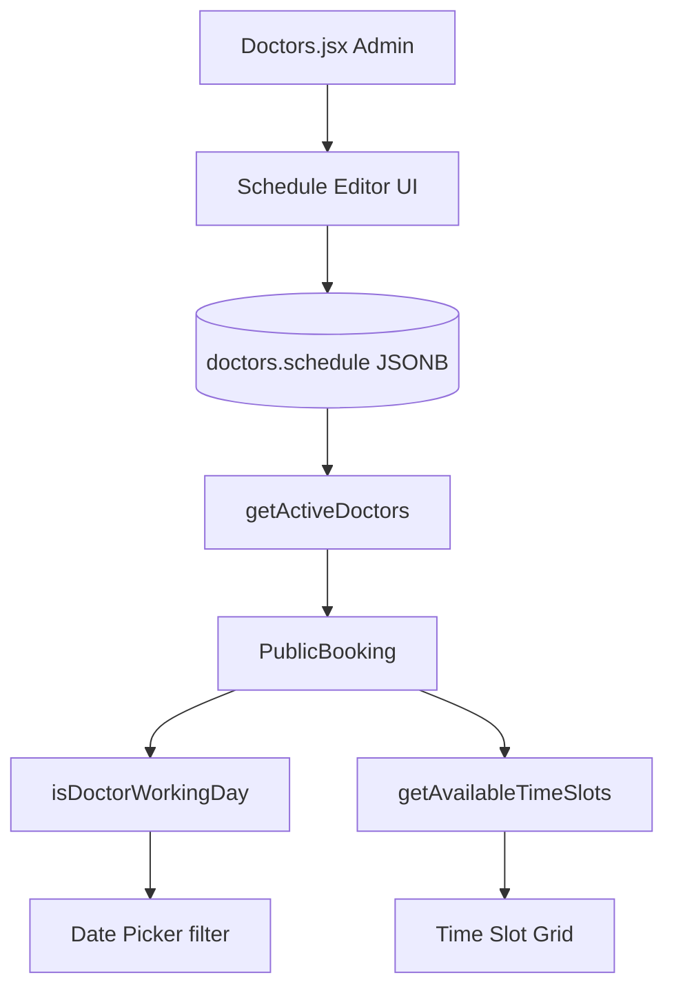

# Design Document: Doctor Schedule Booking

## Overview

Per-doctor schedules are stored as a JSONB column in the `doctors` table. The online booking page reads the schedule from the selected doctor record to filter the date picker and generate time slots within working hours. Admins edit schedules from the Doctors module using a day-toggle UI. No static config file is used — the database is the single source of truth.

## Architecture



## Component Interaction

```
PublicBooking.jsx
│
├── loadDoctors()
│     └── db.getActiveDoctors()          → doctors[] with schedule field
│
├── onDoctorChange(doctor)
│     ├── setSelectedDoctor(doctor)
│     ├── setSelectedDate('')             ← clear date
│     └── setSelectedTime('')            ← clear time
│
├── onDateChange(date)
│     ├── isDoctorWorkingDay(schedule, date)
│     │     ├── true  → loadTimeSlots()
│     │     └── false → show non-working day message (no network call)
│     └── setSelectedTime('')
│
└── loadTimeSlots()
      └── db.getAvailableTimeSlots(doctorId, date, schedule)
            ├── look up schedule[dayOfWeek] → { start, end }
            ├── generate 20-min slots in [start, end)
            └── filter out booked + past slots

Doctors.jsx (admin)
│
├── handleEdit(doctor)
│     └── deserialize doctor.schedule JSONB → scheduleUI state
│
├── ScheduleEditor
│     ├── 7 day checkboxes (Sun–Sat)
│     └── per-day start/end hour dropdowns (0–23)
│
└── handleSubmit()
      └── serialize scheduleUI → JSONB → save to doctors table
```

## Data Models

### Schedule JSONB Format

Keys are day-of-week index strings (`"0"` = Sunday … `"6"` = Saturday). Values are `{ start: number, end: number }` where both are 24-hour integers and `end` is exclusive.

```json
{
  "1": { "start": 10, "end": 17 },
  "2": { "start": 10, "end": 17 },
  "3": { "start": 10, "end": 17 },
  "5": { "start": 10, "end": 17 },
  "6": { "start": 10, "end": 17 }
}
```

### Initial Doctor Schedules

| Doctor | Days | Hours |
|--------|------|-------|
| Dr. Sybil Paz de Leon-Gadon | Mon(1), Tue(2), Wed(3), Fri(5), Sat(6) | 10–17 |
| Dr. Santiago | Tue(2), Fri(5) | 15–17 |
| Dr. Alvarez | Wed(3) | 16–17 |
| Dr. Rodriguez | Thu(4) | 8–17 |

### Schedule UI State (Doctors.jsx internal)

```javascript
// scheduleUI: array of 7 entries, index = day of week
[
  { enabled: false, start: 8, end: 17 },  // 0 = Sun
  { enabled: true,  start: 10, end: 17 }, // 1 = Mon
  // ...
]
```

## Database Migration

```sql
-- Idempotent: add schedule column if it doesn't exist
ALTER TABLE doctors
  ADD COLUMN IF NOT EXISTS schedule JSONB DEFAULT NULL;

-- Seed schedules for the 4 doctors by last name match
-- (Run after confirming doctor names in the database)

UPDATE doctors
SET schedule = '{"1":{"start":10,"end":17},"2":{"start":10,"end":17},"3":{"start":10,"end":17},"5":{"start":10,"end":17},"6":{"start":10,"end":17}}'::jsonb
WHERE last_name ILIKE '%de leon%' OR last_name ILIKE '%gadon%';

UPDATE doctors
SET schedule = '{"2":{"start":15,"end":17},"5":{"start":15,"end":17}}'::jsonb
WHERE last_name ILIKE 'santiago';

UPDATE doctors
SET schedule = '{"3":{"start":16,"end":17}}'::jsonb
WHERE last_name ILIKE 'alvarez';

UPDATE doctors
SET schedule = '{"4":{"start":8,"end":17}}'::jsonb
WHERE last_name ILIKE 'rodriguez';
```

## Key Functions

### `isDoctorWorkingDay(schedule, date)` — pure exported helper

```javascript
// supabase.js (exported, not inside db object)
export function isDoctorWorkingDay(schedule, date) {
  if (!schedule || !date) return false
  const dayIndex = String(new Date(date + 'T00:00:00').getDay())
  return Object.prototype.hasOwnProperty.call(schedule, dayIndex)
}
```

**Preconditions:**
- `schedule` is a plain object or null/undefined
- `date` is an ISO date string `"YYYY-MM-DD"`

**Postconditions:**
- Returns `false` for any day index not present as a key in `schedule`
- Returns `false` when `schedule` is null/undefined
- No side effects

### `getActiveDoctors()` — updated SELECT

```javascript
async getActiveDoctors() {
  const { data, error } = await supabase
    .from('doctors')
    .select('id, first_name, last_name, specialization, license_number, schedule')
    .eq('status', 'Active')
    .order('last_name')
  if (error) throw error
  return data || []
}
```

### `getAvailableTimeSlots(doctorId, date, schedule)` — updated signature

```javascript
async getAvailableTimeSlots(doctorId, date, schedule) {
  // 1. Determine working hours from schedule
  const dayIndex = String(new Date(date + 'T00:00:00').getDay())
  const daySchedule = schedule?.[dayIndex]

  // Non-working day or null schedule → empty array
  if (!daySchedule) return []

  const { start, end } = daySchedule

  // 2. Fetch booked slots
  const { data: appointments, error } = await supabase
    .from('appointments')
    .select('appointment_time')
    .eq('doctor_id', doctorId)
    .eq('appointment_date', date)
    .neq('status', 'Cancelled')
  if (error) throw error

  const bookedTimes = appointments.map(apt => apt.appointment_time)

  // 3. Generate 20-min slots within [start, end)
  const slots = []
  const today = new Date().toISOString().split('T')[0]
  const isToday = date === today
  const now = new Date()
  const currentTimeInMinutes = now.getHours() * 60 + now.getMinutes()

  for (let hour = start; hour < end; hour++) {
    for (const minute of [0, 20, 40]) {
      const timeStr = `${String(hour).padStart(2, '0')}:${String(minute).padStart(2, '0')}`
      const slotTimeInMinutes = hour * 60 + minute
      const isPast = isToday && (slotTimeInMinutes + 20 <= currentTimeInMinutes)
      const isAvailable = !bookedTimes.includes(timeStr) && !isPast
      slots.push({ slot: this.formatTime12Hour(timeStr), time: timeStr, is_available: isAvailable })
    }
  }

  return slots
}
```

**Preconditions:**
- `doctorId` is a valid UUID
- `date` is an ISO date string
- `schedule` is the doctor's schedule object (may be null)

**Postconditions:**
- Returns `[]` when `schedule` is null or `date` is a non-working day
- All returned slots have `time` values within `[start, end)` working hours
- No duplicate slots
- Slot interval is always 20 minutes

## PublicBooking.jsx Changes

### Doctor change handler — clear date and time

```javascript
const handleDoctorSelect = (doctor) => {
  setSelectedDoctor(doctor)
  setSelectedDate('')       // clear date
  setSelectedTime('')       // clear time
  setTimeSlots([])
  setNonWorkingDayMsg('')
}
```

### Date change handler — immediate non-working day check

```javascript
const handleDateChange = (date) => {
  setSelectedDate(date)
  setSelectedTime('')
  setTimeSlots([])

  if (!date || !selectedDoctor) return

  if (!isDoctorWorkingDay(selectedDoctor.schedule, date)) {
    const dayName = new Date(date + 'T00:00:00')
      .toLocaleDateString('en-US', { weekday: 'long' })
    setNonWorkingDayMsg(
      `Dr. ${selectedDoctor.first_name} ${selectedDoctor.last_name} is not available on ${dayName}. Please select a different date.`
    )
  } else {
    setNonWorkingDayMsg('')
    loadTimeSlots(date)
  }
}
```

### loadTimeSlots — pass schedule

```javascript
const loadTimeSlots = async (date) => {
  try {
    setLoading(true)
    const slots = await db.getAvailableTimeSlots(
      selectedDoctor.id,
      date,
      selectedDoctor.schedule   // ← pass schedule
    )
    setTimeSlots(slots || [])
    if (slots.length > 0 && slots.every(s => !s.is_available)) {
      setAllBookedMsg('No available slots for this date. All slots are fully booked.')
    } else {
      setAllBookedMsg('')
    }
  } catch (error) {
    console.error('Error loading time slots:', error)
  } finally {
    setLoading(false)
  }
}
```

### Null schedule fallback

When `selectedDoctor.schedule` is null, `isDoctorWorkingDay` returns false for Saturday (6) and Sunday (0), and true for Mon–Fri. This is implemented inside `isDoctorWorkingDay`:

```javascript
export function isDoctorWorkingDay(schedule, date) {
  const dayIndex = new Date(date + 'T00:00:00').getDay()
  if (!schedule) {
    // Fallback: Mon–Fri only
    return dayIndex >= 1 && dayIndex <= 5
  }
  return Object.prototype.hasOwnProperty.call(schedule, String(dayIndex))
}
```

## Doctors.jsx Schedule Editor UI

Replace the plain text `schedule` input with a structured editor. The `formData.schedule` field changes from a string to an object.

### Schedule serialization helpers

```javascript
// Convert JSONB object → UI array of 7 days
function deserializeSchedule(jsonb) {
  return Array.from({ length: 7 }, (_, i) => {
    const day = jsonb?.[String(i)]
    return day
      ? { enabled: true, start: day.start, end: day.end }
      : { enabled: false, start: 8, end: 17 }
  })
}

// Convert UI array → JSONB object (only enabled days)
function serializeSchedule(uiSchedule) {
  const result = {}
  uiSchedule.forEach((day, i) => {
    if (day.enabled) result[String(i)] = { start: day.start, end: day.end }
  })
  return Object.keys(result).length > 0 ? result : null
}
```

### Schedule editor component (inline in Doctors.jsx modal)

```jsx
const DAY_NAMES = ['Sun', 'Mon', 'Tue', 'Wed', 'Thu', 'Fri', 'Sat']
const HOURS = Array.from({ length: 24 }, (_, i) => i)

// scheduleUI: array[7] of { enabled, start, end }
// setScheduleUI: state setter

{DAY_NAMES.map((name, i) => (
  <div key={i} className="flex items-center gap-3 py-2">
    <input
      type="checkbox"
      checked={scheduleUI[i].enabled}
      onChange={(e) => {
        const updated = [...scheduleUI]
        updated[i] = { ...updated[i], enabled: e.target.checked }
        setScheduleUI(updated)
      }}
    />
    <span className="w-10 text-sm font-medium">{name}</span>
    {scheduleUI[i].enabled && (
      <>
        <select
          value={scheduleUI[i].start}
          onChange={(e) => {
            const updated = [...scheduleUI]
            updated[i] = { ...updated[i], start: Number(e.target.value) }
            setScheduleUI(updated)
          }}
        >
          {HOURS.map(h => <option key={h} value={h}>{h}:00</option>)}
        </select>
        <span className="text-sm">to</span>
        <select
          value={scheduleUI[i].end}
          onChange={(e) => {
            const updated = [...scheduleUI]
            updated[i] = { ...updated[i], end: Number(e.target.value) }
            setScheduleUI(updated)
          }}
        >
          {HOURS.map(h => <option key={h} value={h}>{h}:00</option>)}
        </select>
      </>
    )}
  </div>
))}
```

On `handleSubmit`, serialize before saving:

```javascript
const dataToSave = {
  ...formData,
  schedule: serializeSchedule(scheduleUI),
  consultation_fee: formData.consultation_fee === '' ? null : parseFloat(formData.consultation_fee)
}
```

On `handleEdit`, deserialize on load:

```javascript
setScheduleUI(deserializeSchedule(doctor.schedule))
```

On `closeModal`, reset:

```javascript
setScheduleUI(deserializeSchedule(null)) // all days off
```

## Error Handling

| Scenario | Handling |
|----------|----------|
| `schedule` is null | `isDoctorWorkingDay` falls back to Mon–Fri; `getAvailableTimeSlots` returns `[]` |
| Non-working day selected | Immediate message shown, no network call made |
| Working day but all slots booked | "No available slots for this date. All slots are fully booked." |
| Working day with available slots | No message shown |
| Doctor changed | Date and time cleared, message cleared |

## Correctness Properties

These properties must hold for all valid inputs:

1. `isDoctorWorkingDay` returns `false` for any day index not present as a key in `schedule`
   - For all `schedule` objects and all `date` strings: if `String(dayOfWeek(date))` is not a key in `schedule`, then `isDoctorWorkingDay(schedule, date) === false`

2. `getAvailableTimeSlots` returns an empty array for non-working days
   - For all `(doctorId, date, schedule)` where `isDoctorWorkingDay(schedule, date) === false`: `getAvailableTimeSlots(doctorId, date, schedule)` returns `[]`

3. All generated slots fall within `[start, end)` working hours
   - For all returned slots `s`: `start <= hourOf(s.time) < end` where `{ start, end } = schedule[dayOfWeek(date)]`

4. No duplicate slots generated
   - For all returned slot arrays: all `s.time` values are unique

5. Slot interval is always 20 minutes
   - For all consecutive slots `s[i]` and `s[i+1]`: `minutesOf(s[i+1].time) - minutesOf(s[i].time) === 20` (mod 60 within the same hour)

## Testing Strategy

### Unit tests

- `isDoctorWorkingDay(schedule, date)` with working day, non-working day, null schedule, weekend fallback
- `serializeSchedule` / `deserializeSchedule` round-trip
- Slot generation: correct count for a 1-hour window (3 slots), 7-hour window (21 slots)

### Property-based tests (fast-check)

```javascript
// Property 1: non-working day → empty slots
fc.assert(fc.property(
  fc.record({ start: fc.integer(0,23), end: fc.integer(0,23) }),
  fc.constantFrom('2025-01-05', '2025-01-06'), // Sun, Sat
  (daySchedule, date) => {
    const schedule = { '1': daySchedule } // only Monday
    return getAvailableTimeSlotsSync(schedule, date).length === 0
  }
))

// Property 2: all slots within working hours
fc.assert(fc.property(
  fc.integer({ min: 0, max: 22 }),
  fc.integer({ min: 1, max: 23 }),
  (start, offset) => {
    const end = start + offset
    const schedule = { '1': { start, end } }
    const slots = getAvailableTimeSlotsSync(schedule, '2025-01-06') // Monday
    return slots.every(s => {
      const h = parseInt(s.time.split(':')[0])
      return h >= start && h < end
    })
  }
))

// Property 3: no duplicate slots
fc.assert(fc.property(
  fc.integer({ min: 0, max: 20 }),
  fc.integer({ min: 1, max: 3 }),
  (start, hours) => {
    const schedule = { '1': { start, end: start + hours } }
    const slots = getAvailableTimeSlotsSync(schedule, '2025-01-06')
    const times = slots.map(s => s.time)
    return new Set(times).size === times.length
  }
))
```

### Integration tests

- Admin saves schedule via Doctors.jsx → verify JSONB stored correctly in Supabase
- PublicBooking loads doctor → date picker blocks non-working days → time slots match working hours
