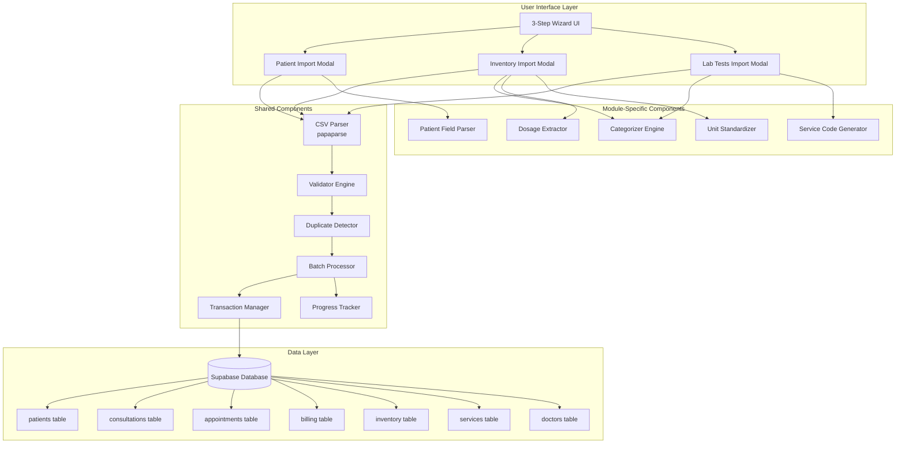
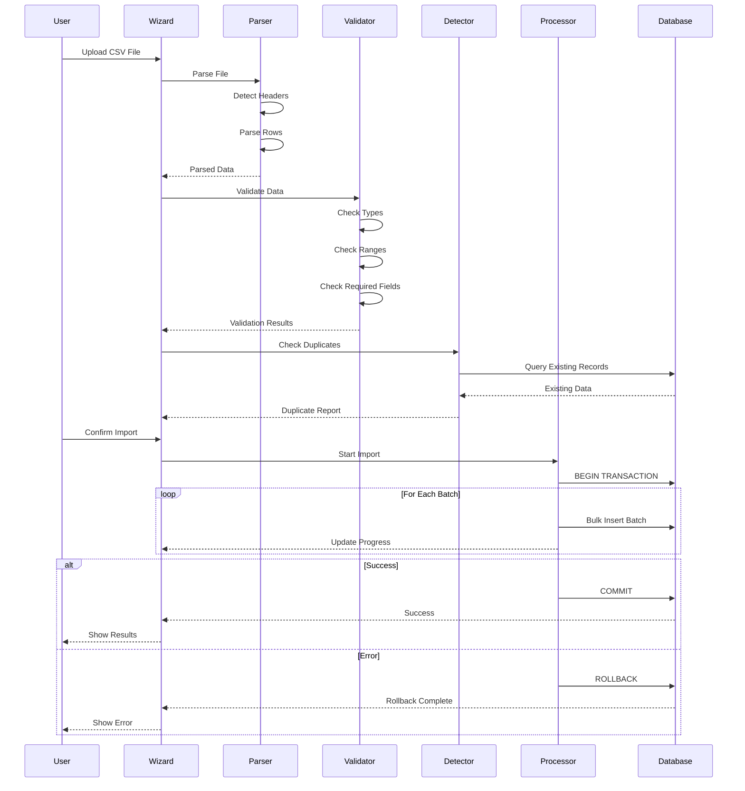
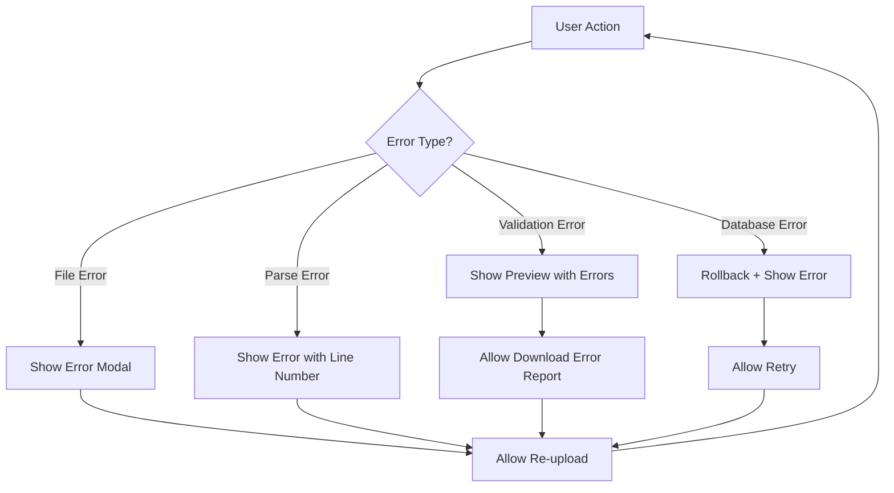

# Design Document: Intelligent CSV Import System

## Overview

The Intelligent CSV Import System provides three specialized import modules for the RCMC EMR application: Patient Data Import, Inventory & Services Import, and Laboratory Tests Import. Each module enables bulk data import from Google Sheets CSV exports through a consistent 3-step wizard interface with automatic parsing, intelligent categorization, validation, and transactional batch processing.

### System Goals

- Enable efficient bulk data migration from Google Sheets to the EMR database
- Provide intelligent field parsing and automatic categorization to minimize manual data entry
- Ensure data integrity through comprehensive validation and transactional imports
- Deliver a consistent, user-friendly import experience across all three modules
- Maintain high performance for datasets up to 200 rows

### Key Features

1. **Three Independent Import Modules**: Patient Data, Inventory & Services, Laboratory Tests
2. **Unified 3-Step Wizard**: Upload → Preview & Validate → Import Progress & Results
3. **Intelligent Parsing**: Automatic field extraction (Age/Sex, dosages, doctor names)
4. **Smart Categorization**: 3-way inventory classification, 15-category lab test organization
5. **Comprehensive Validation**: Type checking, range validation, required field enforcement
6. **Duplicate Detection**: Intelligent matching with user-controlled resolution
7. **Transactional Imports**: Atomic operations with automatic rollback on errors
8. **Batch Processing**: Optimized bulk inserts with real-time progress tracking
9. **Error Recovery**: Detailed error reporting with downloadable error logs


## Architecture

### System Architecture Diagram



### Architecture Principles

1. **Separation of Concerns**: Each module operates independently with shared component library
2. **Reusability**: Common components (CSV Parser, Validator, Batch Processor) used across all modules
3. **Transaction Safety**: All imports wrapped in database transactions with rollback capability
4. **Progressive Enhancement**: Wizard UI guides users through validation before committing changes
5. **Error Isolation**: Module failures don't affect other modules or existing data


### Data Flow Architecture



### Component Integration

The system integrates with existing EMR components:

- **Supabase Client** (`lib/supabase.js`): Database operations and transactions
- **NotificationContext** (`context/NotificationContext.jsx`): Success/error notifications
- **Export Service** (`services/exportService.js`): CSV generation pattern reference
- **Existing Pages**: Patient, Inventory, Services pages host import modals


## Components and Interfaces

### 1. Wizard UI Component

**Purpose**: Provides consistent 3-step import interface across all modules

**Interface**:
```typescript
interface WizardUIProps {
  steps: WizardStep[]
  currentStep: number
  onStepChange: (step: number) => void
  canProgress: boolean
  onComplete: () => void
}

interface WizardStep {
  id: string
  title: string
  description: string
  component: React.ComponentType
  isValid: boolean
}
```

**Responsibilities**:
- Render step indicators and navigation
- Manage step progression logic
- Disable navigation when validation fails
- Display loading states during operations
- Integrate with NotificationContext for alerts

**Implementation Notes**:
- Uses Tailwind CSS for styling consistency
- Responsive design (min-width: 375px)
- Touch-friendly buttons (44x44px minimum)
- Prevents back navigation after import starts

---

### 2. CSV Parser Component

**Purpose**: Parse CSV/Excel files using papaparse library

**Interface**:
```typescript
interface CSVParserConfig {
  file: File
  onComplete: (result: ParseResult) => void
  onError: (error: ParseError) => void
}

interface ParseResult {
  data: Record<string, any>[]
  headers: string[]
  rowCount: number
  errors: ParseError[]
}

interface ParseError {
  row: number
  message: string
  code: string
}
```

**Responsibilities**:
- Parse CSV/Excel files with papaparse
- Auto-detect column headers from first row
- Trim whitespace from all cell values
- Handle UTF-8 encoding for special characters
- Support comma and semicolon delimiters
- Handle quoted fields containing commas
- Return descriptive errors with line numbers

**Configuration**:
```javascript
{
  header: true,              // Auto-detect headers
  skipEmptyLines: true,      // Ignore blank rows
  dynamicTyping: true,       // Auto-convert numbers
  trimHeaders: true,         // Trim header whitespace
  transformHeader: (h) => h.trim(),
  transform: (value) => typeof value === 'string' ? value.trim() : value
}
```


---

### 3. Validation Engine

**Purpose**: Validate imported data against business rules and data types

**Interface**:
```typescript
interface ValidationRule {
  field: string
  type: 'required' | 'type' | 'range' | 'format' | 'custom'
  validator: (value: any, row: Record<string, any>) => ValidationResult
  message: string
}

interface ValidationResult {
  isValid: boolean
  errors: ValidationError[]
}

interface ValidationError {
  row: number
  field: string
  value: any
  message: string
  type: 'missing' | 'invalid_type' | 'out_of_range' | 'invalid_format'
}
```

**Validation Rules by Module**:

**Patient Import**:
- `patient_name`: Required, string, non-empty
- `age_sex`: Required, format "[number]/[M|F]"
- `doctor_name`: Required, must match existing doctor
- `consultation_date`: Required, valid date
- `discount`: Optional, number >= 0
- `payment`: Optional, number >= 0

**Inventory Import**:
- `item_name`: Required, string, non-empty
- `price`: Required, number > 0
- `unit`: Optional, string
- `stock`: Optional, integer >= 0

**Lab Tests Import**:
- `test_name`: Required, string, non-empty
- `price`: Required, number > 0
- `category`: Optional, string
- `turnaround_time`: Optional, string

**Responsibilities**:
- Execute validation rules on each row
- Collect all validation errors
- Group errors by type for reporting
- Provide row-level error details
- Support custom validation functions


---

### 4. Duplicate Detector

**Purpose**: Identify existing records to prevent duplicates

**Interface**:
```typescript
interface DuplicateDetectorConfig {
  data: Record<string, any>[]
  matchFields: string[]
  tableName: string
  onComplete: (result: DuplicateResult) => void
}

interface DuplicateResult {
  duplicates: DuplicateMatch[]
  uniqueRecords: Record<string, any>[]
}

interface DuplicateMatch {
  importRow: Record<string, any>
  existingRecord: Record<string, any>
  matchFields: string[]
  resolution: 'skip' | 'update' | 'create_new' | 'pending'
}
```

**Matching Strategies by Module**:

**Patient Import**:
- Match on: `first_name + last_name + date_of_birth` (case-insensitive)
- Fuzzy matching for name variations
- Date normalization for DOB comparison

**Inventory Import**:
- Match on: `item_name` (case-insensitive, trimmed)
- Normalize whitespace and special characters

**Lab Tests Import**:
- Match on: `test_name` (case-insensitive, trimmed)
- Handle alternative names separated by "/"

**Responsibilities**:
- Query database for potential matches
- Apply matching logic per module
- Present duplicates to user with options
- Track user resolution choices
- Filter data based on resolution

**Performance Optimization**:
- Batch database queries (max 50 at a time)
- Use database indexes for matching fields
- Cache query results during session
- Complete duplicate check within 3 seconds for 100 records


---

### 5. Batch Processor

**Purpose**: Handle bulk database inserts with optimization and progress tracking

**Interface**:
```typescript
interface BatchProcessorConfig {
  data: Record<string, any>[]
  batchSize: number
  insertFunction: (batch: Record<string, any>[]) => Promise<void>
  onProgress: (progress: BatchProgress) => void
  onComplete: (result: BatchResult) => void
  onError: (error: Error) => void
}

interface BatchProgress {
  currentBatch: number
  totalBatches: number
  processedRecords: number
  totalRecords: number
  percentage: number
  status: string
}

interface BatchResult {
  totalProcessed: number
  successful: number
  failed: number
  duration: number
  errors: BatchError[]
}

interface BatchError {
  row: number
  data: Record<string, any>
  error: string
}
```

**Responsibilities**:
- Split data into batches of 50 records
- Execute batch inserts sequentially
- Update progress after each batch
- Collect and report errors
- Measure import duration
- Use Supabase bulk insert methods

**Performance Targets**:
- 100 records: ≤ 10 seconds
- 200 records: ≤ 20 seconds
- Progress updates: ≥ 1 per second
- No UI freezing during import

**Error Handling**:
- Catch batch-level errors
- Trigger transaction rollback on any error
- Preserve error details for reporting
- Maintain database consistency


---

### 6. Transaction Manager

**Purpose**: Ensure atomic imports with rollback capability

**Interface**:
```typescript
interface TransactionManager {
  begin(): Promise<void>
  commit(): Promise<void>
  rollback(): Promise<void>
  execute<T>(operation: () => Promise<T>): Promise<T>
}

interface TransactionContext {
  id: string
  startTime: Date
  operations: TransactionOperation[]
  status: 'pending' | 'committed' | 'rolled_back'
}

interface TransactionOperation {
  type: 'insert' | 'update' | 'delete'
  table: string
  recordCount: number
  timestamp: Date
}
```

**Responsibilities**:
- Begin database transaction before import
- Track all operations within transaction
- Commit transaction on successful completion
- Rollback transaction on any error
- Log transaction operations for audit
- Ensure database returns to pre-import state on rollback

**Implementation Strategy**:
```javascript
// Supabase doesn't support explicit transactions in client
// Use RPC function for server-side transaction handling
async function executeImportTransaction(data, importType) {
  const { data: result, error } = await supabase.rpc('import_data_transaction', {
    import_data: data,
    import_type: importType
  })
  
  if (error) throw error
  return result
}
```

**Alternative Approach** (if RPC not available):
- Use application-level transaction simulation
- Track inserted IDs for manual rollback
- Delete inserted records on error
- Restore updated records to previous state


---

### 7. Progress Tracker

**Purpose**: Display real-time import progress and statistics

**Interface**:
```typescript
interface ProgressTracker {
  start(totalRecords: number): void
  update(processedRecords: number, status: string): void
  complete(result: ImportResult): void
  error(error: Error): void
}

interface ImportResult {
  totalRecords: number
  successful: number
  skipped: number
  failed: number
  duration: number
  categoryBreakdown?: CategoryBreakdown
  timestamp: Date
  userId: string
}

interface CategoryBreakdown {
  [category: string]: number
}
```

**UI Components**:
- Progress bar (0-100%)
- Status text ("Importing patients: 45/100")
- Real-time percentage display
- Estimated time remaining
- Category breakdown (for inventory/lab imports)

**Responsibilities**:
- Calculate and display progress percentage
- Update UI without blocking
- Show current operation status
- Display final results summary
- Provide export buttons for results/errors


---

### 8. Patient Field Parser

**Purpose**: Parse complex patient data fields (Age/Sex, doctor names, discounts, payments)

**Interface**:
```typescript
interface PatientFieldParser {
  parseAgeSex(value: string): { age: number; sex: string } | null
  parseDoctorName(name: string, doctors: Doctor[]): Doctor | null
  parseDiscount(value: string | number): number
  parsePayment(value: string | number): number
}

interface Doctor {
  id: string
  first_name: string
  last_name: string
  full_name: string
}
```

**Parsing Logic**:

**Age/Sex Parser**:
```javascript
function parseAgeSex(value) {
  // Pattern: "25/M", "30/F", "45 / M"
  const pattern = /^(\d+)\s*\/\s*([MF])$/i
  const match = value.trim().match(pattern)
  
  if (!match) return null
  
  return {
    age: parseInt(match[1]),
    sex: match[2].toUpperCase()
  }
}
```

**Doctor Name Parser**:
```javascript
function parseDoctorName(name, doctors) {
  const normalized = name.trim().toLowerCase()
  
  // Try exact match on full name
  let match = doctors.find(d => 
    d.full_name.toLowerCase() === normalized
  )
  
  // Try last name match
  if (!match) {
    match = doctors.find(d => 
      d.last_name.toLowerCase() === normalized
    )
  }
  
  // Try fuzzy match (Levenshtein distance)
  if (!match) {
    match = findClosestMatch(normalized, doctors)
  }
  
  return match
}
```

**Discount Parser**:
```javascript
function parseDiscount(value) {
  if (typeof value === 'number') return value
  
  const str = value.toString().trim()
  
  // Handle percentage: "20%"
  if (str.endsWith('%')) {
    return parseFloat(str.slice(0, -1))
  }
  
  // Handle fixed amount: "100", "₱100"
  return parseFloat(str.replace(/[₱,]/g, ''))
}
```


---

### 9. Categorizer Engine

**Purpose**: Automatically classify items into appropriate categories

**Interface**:
```typescript
interface Categorizer {
  categorizeInventoryItem(item: InventoryItem): ItemCategory
  categorizeLabTest(test: LabTest): LabCategory
}

type ItemCategory = 'Services' | 'Medicines' | 'Medical_Supplies'

type LabCategory = 
  | 'Hematology' | 'Clinical_Chemistry' | 'Serology' 
  | 'Microbiology' | 'Urinalysis' | 'Fecalysis'
  | 'Immunology' | 'Toxicology' | 'Molecular_Diagnostics'
  | 'Histopathology' | 'Cytology' | 'Blood_Banking'
  | 'Coagulation_Studies' | 'Endocrinology' | 'Special_Tests'
```

**Inventory Categorization Logic**:

```javascript
function categorizeInventoryItem(item) {
  const name = item.name.toLowerCase()
  const price = parseFloat(item.price)
  const unit = (item.unit || '').toLowerCase()
  
  // Services keywords
  const serviceKeywords = [
    'consultation', 'procedure', 'examination', 
    'test', 'screening', 'therapy', 'checkup'
  ]
  
  // Medicines keywords
  const medicineKeywords = [
    'tablet', 'capsule', 'syrup', 'injection',
    'mg', 'ml', 'suspension', 'ointment', 'cream',
    'drops', 'inhaler', 'patch', 'suppository'
  ]
  
  // Check for service
  if (serviceKeywords.some(kw => name.includes(kw))) {
    return 'Services'
  }
  
  // Check for medicine
  if (medicineKeywords.some(kw => name.includes(kw))) {
    return 'Medicines'
  }
  
  // Use price and unit as secondary indicators
  if (price > 500 && !unit.includes('box') && !unit.includes('pack')) {
    return 'Services'
  }
  
  if (unit.includes('mg') || unit.includes('ml') || unit.includes('tablet')) {
    return 'Medicines'
  }
  
  // Default to Medical Supplies
  return 'Medical_Supplies'
}
```

**Target Accuracy**: ≥ 95% on provided 180-item dataset


**Lab Test Categorization Logic**:

```javascript
function categorizeLabTest(test) {
  const name = test.name.toLowerCase()
  
  const categoryKeywords = {
    'Hematology': ['cbc', 'hemoglobin', 'hematocrit', 'platelet', 'wbc', 'rbc', 'blood count'],
    'Clinical_Chemistry': ['glucose', 'cholesterol', 'triglyceride', 'creatinine', 'uric acid', 'bun', 'sgpt', 'sgot'],
    'Serology': ['hbsag', 'vdrl', 'hiv', 'dengue', 'typhoid', 'antibody', 'antigen'],
    'Microbiology': ['culture', 'sensitivity', 'gram stain', 'afb', 'koh'],
    'Urinalysis': ['urinalysis', 'urine', 'microscopy'],
    'Fecalysis': ['fecalysis', 'stool', 'fecal', 'occult blood'],
    'Immunology': ['immunoglobulin', 'complement', 'autoantibody', 'rheumatoid'],
    'Toxicology': ['drug test', 'toxicology', 'alcohol', 'substance'],
    'Molecular_Diagnostics': ['pcr', 'dna', 'rna', 'molecular', 'genetic'],
    'Histopathology': ['biopsy', 'histopath', 'tissue', 'frozen section'],
    'Cytology': ['pap smear', 'cytology', 'fnab', 'fine needle'],
    'Blood_Banking': ['blood typing', 'crossmatch', 'blood group', 'rh factor'],
    'Coagulation_Studies': ['pt', 'ptt', 'inr', 'coagulation', 'bleeding time', 'clotting'],
    'Endocrinology': ['thyroid', 'tsh', 't3', 't4', 'hormone', 'cortisol', 'testosterone']
  }
  
  // Find matching category
  for (const [category, keywords] of Object.entries(categoryKeywords)) {
    if (keywords.some(kw => name.includes(kw))) {
      return category
    }
  }
  
  // Default to Special Tests
  return 'Special_Tests'
}
```

**Special Notation Handling**:
- `(each)`: Per-item pricing indicator
- `/`: Alternative test names (e.g., "CBC/Complete Blood Count")
- Package tests: Detect tests that include multiple sub-tests


---

### 10. Dosage Extractor

**Purpose**: Extract dosage information from medicine names

**Interface**:
```typescript
interface DosageExtractor {
  extractDosage(itemName: string): DosageInfo | null
}

interface DosageInfo {
  amount: number
  unit: string
  form: string
  originalName: string
  cleanName: string
}
```

**Extraction Logic**:

```javascript
function extractDosage(itemName) {
  const patterns = [
    // "Amoxicillin 500mg Capsule"
    /(\d+(?:\.\d+)?)\s*(mg|ml|g|mcg|iu|units?)\s*(\w+)?/i,
    
    // "Paracetamol 500 mg"
    /(\d+(?:\.\d+)?)\s+(mg|ml|g|mcg|iu|units?)/i,
    
    // "Vitamin C 1000mg"
    /(\d+(?:\.\d+)?)(mg|ml|g|mcg|iu|units?)/i
  ]
  
  for (const pattern of patterns) {
    const match = itemName.match(pattern)
    if (match) {
      return {
        amount: parseFloat(match[1]),
        unit: match[2].toLowerCase(),
        form: match[3] || detectForm(itemName),
        originalName: itemName,
        cleanName: itemName.replace(match[0], '').trim()
      }
    }
  }
  
  return null
}

function detectForm(itemName) {
  const forms = ['tablet', 'capsule', 'syrup', 'injection', 'ointment', 'cream', 'drops']
  const lower = itemName.toLowerCase()
  
  for (const form of forms) {
    if (lower.includes(form)) {
      return form
    }
  }
  
  return 'unknown'
}
```

**Examples**:
- "Amoxicillin 500mg Capsule" → `{ amount: 500, unit: 'mg', form: 'capsule' }`
- "Paracetamol Syrup 120ml" → `{ amount: 120, unit: 'ml', form: 'syrup' }`
- "Vitamin C 1000mg" → `{ amount: 1000, unit: 'mg', form: 'tablet' }`


---

### 11. Unit Standardizer

**Purpose**: Normalize measurement units to standard formats

**Interface**:
```typescript
interface UnitStandardizer {
  standardize(unit: string): string
  convert(amount: number, fromUnit: string, toUnit: string): number
}
```

**Standardization Rules**:

```javascript
function standardize(unit) {
  const standardUnits = {
    // Weight
    'milligram': 'mg',
    'milligrams': 'mg',
    'gram': 'g',
    'grams': 'g',
    'kilogram': 'kg',
    'kilograms': 'kg',
    'microgram': 'mcg',
    'micrograms': 'mcg',
    
    // Volume
    'milliliter': 'ml',
    'milliliters': 'ml',
    'liter': 'l',
    'liters': 'l',
    
    // Count
    'tablet': 'tablets',
    'capsule': 'capsules',
    'piece': 'pieces',
    'box': 'boxes',
    'bottle': 'bottles',
    'vial': 'vials',
    'ampule': 'ampules',
    'pack': 'packs',
    
    // International Units
    'iu': 'IU',
    'unit': 'units',
    'units': 'units'
  }
  
  const normalized = unit.toLowerCase().trim()
  return standardUnits[normalized] || unit
}
```

**Conversion Support** (optional):
- mg ↔ g ↔ kg
- ml ↔ l
- Maintain precision for medical dosages


---

### 12. Service Code Generator

**Purpose**: Generate unique service codes for laboratory tests

**Interface**:
```typescript
interface ServiceCodeGenerator {
  generate(testName: string, category: LabCategory): string
  isUnique(code: string): Promise<boolean>
}
```

**Generation Logic**:

```javascript
async function generate(testName, category) {
  // Format: LAB-[CATEGORY]-[NUMBER]
  const categoryPrefix = getCategoryPrefix(category)
  
  // Get next available number for this category
  const { data: existing } = await supabase
    .from('services')
    .select('service_code')
    .like('service_code', `LAB-${categoryPrefix}-%`)
    .order('service_code', { ascending: false })
    .limit(1)
  
  let nextNumber = 1
  if (existing && existing.length > 0) {
    const lastCode = existing[0].service_code
    const match = lastCode.match(/LAB-\w+-(\d+)/)
    if (match) {
      nextNumber = parseInt(match[1]) + 1
    }
  }
  
  return `LAB-${categoryPrefix}-${String(nextNumber).padStart(3, '0')}`
}

function getCategoryPrefix(category) {
  const prefixes = {
    'Hematology': 'HEMA',
    'Clinical_Chemistry': 'CHEM',
    'Serology': 'SERO',
    'Microbiology': 'MICRO',
    'Urinalysis': 'URINE',
    'Fecalysis': 'FECAL',
    'Immunology': 'IMMUNO',
    'Toxicology': 'TOX',
    'Molecular_Diagnostics': 'MOLEC',
    'Histopathology': 'HISTO',
    'Cytology': 'CYTO',
    'Blood_Banking': 'BLOOD',
    'Coagulation_Studies': 'COAG',
    'Endocrinology': 'ENDO',
    'Special_Tests': 'SPEC'
  }
  
  return prefixes[category] || 'SPEC'
}
```

**Examples**:
- Hematology test: `LAB-HEMA-001`
- Chemistry test: `LAB-CHEM-015`
- Special test: `LAB-SPEC-003`


## Data Models

### Patient Import Data Model

**CSV Input Format**:
```csv
Patient Name,Age/Sex,Doctor,Consultation Date,Discount,Payment
Juan Dela Cruz,35/M,Dr. Santos,2024-01-15,10%,500
Maria Garcia,28/F,Dr. Reyes,2024-01-15,0,800
```

**Parsed Data Structure**:
```typescript
interface PatientImportRow {
  patient_name: string
  age_sex: string
  doctor_name: string
  consultation_date: string
  discount: string | number
  payment: string | number
}

interface ParsedPatientData {
  // Patient fields
  first_name: string
  middle_name?: string
  last_name: string
  age: number
  sex: 'M' | 'F'
  date_of_birth: Date  // Calculated from age
  
  // Doctor reference
  doctor_id: string
  doctor_name: string
  
  // Consultation fields
  consultation_date: Date
  
  // Billing fields
  discount_amount: number
  discount_percentage: number
  payment_amount: number
  
  // Metadata
  import_row: number
  validation_errors: ValidationError[]
}
```

**Database Mapping**:
```typescript
// Creates records in 4 tables:
interface PatientImportResult {
  patient: {
    table: 'patients',
    fields: ['first_name', 'last_name', 'date_of_birth', 'gender', 'contact_number', 'address']
  },
  appointment: {
    table: 'appointments',
    fields: ['patient_id', 'doctor_id', 'appointment_date', 'status']
  },
  consultation: {
    table: 'consultations',
    fields: ['patient_id', 'doctor_id', 'consultation_date', 'chief_complaint']
  },
  billing: {
    table: 'billing',
    fields: ['patient_id', 'consultation_id', 'discount', 'amount_paid', 'payment_status']
  }
}
```


### Inventory Import Data Model

**CSV Input Format**:
```csv
Item Name,Price,Unit,Stock
Amoxicillin 500mg Capsule,15.50,tablet,500
General Consultation,500.00,service,
Surgical Gloves,250.00,box,100
```

**Parsed Data Structure**:
```typescript
interface InventoryImportRow {
  item_name: string
  price: string | number
  unit?: string
  stock?: string | number
}

interface ParsedInventoryData {
  // Common fields
  name: string
  price: number
  unit: string
  stock: number
  
  // Categorization
  category: 'Services' | 'Medicines' | 'Medical_Supplies'
  
  // Extracted information
  dosage?: DosageInfo
  standardized_unit: string
  
  // Metadata
  import_row: number
  validation_errors: ValidationError[]
  confidence_score: number  // Categorization confidence
}
```

**Database Mapping**:
```typescript
interface InventoryImportResult {
  services: {
    table: 'services',
    fields: ['name', 'category', 'price', 'status'],
    filter: (item) => item.category === 'Services'
  },
  inventory: {
    table: 'inventory',
    fields: ['name', 'category', 'unit_price', 'stock', 'unit', 'status'],
    filter: (item) => item.category === 'Medicines' || item.category === 'Medical_Supplies'
  }
}
```

**Categorization Breakdown**:
- Services → `services` table
- Medicines → `inventory` table with `category='Medicine'`
- Medical Supplies → `inventory` table with `category='Supplies'`


### Lab Tests Import Data Model

**CSV Input Format**:
```csv
Test Name,Price,Category,Turnaround Time
Complete Blood Count (CBC),250.00,Hematology,2-4 hours
Fasting Blood Sugar,150.00,Clinical Chemistry,1 hour
HBsAg Screening,300.00,Serology,24 hours
```

**Parsed Data Structure**:
```typescript
interface LabTestImportRow {
  test_name: string
  price: string | number
  category?: string
  turnaround_time?: string
}

interface ParsedLabTestData {
  // Test fields
  name: string
  alternative_names: string[]  // From "/" notation
  price: number
  per_item_pricing: boolean    // From "(each)" notation
  
  // Categorization
  category: LabCategory
  subcategory?: string
  
  // Service code
  service_code: string
  
  // Additional info
  turnaround_time?: string
  is_package: boolean
  included_tests?: string[]
  
  // Metadata
  import_row: number
  validation_errors: ValidationError[]
  confidence_score: number
}
```

**Database Mapping**:
```typescript
interface LabTestImportResult {
  services: {
    table: 'services',
    fields: [
      'name',
      'service_code',
      'category',
      'price',
      'description',  // Includes turnaround time
      'status'
    ]
  }
}
```

**Special Notation Handling**:
- `"CBC / Complete Blood Count"` → `name: "CBC"`, `alternative_names: ["Complete Blood Count"]`
- `"Urinalysis (each)"` → `per_item_pricing: true`
- `"Lipid Profile Package"` → `is_package: true`, detect included tests


## Module-Specific Designs

### Patient Import Module

**Purpose**: Import patient consultation records with automatic field parsing and multi-table record creation

**Workflow**:
1. Parse CSV with patient consultation data
2. Extract age/sex from combined field
3. Match doctor names to existing doctor records
4. Validate all fields
5. Check for duplicate patients
6. Create patient, appointment, consultation, and billing records atomically

**Field Parsing Requirements**:

**Age/Sex Parser**:
- Input: `"35/M"`, `"28/F"`, `"45 / M"`
- Output: `{ age: 35, sex: 'M' }`
- Calculate DOB: `current_date - age years`

**Doctor Name Matcher**:
- Query all active doctors from database
- Match by full name (case-insensitive)
- Fallback to last name match
- Use fuzzy matching for typos (Levenshtein distance ≤ 2)
- Flag as error if no match found

**Discount Parser**:
- Percentage: `"10%"` → 10% discount
- Fixed amount: `"50"` → ₱50 discount
- Empty: No discount

**Payment Parser**:
- Parse numeric value
- Handle currency symbols: `"₱500"` → 500
- Handle commas: `"1,000"` → 1000

**Multi-Table Insert Strategy**:
```javascript
async function importPatientRecord(data) {
  // 1. Create or find patient
  const patient = await createOrFindPatient({
    first_name: data.first_name,
    last_name: data.last_name,
    date_of_birth: data.date_of_birth,
    gender: data.sex,
    // Default values for required fields
    contact_number: 'N/A',
    address: 'N/A',
    emergency_contact_name: 'N/A',
    emergency_contact_number: 'N/A'
  })
  
  // 2. Create appointment
  const appointment = await createAppointment({
    patient_id: patient.id,
    doctor_id: data.doctor_id,
    appointment_date: data.consultation_date,
    appointment_time: '09:00:00',  // Default time
    status: 'Completed'
  })
  
  // 3. Create consultation
  const consultation = await createConsultation({
    patient_id: patient.id,
    doctor_id: data.doctor_id,
    appointment_id: appointment.id,
    consultation_date: data.consultation_date,
    chief_complaint: 'Imported from CSV',
    diagnosis: 'See consultation notes'
  })
  
  // 4. Create billing record
  const billing = await createBilling({
    patient_id: patient.id,
    consultation_id: consultation.id,
    discount: data.discount_amount,
    amount_paid: data.payment_amount,
    total_amount: data.payment_amount,
    payment_status: 'Paid'
  })
  
  // 5. Update doctor consultation count
  await incrementDoctorConsultationCount(data.doctor_id)
  
  return { patient, appointment, consultation, billing }
}
```


### Inventory & Services Import Module

**Purpose**: Import inventory items with automatic 3-way categorization into Services, Medicines, and Medical Supplies

**Workflow**:
1. Parse CSV with item data
2. Categorize each item (Services/Medicines/Supplies)
3. Extract dosage information for medicines
4. Standardize units
5. Validate all fields
6. Check for duplicate items
7. Insert into appropriate tables (services or inventory)

**Categorization Algorithm**:

```javascript
function categorizeItem(item) {
  const name = item.name.toLowerCase()
  const price = parseFloat(item.price)
  const unit = (item.unit || '').toLowerCase()
  
  // Step 1: Keyword-based classification
  const category = classifyByKeywords(name)
  if (category) return category
  
  // Step 2: Price-based heuristics
  if (price > 500 && !unit.includes('box')) {
    return 'Services'
  }
  
  // Step 3: Unit-based heuristics
  if (unit.includes('mg') || unit.includes('ml') || unit.includes('tablet')) {
    return 'Medicines'
  }
  
  // Step 4: Dosage extraction
  const dosage = extractDosage(name)
  if (dosage) {
    return 'Medicines'
  }
  
  // Default: Medical Supplies
  return 'Medical_Supplies'
}
```

**Dosage Extraction for Medicines**:
- Extract: amount, unit, form
- Examples:
  - "Amoxicillin 500mg Capsule" → 500mg, capsule
  - "Paracetamol Syrup 120ml" → 120ml, syrup
  - "Vitamin C 1000mg" → 1000mg, tablet (inferred)

**Unit Standardization**:
- Normalize: "milligram" → "mg", "tablet" → "tablets"
- Maintain consistency across inventory

**Database Insert Strategy**:
```javascript
async function importInventoryItem(item) {
  if (item.category === 'Services') {
    // Insert into services table
    return await supabase.from('services').insert({
      name: item.name,
      category: 'Laboratory',  // or appropriate category
      price: item.price,
      status: 'Active'
    })
  } else {
    // Insert into inventory table
    const category = item.category === 'Medicines' ? 'Medicine' : 'Supplies'
    return await supabase.from('inventory').insert({
      name: item.name,
      item_code: generateItemCode(item.name),
      category: category,
      unit_price: item.price,
      stock: item.stock || 0,
      unit: item.standardized_unit,
      status: 'In Stock'
    })
  }
}
```

**Category Breakdown Display**:
- Show counts: "Services: 45, Medicines: 80, Supplies: 55"
- Display in results summary
- Export in results CSV


### Laboratory Tests Import Module

**Purpose**: Import laboratory tests with automatic subcategory classification into 15 medical categories

**Workflow**:
1. Parse CSV with lab test data
2. Categorize into 15 subcategories
3. Parse special notations (each, /, packages)
4. Generate unique service codes
5. Validate all fields
6. Check for duplicate tests
7. Insert into services table with category metadata

**15-Category Classification**:

```javascript
const LAB_CATEGORIES = {
  'Hematology': {
    keywords: ['cbc', 'hemoglobin', 'hematocrit', 'platelet', 'wbc', 'rbc', 'blood count', 'esr'],
    prefix: 'HEMA'
  },
  'Clinical_Chemistry': {
    keywords: ['glucose', 'cholesterol', 'triglyceride', 'creatinine', 'uric acid', 'bun', 'sgpt', 'sgot', 'lipid'],
    prefix: 'CHEM'
  },
  'Serology': {
    keywords: ['hbsag', 'vdrl', 'hiv', 'dengue', 'typhoid', 'antibody', 'antigen', 'tpha'],
    prefix: 'SERO'
  },
  'Microbiology': {
    keywords: ['culture', 'sensitivity', 'gram stain', 'afb', 'koh', 'bacterial'],
    prefix: 'MICRO'
  },
  'Urinalysis': {
    keywords: ['urinalysis', 'urine', 'microscopy', 'urine test'],
    prefix: 'URINE'
  },
  'Fecalysis': {
    keywords: ['fecalysis', 'stool', 'fecal', 'occult blood', 'ova', 'parasite'],
    prefix: 'FECAL'
  },
  'Immunology': {
    keywords: ['immunoglobulin', 'complement', 'autoantibody', 'rheumatoid', 'ana', 'ige'],
    prefix: 'IMMUNO'
  },
  'Toxicology': {
    keywords: ['drug test', 'toxicology', 'alcohol', 'substance', 'screening'],
    prefix: 'TOX'
  },
  'Molecular_Diagnostics': {
    keywords: ['pcr', 'dna', 'rna', 'molecular', 'genetic', 'covid'],
    prefix: 'MOLEC'
  },
  'Histopathology': {
    keywords: ['biopsy', 'histopath', 'tissue', 'frozen section', 'pathology'],
    prefix: 'HISTO'
  },
  'Cytology': {
    keywords: ['pap smear', 'cytology', 'fnab', 'fine needle', 'cervical'],
    prefix: 'CYTO'
  },
  'Blood_Banking': {
    keywords: ['blood typing', 'crossmatch', 'blood group', 'rh factor', 'blood type'],
    prefix: 'BLOOD'
  },
  'Coagulation_Studies': {
    keywords: ['pt', 'ptt', 'inr', 'coagulation', 'bleeding time', 'clotting', 'aptt'],
    prefix: 'COAG'
  },
  'Endocrinology': {
    keywords: ['thyroid', 'tsh', 't3', 't4', 'hormone', 'cortisol', 'testosterone', 'fsh', 'lh'],
    prefix: 'ENDO'
  },
  'Special_Tests': {
    keywords: [],  // Default category
    prefix: 'SPEC'
  }
}
```

**Special Notation Parsing**:

```javascript
function parseLabTestNotation(testName) {
  const result = {
    name: testName,
    alternative_names: [],
    per_item_pricing: false,
    is_package: false
  }
  
  // Handle "/" notation for alternative names
  if (testName.includes('/')) {
    const parts = testName.split('/').map(p => p.trim())
    result.name = parts[0]
    result.alternative_names = parts.slice(1)
  }
  
  // Handle "(each)" notation
  if (testName.includes('(each)')) {
    result.per_item_pricing = true
    result.name = testName.replace('(each)', '').trim()
  }
  
  // Detect package tests
  const packageKeywords = ['package', 'panel', 'profile', 'battery']
  if (packageKeywords.some(kw => testName.toLowerCase().includes(kw))) {
    result.is_package = true
  }
  
  return result
}
```

**Service Code Generation**:
- Format: `LAB-[PREFIX]-[NUMBER]`
- Examples: `LAB-HEMA-001`, `LAB-CHEM-015`, `LAB-SPEC-003`
- Ensure uniqueness by querying existing codes

**Database Insert Strategy**:
```javascript
async function importLabTest(test) {
  const serviceCode = await generateServiceCode(test.name, test.category)
  
  const description = [
    test.turnaround_time ? `Turnaround: ${test.turnaround_time}` : null,
    test.alternative_names.length > 0 ? `Also known as: ${test.alternative_names.join(', ')}` : null,
    test.per_item_pricing ? 'Priced per item' : null
  ].filter(Boolean).join(' | ')
  
  return await supabase.from('services').insert({
    name: test.name,
    service_code: serviceCode,
    category: test.category,
    price: test.price,
    description: description,
    status: 'Active'
  })
}
```


## Correctness Properties

*A property is a characteristic or behavior that should hold true across all valid executions of a system-essentially, a formal statement about what the system should do. Properties serve as the bridge between human-readable specifications and machine-verifiable correctness guarantees.*

### Property Reflection

After analyzing all acceptance criteria, I identified the following redundancies:
- Requirements 2.1 and 2.2 both test Age/Sex parsing → Combined into single property
- Requirements 7.3, 7.5, and 8.7 all test transaction rollback → Combined into single property
- Requirements 1.2, 14.1 test CSV parsing → Combined into single property
- Requirements 1.4, 14.2 test parsing error handling → Combined into single property
- Requirements 1.6, 14.7 test UTF-8 encoding → Combined into single property
- Requirements 4.6 and 17.6 test service code uniqueness → Combined into single property
- Requirements 6.1-6.4 test duplicate detection → Combined into single comprehensive property
- Requirements 17.1, 17.2, 17.3 test referential integrity → Combined into single property

The following properties provide unique validation value:

### Property 1: CSV Round-Trip Preservation

*For any* valid structured data object, parsing a CSV then printing it then parsing again should produce an equivalent object with the same data values and structure.

**Validates: Requirements 14.4**

---

### Property 2: CSV Parser Header Detection

*For any* CSV file with a header row, the CSV parser should extract column names that match the first row values exactly.

**Validates: Requirements 1.3**

---

### Property 3: CSV Parser Whitespace Trimming

*For any* CSV file with leading or trailing whitespace in cell values, all parsed values should have no leading or trailing whitespace.

**Validates: Requirements 1.8**

---

### Property 4: CSV Parser UTF-8 Support

*For any* string containing UTF-8 special characters (accents, symbols, emojis), parsing a CSV containing that string should preserve the characters exactly.

**Validates: Requirements 1.6, 14.7**

---

### Property 5: CSV Parser Error Reporting

*For any* malformed CSV file, the parser should return an error message that includes the line number where the error occurred.

**Validates: Requirements 1.4, 14.2**

---

### Property 6: CSV Pretty Printer Special Character Escaping

*For any* string containing CSV special characters (commas, quotes, newlines), printing then parsing should preserve the string exactly.

**Validates: Requirements 14.5**

---

### Property 7: CSV Pretty Printer Header Inclusion

*For any* structured data object with field names, the generated CSV should have those field names as headers in the first row.

**Validates: Requirements 14.6**


---

### Property 8: Age/Sex Parser Extraction

*For any* string matching the pattern "[number]/[M|F]" (with optional whitespace), the Age/Sex parser should extract the age as an integer and sex as a character ('M' or 'F').

**Validates: Requirements 2.1, 2.2**

---

### Property 9: Doctor Name Matching

*For any* doctor name that exists in the database (case-insensitive match), the doctor name parser should return the matching doctor record.

**Validates: Requirements 2.3**

---

### Property 10: Non-Existent Doctor Validation

*For any* doctor name that does not exist in the database, validation should fail with an error indicating the doctor was not found.

**Validates: Requirements 2.4**

---

### Property 11: Discount Parser Flexibility

*For any* discount value (percentage "10%" or fixed amount "50"), the discount parser should extract the numeric value correctly.

**Validates: Requirements 2.5**

---

### Property 12: Payment Parser Numeric Extraction

*For any* payment string containing a numeric value (with or without currency symbols and commas), the payment parser should extract the decimal number.

**Validates: Requirements 2.6**

---

### Property 13: Patient Import Multi-Table Creation

*For any* valid patient import row, the import should create exactly one record in each of four tables: patients, appointments, consultations, and billing, all linked by foreign keys.

**Validates: Requirements 2.7, 2.8, 2.9, 2.10, 2.12**

---

### Property 14: Doctor Consultation Count Increment

*For any* doctor, importing N valid consultations for that doctor should increase their consultation count by exactly N.

**Validates: Requirements 2.11**

---

### Property 15: Inventory Item Single Category Assignment

*For any* inventory item, the categorizer should assign exactly one category from the set {Services, Medicines, Medical_Supplies}.

**Validates: Requirements 3.1**

---

### Property 16: Service Keyword Categorization

*For any* item name containing service keywords (consultation, procedure, examination, test, screening, therapy), the categorizer should return 'Services'.

**Validates: Requirements 3.2**

---

### Property 17: Medicine Keyword Categorization

*For any* item name containing medicine keywords (tablet, capsule, syrup, injection, mg, ml, suspension, ointment), the categorizer should return 'Medicines'.

**Validates: Requirements 3.3**

---

### Property 18: Medical Supplies Default Categorization

*For any* item name not matching Services or Medicines patterns, the categorizer should return 'Medical_Supplies'.

**Validates: Requirements 3.4**

---

### Property 19: Dosage Extraction Pattern Matching

*For any* item name containing a dosage pattern (number + unit like "500mg"), the dosage extractor should return the amount and unit.

**Validates: Requirements 3.5**

---

### Property 20: Unit Standardization Normalization

*For any* unit variant (milligram, milligrams, mg), the unit standardizer should return the canonical form (mg).

**Validates: Requirements 3.6**

---

### Property 21: Inventory Category-Based Table Routing

*For any* item categorized as 'Services', it should be inserted into the services table; for any item categorized as 'Medicines' or 'Medical_Supplies', it should be inserted into the inventory table with the appropriate category flag.

**Validates: Requirements 3.7, 3.8**

---

### Property 22: Inventory Import Data Preservation

*For any* inventory item, the imported record should have the same name and price as the original CSV row.

**Validates: Requirements 3.11**

---

### Property 23: Lab Test 15-Category Assignment

*For any* lab test, the categorizer should assign exactly one category from the 15 valid lab categories.

**Validates: Requirements 4.1**

---

### Property 24: Lab Test Keyword-Based Categorization

*For any* lab test name containing category-specific keywords, the categorizer should return the matching category.

**Validates: Requirements 4.2**

---

### Property 25: Lab Test Special Notation Parsing

*For any* lab test name containing "(each)" notation, the parser should flag per_item_pricing as true; for any name containing "/" notation, the parser should extract alternative names.

**Validates: Requirements 4.3**

---

### Property 26: Lab Test Package Detection

*For any* lab test name containing package keywords (package, panel, profile, battery), the parser should flag is_package as true.

**Validates: Requirements 4.4**

---

### Property 27: Lab Test Turnaround Time Extraction

*For any* lab test with turnaround time information, the parser should extract and store the turnaround time value.

**Validates: Requirements 4.5**

---

### Property 28: Lab Test Service Code Uniqueness

*For any* set of lab tests imported together, all generated service codes should be unique with no duplicates.

**Validates: Requirements 4.6, 17.6**

---

### Property 29: Lab Test Service Code Format

*For any* generated service code, it should match the pattern "LAB-[PREFIX]-[NUMBER]" where PREFIX is 3-6 uppercase letters and NUMBER is 3 digits.

**Validates: Requirements 4.7**

---

### Property 30: Lab Test Database Insertion

*For any* imported lab test, it should appear in the services table with the correct category metadata.

**Validates: Requirements 4.8**

---

### Property 31: Lab Test Default Category Assignment

*For any* lab test name not matching any subcategory keywords, the categorizer should assign it to 'Special_Tests'.

**Validates: Requirements 4.10**


---

### Property 32: Required Field Validation

*For any* import row missing a required field, validation should fail with an error indicating which field is missing.

**Validates: Requirements 5.1**

---

### Property 33: Data Type Validation

*For any* import row with a field of incorrect data type (string where number expected, invalid date format), validation should fail with an error indicating the type mismatch.

**Validates: Requirements 5.2**

---

### Property 34: Value Range Validation

*For any* import row with a field value outside the valid range (age < 0 or > 150, price ≤ 0), validation should fail with an error indicating the value is out of range.

**Validates: Requirements 5.3**

---

### Property 35: Format Pattern Validation

*For any* import row with a field not matching the required format pattern (invalid phone number, invalid email), validation should fail with an error indicating the format is invalid.

**Validates: Requirements 5.4**

---

### Property 36: Validation Error CSV Export Round-Trip

*For any* set of validation errors, exporting to CSV then parsing should preserve all error information (row numbers, field names, error messages).

**Validates: Requirements 5.11**

---

### Property 37: Duplicate Detection Matching

*For any* record that exists in the database (matching by name for patients/items/tests, case-insensitive), the duplicate detector should identify it as a duplicate.

**Validates: Requirements 6.1, 6.2, 6.3, 6.4**

---

### Property 38: Duplicate Resolution - Skip

*For any* duplicate marked with resolution 'skip', the record should not appear in the database after import (no new record created, existing record unchanged).

**Validates: Requirements 6.7**

---

### Property 39: Duplicate Resolution - Update

*For any* duplicate marked with resolution 'update', the existing database record should have the new values from the CSV after import.

**Validates: Requirements 6.8**

---

### Property 40: Duplicate Resolution - Create New

*For any* duplicate marked with resolution 'create_new', a new database record should exist after import (resulting in two records with similar data).

**Validates: Requirements 6.9**

---

### Property 41: Transaction Rollback on Error

*For any* import that encounters a database error during processing, the database should return to its pre-import state with no partial data (all or nothing).

**Validates: Requirements 7.3, 7.5, 8.7**

---

### Property 42: Import Audit Logging

*For any* import operation (successful or failed), the system should create an audit log entry containing timestamp, user ID, record counts, and operation type.

**Validates: Requirements 7.7**

---

### Property 43: Import Results CSV Export

*For any* completed import, exporting the results summary to CSV then parsing should preserve all result information (counts, categories, timestamp).

**Validates: Requirements 9.7**

---

### Property 44: Import Errors CSV Export

*For any* import with failed records, exporting the errors to CSV then parsing should preserve all error information (row numbers, data, error messages).

**Validates: Requirements 9.8**

---

### Property 45: Import Result Metadata

*For any* completed import, the result summary should include the import timestamp and the user ID of the user who performed the import.

**Validates: Requirements 9.9**

---

### Property 46: Referential Integrity Enforcement

*For any* import creating records with foreign key relationships, all referenced records must exist in the database, and no orphaned records should be created.

**Validates: Requirements 17.1, 17.2, 17.3**

---

### Property 47: Atomic Related Record Updates

*For any* import that updates related records (e.g., doctor consultation counts with consultation creation), all updates should succeed together or all should fail together.

**Validates: Requirements 17.5**

---

### Property 48: Unique Constraint Enforcement

*For any* import, no unique constraint violations should occur (no duplicate patient numbers, item codes, or service codes).

**Validates: Requirements 17.7**


## Error Handling

### Error Categories

The system handles four categories of errors:

1. **File Errors**: Invalid file format, encoding issues, file size limits
2. **Parsing Errors**: Malformed CSV, missing headers, invalid data structure
3. **Validation Errors**: Missing fields, type mismatches, range violations, format errors
4. **Database Errors**: Connection failures, constraint violations, transaction errors

### Error Handling Strategy



### Error Message Format

**File Errors**:
```
"Invalid file format. Please upload a CSV or Excel file."
"File size exceeds 5MB limit. Please reduce file size."
"Unable to read file. Please check file encoding (UTF-8 required)."
```

**Parsing Errors**:
```
"CSV parsing failed at line 15: Unclosed quote"
"CSV parsing failed at line 23: Invalid delimiter"
"Missing required header: 'Patient Name'"
```

**Validation Errors**:
```
"Row 5: Missing required field: doctor_name"
"Row 12: Invalid age_sex: expected format '25/M', got '25'"
"Row 18: price out of range: -50 (must be > 0)"
"Row 22: Invalid doctor_name: 'Dr. Unknown' not found in database"
```

**Database Errors**:
```
"Import failed: Database connection timeout. Please try again."
"Import failed: Unique constraint violation on patient_number"
"Import failed: Foreign key constraint violation - doctor not found"
```

### Error Recovery Mechanisms

1. **Validation Errors**: User can download error report, fix CSV, and re-upload
2. **Database Errors**: Automatic rollback ensures no partial data; user can retry
3. **Network Errors**: Retry button with exponential backoff
4. **Transaction Errors**: Complete rollback with detailed error logging

### Error Reporting

**Error Report CSV Format**:
```csv
Row,Field,Value,Error Type,Error Message
5,doctor_name,Dr. Unknown,validation,Doctor not found in database
12,age_sex,25,validation,Invalid format: expected '25/M' or '25/F'
18,price,-50,validation,Price must be greater than 0
```

**Error Summary Display**:
- Total errors: 15
- Missing fields: 5
- Invalid types: 3
- Out of range: 4
- Format errors: 3


## Testing Strategy

### Dual Testing Approach

The Intelligent CSV Import System requires both unit testing and property-based testing for comprehensive coverage:

**Unit Tests**: Verify specific examples, edge cases, and error conditions
- Specific CSV file examples (valid and invalid)
- Edge cases (empty files, single row, maximum rows)
- Error conditions (missing headers, malformed data)
- Integration points (Supabase client, NotificationContext)

**Property Tests**: Verify universal properties across all inputs
- Round-trip properties (parse → print → parse)
- Categorization accuracy across random item names
- Validation rules across random data
- Transaction atomicity across random failure points

Together, these approaches provide comprehensive coverage: unit tests catch concrete bugs in specific scenarios, while property tests verify general correctness across the input space.

### Property-Based Testing Configuration

**Library Selection**: 
- JavaScript/TypeScript: `fast-check` (recommended for React/Node.js projects)
- Alternative: `jsverify`

**Test Configuration**:
```javascript
import fc from 'fast-check'

// Minimum 100 iterations per property test
const testConfig = {
  numRuns: 100,
  verbose: true,
  seed: Date.now()
}

// Example property test
describe('CSV Parser Properties', () => {
  it('Property 1: CSV Round-Trip Preservation', () => {
    fc.assert(
      fc.property(
        fc.array(fc.record({
          name: fc.string(),
          value: fc.oneof(fc.string(), fc.integer(), fc.float())
        })),
        (data) => {
          const csv = printCSV(data)
          const parsed = parseCSV(csv)
          const csv2 = printCSV(parsed)
          const parsed2 = parseCSV(csv2)
          
          expect(parsed2).toEqual(parsed)
        }
      ),
      testConfig
    )
  })
})
```

**Property Test Tagging**:
Each property test must include a comment referencing the design document property:

```javascript
/**
 * Feature: intelligent-csv-import-system
 * Property 1: CSV Round-Trip Preservation
 * 
 * For any valid structured data object, parsing a CSV then printing it 
 * then parsing again should produce an equivalent object.
 */
it('Property 1: CSV Round-Trip Preservation', () => {
  // test implementation
})
```

### Unit Test Coverage

**CSV Parser Tests**:
- Valid CSV with headers
- CSV with missing headers
- CSV with special characters
- CSV with quoted fields
- CSV with empty rows
- CSV with UTF-8 characters
- Malformed CSV (unclosed quotes)
- Empty file
- Single row file
- Maximum size file (200 rows)

**Patient Field Parser Tests**:
- Valid Age/Sex: "25/M", "30/F"
- Invalid Age/Sex: "25", "M", "25/X"
- Age/Sex with whitespace: "25 / M"
- Doctor name exact match
- Doctor name case-insensitive match
- Doctor name fuzzy match
- Doctor name not found
- Discount percentage: "10%"
- Discount fixed: "50"
- Payment with currency: "₱500"
- Payment with commas: "1,000"

**Categorizer Tests**:
- Service keywords: "General Consultation"
- Medicine keywords: "Amoxicillin 500mg Capsule"
- Medical supplies: "Surgical Gloves"
- Ambiguous items with price heuristics
- Lab test categories (15 categories)
- Lab test with multiple keywords
- Lab test with no matching keywords

**Validator Tests**:
- Missing required field
- Invalid data type (string for number)
- Out of range value (age = -5)
- Invalid format (malformed email)
- Valid data passing all rules

**Duplicate Detector Tests**:
- Exact match (case-insensitive)
- No match (new record)
- Multiple matches (ambiguous)
- Fuzzy match within threshold

**Batch Processor Tests**:
- Single batch (< 50 records)
- Multiple batches (> 50 records)
- Progress updates
- Error in middle of batch
- Database connection timeout

**Transaction Manager Tests**:
- Successful commit
- Rollback on error
- Rollback completeness (no partial data)
- Nested transaction handling

### Integration Tests

**End-to-End Import Tests**:
1. Upload valid CSV → Parse → Validate → Import → Verify database
2. Upload CSV with errors → Parse → Validate → Show errors → Fix → Re-upload
3. Upload CSV with duplicates → Detect → Resolve → Import
4. Upload CSV → Import fails → Rollback → Verify no changes
5. Upload large CSV (200 rows) → Import → Verify performance

**Module-Specific Integration Tests**:
- Patient Import: Create patient + appointment + consultation + billing
- Inventory Import: Categorize + Insert into correct tables
- Lab Tests Import: Categorize + Generate codes + Insert

### Performance Tests

While not part of correctness properties, performance tests verify:
- CSV parsing: 100 rows in ≤ 1 second
- Validation: 100 rows in ≤ 2 seconds
- Duplicate detection: 100 rows in ≤ 3 seconds
- Batch import: 100 rows in ≤ 10 seconds
- UI responsiveness: No freezing during import

### Test Data Generators

**Property Test Generators**:
```javascript
// Generate random CSV data
const csvDataGenerator = fc.array(
  fc.record({
    name: fc.string({ minLength: 1, maxLength: 100 }),
    price: fc.float({ min: 0.01, max: 10000 }),
    unit: fc.oneof(fc.constant('mg'), fc.constant('ml'), fc.constant('tablet'))
  }),
  { minLength: 1, maxLength: 200 }
)

// Generate random patient data
const patientDataGenerator = fc.record({
  patient_name: fc.string({ minLength: 5, maxLength: 50 }),
  age_sex: fc.tuple(fc.integer({ min: 0, max: 150 }), fc.constantFrom('M', 'F'))
    .map(([age, sex]) => `${age}/${sex}`),
  doctor_name: fc.constantFrom('Dr. Santos', 'Dr. Reyes', 'Dr. Cruz'),
  consultation_date: fc.date({ min: new Date('2020-01-01'), max: new Date() })
    .map(d => d.toISOString().split('T')[0]),
  discount: fc.oneof(
    fc.float({ min: 0, max: 100 }).map(n => `${n}%`),
    fc.float({ min: 0, max: 1000 })
  ),
  payment: fc.float({ min: 0, max: 10000 })
})

// Generate random inventory items
const inventoryItemGenerator = fc.record({
  item_name: fc.oneof(
    fc.constant('General Consultation'),
    fc.tuple(fc.constantFrom('Amoxicillin', 'Paracetamol', 'Ibuprofen'),
             fc.integer({ min: 100, max: 1000 }),
             fc.constantFrom('mg', 'ml'),
             fc.constantFrom('Tablet', 'Capsule', 'Syrup'))
      .map(([drug, dose, unit, form]) => `${drug} ${dose}${unit} ${form}`),
    fc.constantFrom('Surgical Gloves', 'Face Mask', 'Syringe')
  ),
  price: fc.float({ min: 1, max: 5000 }),
  unit: fc.constantFrom('tablet', 'ml', 'box', 'piece', 'service'),
  stock: fc.integer({ min: 0, max: 1000 })
})
```

### Test Execution

**Unit Tests**: Run on every commit
```bash
npm test
```

**Property Tests**: Run on every commit (100 iterations each)
```bash
npm test -- --testNamePattern="Property"
```

**Integration Tests**: Run before deployment
```bash
npm test -- --testNamePattern="Integration"
```

**Performance Tests**: Run weekly or before major releases
```bash
npm test -- --testNamePattern="Performance"
```

### Test Coverage Goals

- Unit test coverage: ≥ 80% of code
- Property test coverage: All 48 correctness properties
- Integration test coverage: All 3 import modules
- Edge case coverage: All identified edge cases


## Implementation Notes

### Technology Stack

- **CSV Parsing**: papaparse v5.x
- **Property Testing**: fast-check
- **UI Framework**: React with Tailwind CSS
- **Database**: Supabase (PostgreSQL)
- **State Management**: React hooks (useState, useEffect)
- **Notifications**: Existing NotificationContext

### File Structure

```
src/
├── components/
│   ├── import/
│   │   ├── WizardUI.jsx                 # 3-step wizard component
│   │   ├── UploadStep.jsx               # Step 1: File upload
│   │   ├── PreviewStep.jsx              # Step 2: Preview & validate
│   │   ├── ImportStep.jsx               # Step 3: Progress & results
│   │   ├── PatientImportModal.jsx       # Patient import modal
│   │   ├── InventoryImportModal.jsx     # Inventory import modal
│   │   └── LabTestsImportModal.jsx      # Lab tests import modal
│   └── ...
├── services/
│   ├── import/
│   │   ├── csvParser.js                 # CSV parsing with papaparse
│   │   ├── validator.js                 # Validation engine
│   │   ├── duplicateDetector.js         # Duplicate detection
│   │   ├── batchProcessor.js            # Batch insert processor
│   │   ├── transactionManager.js        # Transaction handling
│   │   ├── progressTracker.js           # Progress tracking
│   │   ├── patientFieldParser.js        # Patient field parsing
│   │   ├── categorizer.js               # Item/test categorization
│   │   ├── dosageExtractor.js           # Dosage extraction
│   │   ├── unitStandardizer.js          # Unit normalization
│   │   └── serviceCodeGenerator.js      # Service code generation
│   └── ...
├── utils/
│   ├── import/
│   │   ├── csvPrettyPrinter.js          # CSV generation
│   │   └── importHelpers.js             # Helper functions
│   └── ...
└── tests/
    ├── import/
    │   ├── csvParser.test.js            # Unit tests
    │   ├── csvParser.property.test.js   # Property tests
    │   ├── validator.test.js
    │   ├── validator.property.test.js
    │   ├── categorizer.test.js
    │   ├── categorizer.property.test.js
    │   └── integration.test.js          # Integration tests
    └── ...
```

### Database Considerations

**No Schema Changes Required**: The import system uses existing tables:
- `patients`
- `doctors`
- `appointments`
- `consultations`
- `billing`
- `inventory`
- `services`

**Transaction Support**: 
- Supabase supports transactions through RPC functions
- Alternative: Application-level transaction simulation with manual rollback

**Indexes**: Ensure indexes exist on matching fields:
- `patients`: `first_name`, `last_name`, `date_of_birth`
- `inventory`: `name`
- `services`: `name`, `service_code`
- `doctors`: `first_name`, `last_name`

### Security Considerations

1. **File Upload**: Validate file type and size before processing
2. **SQL Injection**: Use parameterized queries (Supabase handles this)
3. **Access Control**: Check user role before allowing import
4. **Data Sanitization**: Trim and validate all input data
5. **Audit Logging**: Log all import operations with user ID

### Performance Optimization

1. **Batch Size**: 50 records per batch (configurable)
2. **Database Queries**: Use bulk insert methods
3. **Duplicate Detection**: Batch queries with IN clause
4. **Progress Updates**: Throttle to max 1 update per second
5. **Memory Management**: Stream large files if needed

### Deployment Checklist

- [ ] Install papaparse: `npm install papaparse`
- [ ] Install fast-check: `npm install --save-dev fast-check`
- [ ] Create import component files
- [ ] Create import service files
- [ ] Write unit tests
- [ ] Write property tests
- [ ] Write integration tests
- [ ] Add import buttons to existing pages
- [ ] Test with sample CSV files
- [ ] Test error scenarios
- [ ] Test rollback functionality
- [ ] Performance test with 200 rows
- [ ] Security review
- [ ] User acceptance testing

### Future Enhancements

1. **Excel Direct Import**: Support .xlsx without CSV conversion
2. **Template Download**: Provide CSV templates for each import type
3. **Scheduled Imports**: Allow scheduled/automated imports
4. **Import History**: Track and display past imports
5. **Undo Import**: Allow reverting completed imports
6. **Advanced Mapping**: Custom field mapping UI
7. **Validation Rules Editor**: Allow admins to customize validation rules
8. **Multi-File Import**: Import multiple files in one session

