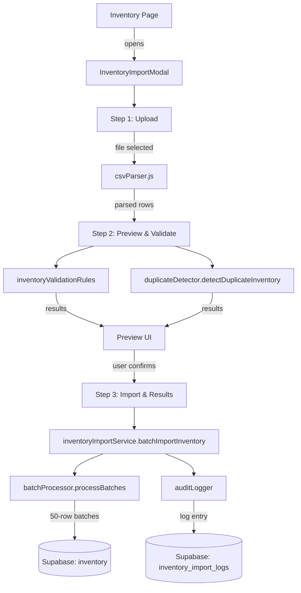

# Design Document — Inventory CSV Import

## Overview

This feature adds a robust, wizard-driven CSV import flow for the RCMC EMR inventory module. Clinic staff can upload a CSV file of medicines and supplies, preview and validate the data, then bulk-insert valid rows into the Supabase `public.inventory` table. The same medicine name may appear multiple times with different `expiry_date` values — each is a distinct batch row. Duplicate detection is keyed on `(name, expiry_date)`. Prices are in Philippine Peso (PHP). The `status` column is trigger-managed and must never appear in INSERT payloads.

The feature reuses and extends existing infrastructure:
- `InventoryImportModal` (newer modal, becomes the primary entry point)
- `inventoryImportService` (extended with new validation rules and batch logic)
- `validationEngine`, `duplicateDetector`, `batchProcessor` (reused as-is)
- `inventoryCategorizer` (reused for optional auto-categorization preview)
- `CSVImportModal` (older modal — replaced by `InventoryImportModal`)

A new `inventory_import_logs` table is created in Supabase for audit logging.

---

## Architecture



### Key Design Decisions

- **Wizard replaces old modal**: `CSVImportModal` is superseded. `InventoryImportModal` is the single entry point wired into `Inventory.jsx`.
- **No `status` in INSERT**: The `status` column is omitted from all insert payloads; the existing DB trigger computes it from `stock` and `reorder_level`.
- **Batch key = `(name, expiry_date)`**: Two rows with the same name but different expiry dates are independent batches. A null `expiry_date` is never matched against another null — each null-expiry row is treated as distinct.
- **Batch size = 50**: Matches the existing `batchProcessor` default and Supabase's recommended bulk insert size.
- **Validation before insert**: All rows are validated in memory before any DB write begins.
- **Audit log**: Every import session writes one row to `inventory_import_logs`, regardless of success or failure.

---

## Components and Interfaces

### UI Components

#### `InventoryImportModal` (`src/components/import/InventoryImportModal.jsx`)

The existing file is extended minimally. The three internal step components are updated:

| Step | Component | Responsibility |
|------|-----------|----------------|
| 1 | `Step1Upload` | File picker, size/type validation, row count display, sample template download |
| 2 | `Step2Preview` | Validation error list, duplicate summary, first-5-row table, error CSV download |
| 3 | `Step3ImportResults` | Progress bar, final summary (inserted / skipped / failed), result CSV download |

**Props (unchanged):**
```js
{
  isOpen: boolean,
  onClose: () => void,
  onSuccess: () => void   // triggers inventory list refresh
}
```

**State machine:**
```
step 1 → (file parsed) → step 2 → (user clicks "Start Import") → step 3
                ↑ Back button (step 2 → step 1, parsed data preserved)
```

Close button is disabled while import is running on step 3.

#### `Inventory.jsx` (minor change)

Replace the `CSVImportModal` import and usage with `InventoryImportModal`. Pass `onSuccess` to trigger a re-fetch of the inventory list.

---

### Service Layer

#### `inventoryImportService.js` (`src/services/import/inventoryImportService.js`)

Extended with inventory-specific validation rules. Key functions:

```js
// Validate all rows against inventory rules (returns Row_Error[])
validateInventoryRows(rows: object[]): RowError[]

// Build insert payload — omits status, applies defaults
buildInsertPayload(row: object): InventoryInsertRow

// Batch import with audit logging
batchImportInventory(
  rows: object[],
  onProgress: (ProgressUpdate) => void,
  userProfile: UserProfile,
  filename: string
): Promise<ImportResult>
```

`buildInsertPayload` maps CSV fields to DB columns and applies defaults:

| CSV column(s) | DB column | Default |
|---|---|---|
| `item_name` / `Item Name` / `name` | `name` | — (required) |
| `price` / `Price` | `price` | — (required) |
| `category` | `category` | `'Others'` |
| `unit` | `unit` | `''` |
| `stock` | `stock` | `0` |
| `reorder_level` | `reorder_level` | `10` |
| `supplier` | `supplier` | `''` |
| `expiry_date` / `expiration_date` | `expiry_date` | `null` |
| `batch_number` | `batch_number` | auto-generated |
| `lot_number` | `lot_number` | `null` |
| *(omitted)* | `status` | *(trigger sets this)* |

#### `inventoryValidationRules.js` (`src/utils/import/inventoryValidationRules.js`) — new file

Exports a `getInventoryValidationRules()` function returning the rule array for `validationEngine.validateData()`.

```js
const VALID_CATEGORIES = [
  'Anti-Infectives',
  'Cardiovascular & Hypertension',
  'Gastrointestinal & Metabolism',
  'Pain & Fever',
  'Respiratory & Allergy',
  'Vaccines & Biologicals',
  'Medical Supplies',
  'Others'
]

export function getInventoryValidationRules() { ... }
```

Rules cover: required `name`, required positive `price` (PHP), non-negative integer `stock`, non-negative integer `reorder_level`, valid `category` enum, parseable `expiry_date`.

#### `duplicateDetector.js` (reused)

`detectDuplicateInventory` already keys on `(name, batch_number, expiration_date)`. We extend it to key on `(name, expiry_date)` per the requirements. The function signature is unchanged; the query logic is updated to match `(name ilike X AND expiry_date = Y)` only when `expiry_date` is non-null.

#### `batchProcessor.js` (reused as-is)

`processBatches(data, insertFn, onProgress, { batchSize: 50 })` handles chunking, retry, and progress callbacks.

#### `auditLogger.js` (reused)

`startImportLog`, `updateImportLog`, `completeImportLog`, `failImportLog` write to `inventory_import_logs`.

---

## Data Models

### CSV Input Row (after parsing and trimming)

```ts
interface CSVRow {
  item_name?: string       // required (also: "Item Name", "name")
  price?: string           // required positive number (PHP)
  category?: string        // optional, must be Valid_Category if present
  unit?: string            // optional
  stock?: string           // optional non-negative integer
  reorder_level?: string   // optional non-negative integer
  supplier?: string        // optional
  expiry_date?: string     // optional date (also: "expiration_date")
  batch_number?: string    // optional
  lot_number?: string      // optional
}
```

### Inventory Insert Payload (sent to Supabase)

```ts
interface InventoryInsertRow {
  name: string             // trimmed, non-empty
  price: number            // positive float (PHP)
  category: string         // Valid_Category
  unit: string             // default ''
  stock: number            // default 0, non-negative integer
  reorder_level: number    // default 10, non-negative integer
  supplier: string         // default ''
  expiry_date: string|null // ISO date string or null
  batch_number: string     // provided or auto-generated
  lot_number: string|null  // null if absent
  // status intentionally omitted — set by DB trigger
}
```

### Row Error

```ts
interface RowError {
  row: number        // 1-indexed, excludes header
  field: string      // e.g. 'price', 'category'
  value: any         // original cell value
  type: string       // 'missing' | 'invalid_type' | 'out_of_range' | 'invalid_format' | 'custom_error'
  message: string    // human-readable, e.g. "Price must be a positive number (PHP)"
}
```

### Import Result

```ts
interface ImportResult {
  totalRecords: number
  successful: number
  skipped: number      // duplicates
  failed: number
  errors: RowError[]
  timestamp: string    // ISO
  userId: string
}
```

### Audit Log Table — `inventory_import_logs`

#### SQL Migration

```sql
-- Migration: create inventory_import_logs table
-- Run in Supabase SQL Editor

CREATE TABLE IF NOT EXISTS public.inventory_import_logs (
  id            uuid PRIMARY KEY DEFAULT gen_random_uuid(),
  user_id       uuid REFERENCES auth.users(id) ON DELETE SET NULL,
  username      text,
  filename      text NOT NULL,
  status        text NOT NULL CHECK (status IN ('completed', 'failed', 'in_progress')),
  total_records integer NOT NULL DEFAULT 0,
  successful    integer NOT NULL DEFAULT 0,
  skipped       integer NOT NULL DEFAULT 0,
  failed        integer NOT NULL DEFAULT 0,
  error_message text,
  error_details jsonb,
  started_at    timestamptz NOT NULL DEFAULT now(),
  completed_at  timestamptz,
  created_at    timestamptz NOT NULL DEFAULT now()
);

-- Only admin users can read audit logs
ALTER TABLE public.inventory_import_logs ENABLE ROW LEVEL SECURITY;

CREATE POLICY "Admin read inventory import logs"
  ON public.inventory_import_logs
  FOR SELECT
  USING (
    EXISTS (
      SELECT 1 FROM public.user_profiles
      WHERE user_profiles.id = auth.uid()
        AND user_profiles.role = 'admin'
    )
  );

-- Authenticated users (admin + staff) can insert their own log entries
CREATE POLICY "Authenticated insert inventory import logs"
  ON public.inventory_import_logs
  FOR INSERT
  WITH CHECK (auth.uid() IS NOT NULL);

-- Users can update their own in-progress log entries
CREATE POLICY "Own update inventory import logs"
  ON public.inventory_import_logs
  FOR UPDATE
  USING (user_id = auth.uid());

-- Index for admin queries by user and date
CREATE INDEX IF NOT EXISTS idx_inventory_import_logs_user_id
  ON public.inventory_import_logs (user_id);

CREATE INDEX IF NOT EXISTS idx_inventory_import_logs_started_at
  ON public.inventory_import_logs (started_at DESC);
```

---

## Correctness Properties

*A property is a characteristic or behavior that should hold true across all valid executions of a system — essentially, a formal statement about what the system should do. Properties serve as the bridge between human-readable specifications and machine-verifiable correctness guarantees.*

### Property 1: File type rejection

*For any* file object whose extension is not `.csv`, the file validator should return an invalid result and not produce parsed rows.

**Validates: Requirements 1.1, 1.3**

---

### Property 2: CSV parsing correctness

*For any* well-formed CSV string with N data rows, the parser should return exactly N row objects whose keys match the header row.

**Validates: Requirements 2.1**

---

### Property 3: Whitespace trimming

*For any* CSV where header names or cell values have leading/trailing whitespace, parsing should produce the same row objects as the version with whitespace removed.

**Validates: Requirements 2.2**

---

### Property 4: Quoted field parsing

*For any* CSV field enclosed in double quotes (including fields containing commas), the parser should treat the entire quoted content as a single field value.

**Validates: Requirements 2.3**

---

### Property 5: Round-trip parsing

*For any* valid set of inventory rows, serializing them to CSV and then parsing the result should produce an equivalent set of rows (same keys and values after trimming).

**Validates: Requirements 2.5**

---

### Property 6: Column mapping is case-insensitive

*For any* CSV header that is a case variation of a recognized column name (e.g., `ITEM_NAME`, `Item_Name`, `item_name`), the column mapper should produce the same field mapping as the canonical lowercase form.

**Validates: Requirements 3.1, 3.2**

---

### Property 7: Missing required columns are rejected

*For any* CSV whose headers do not include `item_name` (or alias) or `price` (or alias), the importer should halt and return an error listing the missing required columns.

**Validates: Requirements 3.4**

---

### Property 8: Optional column defaults

*For any* row that omits one or more optional columns, `buildInsertPayload` should fill in the defined defaults: `stock=0`, `reorder_level=10`, `unit=''`, `supplier=''`, `expiry_date=null`.

**Validates: Requirements 3.5**

---

### Property 9: Required field validation

*For any* row where `item_name` is empty, null, or whitespace-only, or where `price` is empty or absent, the validation engine should produce a `RowError` for that row.

**Validates: Requirements 4.1, 4.2**

---

### Property 10: Numeric field validation

*For any* row where `price` is non-positive or non-numeric, or where `stock` or `reorder_level` is a negative number or non-integer, the validation engine should produce a `RowError` for that field.

**Validates: Requirements 4.3, 4.4, 4.5**

---

### Property 11: Category enum validation

*For any* row where `category` is present and its value is not one of the eight `Valid_Category` strings, the validation engine should produce a `RowError` listing the invalid value and the accepted categories.

**Validates: Requirements 4.6**

---

### Property 12: Date field validation

*For any* row where `expiry_date` is present and cannot be parsed as a valid calendar date, the validation engine should produce a `RowError` for that field.

**Validates: Requirements 4.7**

---

### Property 13: Duplicate batch detection

*For any* import dataset where a row's `(name, expiry_date)` pair (case-insensitive name, non-null expiry) already exists in the `inventory` table, that row should be flagged as a `Duplicate_Batch` and excluded from the insert set.

**Validates: Requirements 5.1**

---

### Property 14: Intra-file duplicate detection

*For any* CSV containing two or more rows with the same `(name, expiry_date)` pair, only the first occurrence should be kept; all subsequent occurrences should be flagged as intra-file duplicates and not inserted.

**Validates: Requirements 5.4, 9.3**

---

### Property 15: Error object completeness

*For any* validation error produced by the validation engine, the error object should contain a non-null `row` (1-indexed integer), a non-empty `field` string, and a non-empty `message` string.

**Validates: Requirements 6.3, 8.1**

---

### Property 16: INSERT payload excludes status

*For any* row being inserted into the `inventory` table, the insert payload object should not contain a `status` key.

**Validates: Requirements 7.2**

---

### Property 17: Batch size invariant

*For any* dataset of N rows, splitting into batches with `batchSize=50` should produce `ceil(N/50)` batches where every batch except possibly the last has exactly 50 rows, and the last batch has `N mod 50` rows (or 50 if N is divisible by 50).

**Validates: Requirements 7.3**

---

### Property 18: Failed batch continues processing

*For any* import where one batch fails, the importer should record `RowError` entries for all rows in that batch and continue processing the remaining batches rather than aborting the entire import.

**Validates: Requirements 7.4**

---

### Property 19: Multi-batch same name different expiry

*For any* two rows with the same `name` but different non-null `expiry_date` values, both rows should be present in the final insert set (neither flagged as a duplicate of the other).

**Validates: Requirements 9.1, 9.2**

---

### Property 20: Role-based access control

*For any* user whose role is not `admin` or `staff`, calling `batchImportInventory` should throw an authorization error and perform zero database inserts.

**Validates: Requirements 10.2**

---

### Property 21: Audit log completeness

*For any* completed import session, the resulting `inventory_import_logs` row should contain non-null values for `user_id`, `filename`, `started_at`, `total_records`, `successful`, `skipped`, `failed`, and `status`.

**Validates: Requirements 11.1**

---

### Property 22: Error report includes original row data

*For any* `RowError` included in the downloadable error report, the report entry should contain both the error message and the original CSV row data that caused the error.

**Validates: Requirements 8.4**

---

## Error Handling

| Scenario | Behavior |
|---|---|
| Non-CSV file selected | Reject immediately; show "Only .csv files are supported" |
| File > 10 MB | Reject immediately; show "File exceeds the 10 MB size limit" |
| CSV has no data rows | Show "The uploaded file contains no data rows" |
| Required column missing | Halt parsing; list all missing required columns |
| Row fails validation | Record `RowError`; continue validating remaining rows |
| All rows invalid | Disable "Start Import" button; show "No valid rows to import" |
| Duplicate batch detected | Flag row; skip during insert; count in `skipped` |
| Supabase batch insert error | Record `RowError` for each row in the failed batch; continue next batch |
| Supabase auth error | Surface error message; do not retry; log failure |
| Audit log write failure | Log to console; do not block the import (non-critical) |
| User navigates away during import | Show browser `beforeunload` warning; disable Close button |

All user-facing error messages include the PHP currency context where relevant (e.g., "Price must be a positive number (PHP)").

---

## Testing Strategy

### Dual Testing Approach

Both unit tests and property-based tests are required. Unit tests cover specific examples and integration points; property tests verify universal correctness across randomized inputs.

### Unit Tests

Located in `src/tests/inventory/`:

- `inventoryValidationRules.test.js` — specific examples for each validation rule (empty name, zero price, invalid category, bad date format)
- `inventoryImportService.test.js` — `buildInsertPayload` omits `status`, applies defaults, maps `expiration_date` alias
- `duplicateDetector.inventory.test.js` — null expiry treated as distinct, intra-file duplicate detection
- `batchProcessor.test.js` — already exists; add test for batch-size-50 invariant
- `auditLogger.inventory.test.js` — log entry contains all required fields on success and failure

### Property-Based Tests

Located in `src/tests/inventory/inventory-csv-import.property.test.js`.

Use **fast-check** (already a dev dependency in the project).

Each property test runs a minimum of **100 iterations**.

Tag format: `// Feature: inventory-csv-import, Property N: <property text>`

```js
// Feature: inventory-csv-import, Property 5: Round-trip parsing
fc.assert(fc.property(
  fc.array(inventoryRowArbitrary(), { minLength: 1, maxLength: 200 }),
  (rows) => {
    const csv = serializeToCSV(rows)
    const reparsed = parseCSVSync(csv)
    return rowsAreEquivalent(rows, reparsed)
  }
), { numRuns: 100 })
```

Properties to implement as property-based tests (one test per property):

| Property | Test description |
|---|---|
| P1 | Random non-CSV extensions → rejected |
| P2 | Random N-row CSV → parser returns N rows |
| P3 | Whitespace-padded CSV ≡ trimmed CSV |
| P4 | Quoted fields with commas → single value |
| P5 | Round-trip: serialize → parse → equivalent rows |
| P6 | Case variations of column names → same mapping |
| P7 | CSV missing required columns → error listing them |
| P8 | Rows missing optional columns → defaults applied |
| P9 | Empty/whitespace name or empty price → RowError |
| P10 | Non-positive price, negative stock/reorder → RowError |
| P11 | Invalid category string → RowError |
| P12 | Unparseable date string → RowError |
| P13 | (name, expiry_date) exists in DB → flagged duplicate |
| P14 | Repeated (name, expiry_date) in file → only first kept |
| P15 | Every RowError has row, field, message |
| P16 | Insert payload never contains `status` key |
| P17 | `ceil(N/50)` batches, each ≤ 50 rows |
| P18 | Failed batch → errors recorded, processing continues |
| P19 | Same name, different expiry → both in insert set |
| P20 | Non-admin/staff role → auth error, zero inserts |
| P21 | Completed session → audit log has all required fields |
| P22 | Error report entries contain original row data |

### Generators (fast-check arbitraries)

```js
// Valid inventory row
const inventoryRowArbitrary = () => fc.record({
  item_name: fc.string({ minLength: 1, maxLength: 100 }).filter(s => s.trim().length > 0),
  price: fc.float({ min: 0.01, max: 100000, noNaN: true }),
  category: fc.constantFrom(...VALID_CATEGORIES),
  unit: fc.string({ maxLength: 20 }),
  stock: fc.nat({ max: 10000 }),
  reorder_level: fc.nat({ max: 1000 }),
  expiry_date: fc.option(fc.date({ min: new Date('2020-01-01'), max: new Date('2035-12-31') })
    .map(d => d.toISOString().split('T')[0]), { nil: null })
})

// Invalid price values
const invalidPriceArbitrary = () => fc.oneof(
  fc.constant(''),
  fc.constant('0'),
  fc.constant('-5'),
  fc.constant('abc'),
  fc.float({ max: 0, noNaN: true }).map(String)
)
```
