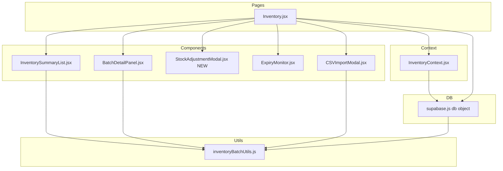
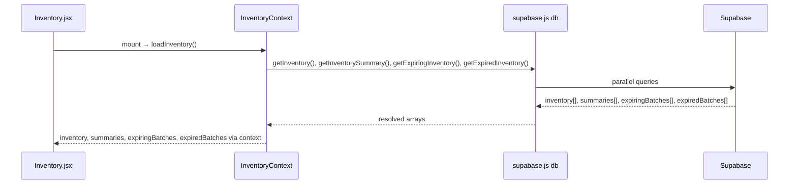
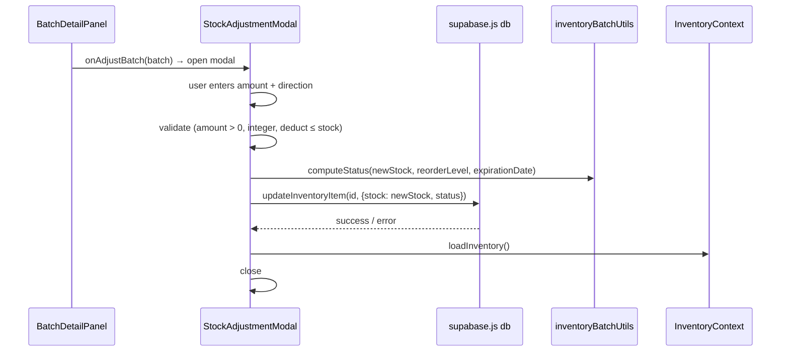
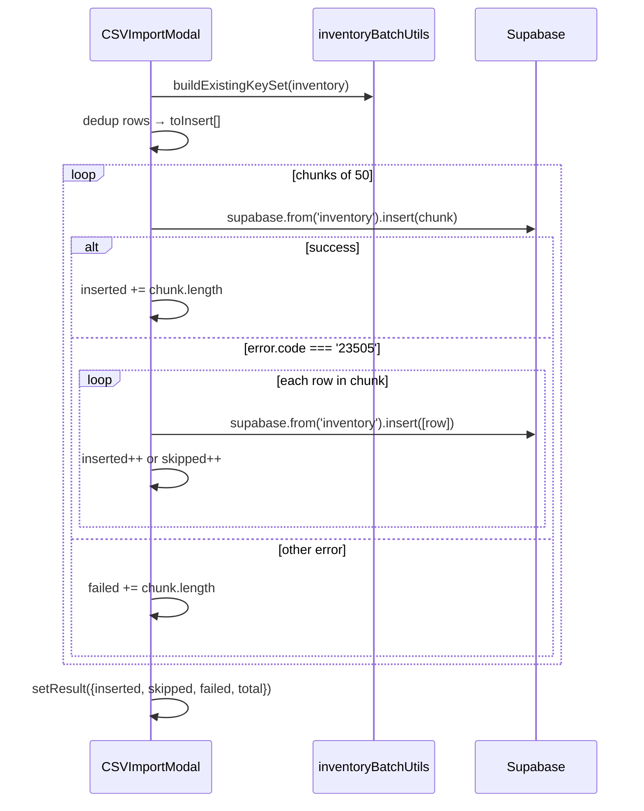

# Design Document: Inventory Module Improvements

## Overview

This document covers the technical design for eight targeted improvements to the RCMC-EMR medicine inventory module. The changes span a shared utility layer, a new modal component, bug fixes in two existing components, a performance improvement in the CSV importer, and two display enhancements in the inventory page header and summary list. No new Supabase tables or views are required — all changes are purely in the React/JS layer.

The guiding principle is to eliminate duplicated status logic by introducing a single `computeStatus` utility, then wire every status-producing code path through it. The remaining improvements build on that foundation or address independent usability gaps.

---

## Architecture



The `inventoryBatchUtils.js` module becomes the single source of truth for status computation. Every component and the DB layer that previously contained inline status logic will import `computeStatus` from there.

---

## Data Flow

### Inventory Load Flow



`inventory` is the flat array of all batch rows. `summaries` comes from the `inventory_summary` Supabase view and has no `batches` sub-array. Both are needed: `summaries` drives the table rows, `inventory` drives the status filter and worst-case status computation.

### Stock Adjustment Flow (Req 2)



### CSV Import Batched Flow (Req 4)



---

## Components and Interfaces

### inventoryBatchUtils.js — New Exports

Three new pure functions are added to the existing utility module.

**`computeStatus(stock, reorderLevel, expirationDate)`**

Priority order (first match wins):
1. `stock === 0` → `'Out of Stock'`
2. `expirationDate !== null && new Date(expirationDate) < today` → `'Expired'`
3. `stock <= reorderLevel * 0.3` → `'Critical'`
4. `stock <= reorderLevel` → `'Low Stock'`
5. otherwise → `'In Stock'`

`expirationDate` is compared against midnight of the current local date (not `Date.now()`) to avoid timezone edge cases.

```javascript
// Signature
export function computeStatus(stock, reorderLevel, expirationDate) // → string
```

**`getWorstCaseStatus(batches)`**

Accepts an array of batch objects (each with a `status` field). Returns the highest-severity status present, using the priority: `Expired` > `Critical` > `Low Stock` > `Out of Stock` > `In Stock`. Returns `'In Stock'` for an empty array.

```javascript
export function getWorstCaseStatus(batches) // → string
```

**`exportInventoryCSV(inventory)`**

Accepts the flat `inventory` array. Builds a CSV string with the header row followed by one row per batch. Triggers a browser download. Fields containing commas or double-quotes are wrapped in double-quotes; embedded double-quotes are escaped as `""` (RFC 4180).

Columns in order: `item_name`, `price`, `stock`, `unit`, `category`, `supplier`, `reorder_level`, `batch_number`, `lot_number`, `expiration_date`, `manufacture_date`, `status`.

Filename: `inventory_export_YYYY-MM-DD.csv` using the current local date.

```javascript
export function exportInventoryCSV(inventory) // → void (triggers download)
```

---

### StockAdjustmentModal.jsx — New Component

**Props:**
```javascript
{
  batch: object,        // { id, name, stock, reorder_level, expiration_date, ... }
  onClose: () => void,
  onSave: (id, newStock, newStatus) => Promise<void>
}
```

**Internal state:**
- `amount` — string input, validated as positive integer
- `direction` — `'Add'` | `'Deduct'`
- `error` — validation or server error message
- `saving` — boolean

**Validation rules:**
- `amount` must parse to a positive integer (`> 0`)
- When `direction === 'Deduct'`: `parseInt(amount) <= batch.stock`

**On confirm:**
1. Compute `newStock = direction === 'Add' ? batch.stock + n : batch.stock - n`
2. Call `computeStatus(newStock, batch.reorder_level, batch.expiration_date)`
3. Call `onSave(batch.id, newStock, newStatus)` — the parent handles the DB write and `loadInventory()`
4. On success: call `onClose()`
5. On error: set `error` message, keep modal open

---

### BatchDetailPanel.jsx — Changes

- Add `onAdjustBatch` prop: `(batch) => void`
- Import `Scales` (or `ArrowUpDown`) icon from lucide-react for the button
- Add "Adjust Stock" button in the actions column, between Edit and Delete
- The button calls `onAdjustBatch(batch)` on click

---

### InventorySummaryList.jsx — Changes

**New prop:** `inventory` (flat array of all batch rows from context)

**Status filter fix (Req 3):**

Replace the broken `(s.batches ?? []).some(b => b.status === statusFilter)` with a pre-computed Set:

```javascript
const matchingNames = statusFilter && statusFilter !== 'All'
  ? new Set(inventory.filter(b => b.status === statusFilter).map(b => b.name))
  : null

// In filter:
const matchesStatus = !matchingNames || matchingNames.has(s.name)
```

**Worst-case status column (Req 7):**

For each summary row, compute worst-case status from the `inventory` flat array:

```javascript
const batchesForMedicine = inventory.filter(b => b.name === summary.name)
const worstStatus = getWorstCaseStatus(batchesForMedicine)
```

Replace the binary "Warning"/"OK" badge with a color-coded badge:

| Status | Badge classes |
|--------|--------------|
| Expired | `bg-red-100 text-red-700` |
| Critical | `bg-orange-100 text-orange-700` |
| Low Stock | `bg-yellow-100 text-yellow-700` |
| Out of Stock | `bg-red-100 text-red-700` |
| In Stock | `bg-green-100 text-green-700` |

The row highlight logic (amber background for warning) is updated to use `worstStatus !== 'In Stock'` instead of `getStatusWarning()`.

---

### ExpiryMonitor.jsx — Changes

**New prop:** `onDispose: (batch) => Promise<void>`

In the expired-batches table:
- Add an "Actions" column header
- For each row where `b.stock > 0`, render a "Dispose" button
- On click: `window.confirm(...)` with batch name, batch number, and stock count
- On confirm: call `onDispose(batch)`
- Rows where `b.stock === 0` render no button (or a disabled placeholder)

---

### CSVImportModal.jsx — Changes

1. Replace inline status logic with `computeStatus(stockQty, reorderLevel, expirationDate)`
2. After dedup loop, collect valid rows into `toInsert[]`
3. Chunk `toInsert` into groups of 50 using a helper:
   ```javascript
   function chunk(arr, size) {
     const out = []
     for (let i = 0; i < arr.length; i += size) out.push(arr.slice(i, i + size))
     return out
   }
   ```
4. For each chunk: call `supabase.from('inventory').insert(chunk)`
5. On `error.code === '23505'`: fall back to row-by-row for that chunk
6. On other errors: `failed += chunk.length`

---

### supabase.js — Changes

In `db.deductStock` and `db.addStock`, replace the inline status computation block with a call to `computeStatus(newStock, item.reorder_level, item.expiration_date)`.

Import `computeStatus` at the top of the file.

---

### Inventory.jsx — Changes

1. **Export CSV button**: Add next to "Import CSV" in the header, calls `exportInventoryCSV(inventory)`
2. **StockAdjustmentModal**: Add `adjustingBatch` state; wire `onAdjustBatch` through `BatchDetailPanel`; render `<StockAdjustmentModal>` when `adjustingBatch` is set; `onSave` calls `db.updateInventoryItem` then `loadInventory()`
3. **onDispose**: Pass handler to `<ExpiryMonitor>`; handler calls `db.updateInventoryItem(batch.id, { stock: 0, status: 'Out of Stock' })` then `loadInventory()`
4. **Stats cards**: Derive `lowStockCount` and `criticalCount` from `summaries` using `getWorstCaseStatus` over `inventory`:
   ```javascript
   const lowStockCount = summaries.filter(s => {
     const worst = getWorstCaseStatus(inventory.filter(b => b.name === s.name))
     return worst === 'Low Stock'
   }).length

   const criticalCount = summaries.filter(s => {
     const worst = getWorstCaseStatus(inventory.filter(b => b.name === s.name))
     return worst === 'Critical'
   }).length
   ```
5. **Grid layout**: Change stats grid from `grid-cols-2 md:grid-cols-4` to `grid-cols-2 md:grid-cols-3 lg:grid-cols-6` to accommodate 6 cards
6. **Pass `inventory` to `InventorySummaryList`**: Add `inventory={inventory}` prop

---

## Error Handling

| Scenario | Handling |
|----------|----------|
| Stock adjustment DB failure | Modal stays open, shows error message, user can retry |
| Dispose DB failure | ExpiryMonitor shows inline error, batch remains in list |
| CSV chunk insert failure (non-23505) | `failed += chunk.length`, import continues |
| CSV chunk insert 23505 | Fall back to row-by-row for that chunk |
| Export with empty inventory | CSV with header row only is downloaded |
| computeStatus with null expirationDate | Null check before date comparison — treated as no expiry |

---

## Testing Strategy

### Unit Testing

Each new utility function in `inventoryBatchUtils.js` should have unit tests covering:
- `computeStatus`: all five status branches, boundary values (stock === reorderLevel, stock === reorderLevel * 0.3), null expiration date, expired date
- `getWorstCaseStatus`: empty array, single-status array, mixed statuses, all combinations of priority ordering
- `exportInventoryCSV`: header row presence, correct column order, RFC 4180 escaping for commas and quotes, empty inventory

### Property-Based Testing

The following correctness properties are suitable for property-based testing using a library such as `fast-check`:

**Property 1 — computeStatus is pure and idempotent**
For any `(stock ≥ 0, reorderLevel ≥ 0, expirationDate | null)`, calling `computeStatus` twice with the same inputs returns the same string.
```
∀ (s, r, d): computeStatus(s, r, d) === computeStatus(s, r, d)
```

**Property 2 — computeStatus is total (covers all cases)**
For any valid inputs, `computeStatus` returns exactly one of the five defined status strings and never throws.
```
∀ (s ≥ 0, r ≥ 0, d): computeStatus(s, r, d) ∈ {'Out of Stock', 'Expired', 'Critical', 'Low Stock', 'In Stock'}
```

**Property 3 — Status filter correctness**
After filtering the summary list by status X, every displayed medicine name has at least one batch in `inventory` with `status === X`.
```
∀ medicine in filtered(summaries, statusFilter=X):
  inventory.some(b => b.name === medicine.name && b.status === X)
```

**Property 4 — Export/import roundtrip**
Exporting the current inventory to CSV and re-importing it produces zero new inserted rows (all rows are classified as skipped duplicates).
```
∀ inventory[]: importResult(exportCSV(inventory[])).inserted === 0
```

**Property 5 — Stock adjustment status invariant**
After any stock adjustment, the stored status equals `computeStatus(newStock, reorderLevel, expirationDate)`.
```
∀ (batch, amount, direction):
  let newStock = direction === 'Add' ? batch.stock + amount : batch.stock - amount
  storedStatus === computeStatus(newStock, batch.reorder_level, batch.expiration_date)
```

**Property 6 — Dispose invariant**
After a successful dispose, `batch.stock === 0` and `batch.status === 'Out of Stock'`.
```
∀ batch with stock > 0:
  after dispose(batch): batch.stock === 0 ∧ batch.status === 'Out of Stock'
```

**Property 7 — Worst-case status monotonicity**
`getWorstCaseStatus(batches)` severity is greater than or equal to the severity of any individual batch status in the array.
```
∀ batches[], ∀ b ∈ batches:
  severity(getWorstCaseStatus(batches)) ≥ severity(b.status)
```
where `severity` maps: `Expired=5, Critical=4, Low Stock=3, Out of Stock=2, In Stock=1`.

**Property 8 — CSV batch chunking accounting**
For any CSV input, `inserted + skipped + failed === total rows parsed`.
```
∀ csvInput: importResult.inserted + importResult.skipped + importResult.failed === importResult.total
```

### Integration Testing

- Import a 150-row CSV and verify it completes in ≤ 3 chunk insert calls (3 chunks of 50)
- Import a CSV with a known duplicate and verify the duplicate is skipped without failing the rest
- Adjust stock on a batch and verify the summary list reflects the updated status without page reload

---

## Dependencies

No new npm packages are required. All changes use existing dependencies:
- `lucide-react` — one additional icon (`ArrowUpDown` or `Scales`) for the stock adjustment button
- `supabase-js` — already imported in `CSVImportModal` for the batched insert call
- `fast-check` — already available in the project for property-based tests (or can be added as a dev dependency)
