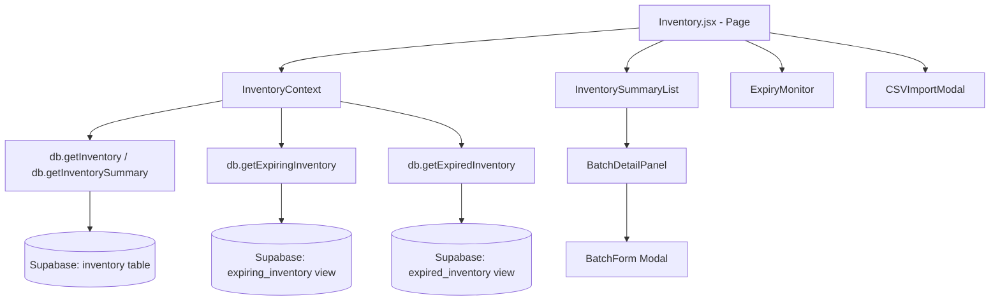

# Design Document: Medicine Inventory Batch Tracking

## Overview

This feature extends the existing `Inventory.jsx` page and `InventoryContext.jsx` to support batch/lot-level tracking of medicines. The current system treats each medicine name as a single flat record. After this feature, the same medicine can exist as multiple distinct batch records — each with its own batch number, expiration date, and stock quantity — while the UI still presents a consolidated per-medicine summary.

The database schema is already defined in `ADD_INVENTORY_BATCH_TRACKING.sql`. This design covers the UI architecture, component hierarchy, data flow, key algorithms, and correctness properties.

---

## Architecture

The feature follows the existing React + Supabase pattern used throughout the EMR. No new backend services are introduced. All data access goes through the `db` object in `src/lib/supabase.js`, and state is managed via `InventoryContext`.



The page is split into two primary views toggled by a tab bar:
- **Inventory** — the main summary + batch detail view
- **Expiry Monitor** — the expiring/expired batch alert view


---

## Components and Interfaces

### Component Hierarchy

```
Inventory.jsx (page)
├── StatsCards                    — 4 stat cards: total medicines, in-stock, expiring-soon count, expired count
├── SearchFilterBar               — search input + category dropdown + status dropdown
├── TabBar                        — "Inventory" | "Expiry Monitor" tabs
├── [tab: Inventory]
│   ├── InventorySummaryList      — one row per unique medicine name
│   │   └── SummaryRow (×N)       — name, total stock, batch count, earliest expiry, warning badge
│   └── BatchDetailPanel          — slides in when a SummaryRow is selected
│       ├── BatchRow (×N)         — batch#, lot#, stock, expiry, manufacture date, status badge, FIFO label
│       ├── AddBatchButton        — opens BatchForm in "add" mode pre-filled with medicine name
│       └── BatchForm (modal)     — add/edit a single batch record
└── [tab: Expiry Monitor]
    ├── ExpiryMonitor             — lists batches expiring within 90 days
    └── ExpiredList               — lists expired batches with stock > 0
```

### InventorySummaryList

Props: `{ summaries, selectedMedicine, onSelect, searchTerm, categoryFilter, statusFilter }`

Renders a table where each row is a grouped medicine. Filtering is applied client-side against the `summaries` array (derived from `inventory_summary` view data). A row is highlighted with an amber warning border when `hasExpiryWarning` is true (any batch has status `Expired` or `Expiring Soon`).

### BatchDetailPanel

Props: `{ medicine, batches, onAddBatch, onEditBatch, onDeleteBatch, onClose }`

Renders a side panel (or below-row expansion) listing all batches for the selected medicine, sorted by `expiration_date` ascending. The batch with the minimum `expiration_date` (and all ties) receives a "Dispense First" FIFO badge.

### BatchForm

Props: `{ initialData, medicineName, onSave, onClose }`

A modal form for adding or editing a single batch. When `medicineName` is provided (add mode from detail panel), the medicine name field is pre-filled and locked. Validates that `expiration_date`, `stock`, `reorder_level`, `unit`, and `price` are present before submission. If `batch_number` is empty on submit, the client generates `BATCH-{Date.now()}-{Math.random().toString(36).slice(2,6)}` before calling the save handler.

### ExpiryMonitor

Props: `{ expiringBatches, expiredBatches }`

Two sub-sections: "Expiring Within 90 Days" and "Expired (with remaining stock)". Each row shows medicine name, batch number, stock, expiration date, and days until/since expiry.

### CSVImportModal

Props: `{ onImportComplete, onClose }`

Handles file selection, CSV parsing, deduplication check against existing inventory, and batch insert. Displays a results summary (inserted / skipped / failed counts) after import.

---

## Data Models

### inventory table (extended by migration)

| Column           | Type    | Notes                                              |
|------------------|---------|----------------------------------------------------|
| id               | uuid    | PK                                                 |
| name             | text    | Medicine name                                      |
| category         | text    |                                                    |
| unit             | text    |                                                    |
| price            | numeric |                                                    |
| supplier         | text    |                                                    |
| stock            | integer |                                                    |
| reorder_level    | integer |                                                    |
| status           | text    | Auto-managed by trigger                            |
| batch_number     | text    | Auto-generated if null on insert                   |
| lot_number       | text    | Optional                                           |
| expiration_date  | date    | Required for medicines                             |
| manufacture_date | date    | Optional                                           |
| created_at       | timestamptz |                                               |

Uniqueness is enforced via four partial indexes covering all NULL combinations of `(name, batch_number, expiration_date)`.

### inventory_summary view

Returned shape (used by `InventorySummaryList`):

```js
{
  name: string,
  category: string,
  unit: string,
  price: number,
  total_stock: number,       // SUM(stock)
  batch_count: number,       // COUNT(*)
  earliest_expiry: date,     // MIN(expiration_date)
  latest_expiry: date,       // MAX(expiration_date)
  batches: BatchObject[]     // ARRAY_AGG ordered by expiration_date
}
```

### expiring_inventory view

```js
{
  id, name, batch_number, lot_number, stock,
  expiration_date, days_until_expiry, status
}
```

### expired_inventory view

```js
{
  id, name, batch_number, lot_number, stock,
  expiration_date, days_expired, status
}
```

### BatchObject (client-side)

```js
{
  id: string,
  name: string,
  batch_number: string,
  lot_number: string | null,
  stock: number,
  reorder_level: number,
  unit: string,
  price: number,
  supplier: string,
  expiration_date: string,   // ISO date
  manufacture_date: string | null,
  status: 'In Stock' | 'Low Stock' | 'Out of Stock' | 'Expiring Soon' | 'Expired'
}
```

---

## Data Flow

### Page Load

```
Inventory.jsx mounts
  → InventoryContext.loadInventory()
      → db.getInventory()           → SELECT * FROM inventory ORDER BY name
      → db.getExpiringInventory()   → SELECT * FROM expiring_inventory
      → db.getExpiredInventory()    → SELECT * FROM expired_inventory
  → Context stores: inventory[], expiringBatches[], expiredBatches[]
  → Inventory.jsx derives summaries[] via groupBySummary(inventory)
  → StatsCards reads: total unique names, expiring count, expired count
```

### groupBySummary (client-side derivation)

The `inventory_summary` view is queried directly via a new `db.getInventorySummary()` method. The result is stored in context as `summaries[]`. This avoids re-deriving aggregates client-side and keeps the summary consistent with the DB view.

### Selecting a Medicine

```
User clicks SummaryRow
  → Inventory.jsx sets selectedMedicine = name
  → BatchDetailPanel receives batches = inventory.filter(b => b.name === name)
                                        .sort((a,b) => a.expiration_date - b.expiration_date)
  → FIFO detection runs: minExpiry = min(batches.map(b => b.expiration_date))
                         fifoBatches = batches.filter(b => b.expiration_date === minExpiry)
```

### Adding / Editing a Batch

```
BatchForm.onSave(formData)
  → if !formData.batch_number: formData.batch_number = generateBatchNumber()
  → if editingBatch: db.updateInventoryItem(id, formData)
  → else:            db.addInventoryItem(formData)
  → InventoryContext.loadInventory()   ← full reload to refresh summary view
```

### CSV Import

```
CSVImportModal
  → parseCSV(file) → rows[]
  → for each row:
      key = (name.toLowerCase(), batch_number, expiration_date)
      if existingKeys.has(key): mark as duplicate, skip
      else if !row.batch_number: row.batch_number = generateBatchNumber()
      → db.addInventoryItem(row)
  → report { inserted, skipped, failed }
  → InventoryContext.loadInventory()
```

---

## Key Algorithms

### Status Auto-Management (DB trigger)

Implemented in `update_inventory_status_by_expiry()` trigger function (already in migration):

```
if expiration_date < today          → 'Expired'
elif expiration_date <= today + 30  → 'Expiring Soon'
elif stock == 0                     → 'Out of Stock'
elif stock <= reorder_level         → 'Low Stock'
else                                → 'In Stock'
```

The trigger fires `BEFORE INSERT OR UPDATE OF stock, expiration_date, reorder_level`.

### FIFO Detection (client-side)

```js
function getFifoBatches(batches) {
  const active = batches.filter(b => b.stock > 0 && b.status !== 'Expired')
  if (active.length === 0) return []
  const minExpiry = active.reduce((min, b) =>
    b.expiration_date < min ? b.expiration_date : min,
    active[0].expiration_date
  )
  return active.filter(b => b.expiration_date === minExpiry)
}
```

### CSV Deduplication

```js
function buildExistingKeySet(inventory) {
  return new Set(inventory.map(b =>
    `${b.name.toLowerCase()}|${b.batch_number ?? ''}|${b.expiration_date ?? ''}`
  ))
}

function isDuplicate(row, existingKeys) {
  const key = `${row.item_name.toLowerCase()}|${row.batch_number ?? ''}|${row.expiration_date ?? ''}`
  return existingKeys.has(key)
}
```

A row is a duplicate only when all three fields match exactly. A row with the same name+batch_number but a different expiration_date is treated as a new batch.

### Batch Number Auto-Generation

```js
function generateBatchNumber() {
  const ts = Date.now()
  const rand = Math.random().toString(36).slice(2, 6).toUpperCase()
  return `BATCH-${ts}-${rand}`
}
```

---

## Correctness Properties

*A property is a characteristic or behavior that should hold true across all valid executions of a system — essentially, a formal statement about what the system should do. Properties serve as the bridge between human-readable specifications and machine-verifiable correctness guarantees.*

### Property 1: Batch uniqueness constraint

*For any* two batch records with the same `name`, `batch_number`, and `expiration_date`, the system should reject the second insert with an error identifying the conflicting fields.

**Validates: Requirements 1.1, 1.4, 1.5**

---

### Property 2: Batch round-trip field preservation

*For any* batch record inserted into the system, fetching it back should return a record containing all required fields: `batch_number`, `lot_number`, `expiration_date`, `manufacture_date`, and `stock`.

**Validates: Requirements 1.2, 4.2**

---

### Property 3: Auto-generated batch number format

*For any* batch saved without a `batch_number`, the returned record should have a `batch_number` matching the pattern `BATCH-{digits}-{alphanumeric}`.

**Validates: Requirements 1.3, 5.5, 9.4**

---

### Property 4: Status auto-classification

*For any* batch record with a given `expiration_date`, `stock`, and `reorder_level`, the system-assigned `status` should satisfy:
- `expiration_date < today` → `'Expired'`
- `today <= expiration_date <= today + 30` → `'Expiring Soon'`
- `expiration_date > today + 30 AND stock == 0` → `'Out of Stock'`
- `expiration_date > today + 30 AND 0 < stock <= reorder_level` → `'Low Stock'`
- `expiration_date > today + 30 AND stock > reorder_level` → `'In Stock'`

**Validates: Requirements 2.1, 2.2, 2.3**

---

### Property 5: Summary aggregation correctness

*For any* set of batch records, the `inventory_summary` view should produce exactly one row per distinct medicine name, where `total_stock` equals the sum of all batch stocks for that name, `batch_count` equals the count of batches, and `earliest_expiry` equals the minimum `expiration_date` across all batches for that name.

**Validates: Requirements 3.1, 3.2, 3.3, 3.4**

---

### Property 6: Summary warning indicator

*For any* medicine summary row, the warning indicator should be shown if and only if at least one of its batches has status `'Expired'` or `'Expiring Soon'`.

**Validates: Requirements 3.5**

---

### Property 7: Batch detail completeness and ordering

*For any* medicine name selected in the summary list, the batch detail panel should display all and only the batches belonging to that medicine, sorted by `expiration_date` ascending (nulls last).

**Validates: Requirements 4.1, 4.3**

---

### Property 8: FIFO selection

*For any* set of batches for a medicine (with stock > 0 and not expired), the FIFO "Dispense First" indicator should be applied to all batches whose `expiration_date` equals the minimum `expiration_date` in that set — including all ties.

**Validates: Requirements 8.1, 8.2, 8.3**

---

### Property 9: Expiring inventory filter

*For any* set of batch records, the expiring inventory view should contain exactly those batches where `expiration_date` is between today (inclusive) and today + 90 days (inclusive), and `stock > 0`. The `days_until_expiry` field for each row should equal `expiration_date - today`.

**Validates: Requirements 6.1, 6.2**

---

### Property 10: Expired inventory filter

*For any* set of batch records, the expired inventory view should contain exactly those batches where `expiration_date < today` and `stock > 0`.

**Validates: Requirements 6.3**

---

### Property 11: Search filter correctness

*For any* search term and any set of medicine summaries, the filtered result should contain exactly those medicines where `name` or `supplier` contains the search term (case-insensitive), and no others.

**Validates: Requirements 7.1**

---

### Property 12: Category filter correctness

*For any* selected category and any set of medicine summaries, all returned medicines should have `category` equal to the selected category.

**Validates: Requirements 7.2**

---

### Property 13: Status filter correctness

*For any* selected status and any set of medicine summaries, all returned medicines should have at least one batch whose `status` equals the selected status.

**Validates: Requirements 7.3, 7.4, 7.5**

---

### Property 14: CSV deduplication

*For any* CSV import where a row has the same `name`, `batch_number`, and `expiration_date` as an existing record, that row should be counted as skipped and not inserted. Conversely, a row with the same `name` and `batch_number` but a different `expiration_date` should be inserted as a new batch.

**Validates: Requirements 9.2, 9.3**

---

### Property 15: CSV import accounting

*For any* CSV import of N rows, the sum of `inserted + skipped + failed` should equal N.

**Validates: Requirements 9.5**

---

### Property 16: CSV parsing round-trip

*For any* valid CSV string containing the required columns (`item_name`, `price`, `stock`, `unit`, `batch_number`, `expiration_date`), parsing it should produce a row object with all those fields accessible by their canonical names.

**Validates: Requirements 9.1**

---

## Error Handling

| Scenario | Handling |
|---|---|
| Duplicate batch insert (DB constraint violation) | Catch Supabase error code `23505`, display message: "A batch with this name, batch number, and expiration date already exists." |
| Missing required fields on BatchForm submit | Client-side validation before DB call; highlight empty required fields |
| CSV row with invalid date format | Mark row as `failed`, include in failed count with reason |
| CSV row with negative stock | Mark row as `failed` |
| DB connection failure on page load | Show error toast; display empty state with retry button |
| Delete batch with stock > 0 | Show confirmation dialog: "This batch still has {N} units. Are you sure?" |

---

## Testing Strategy

### Unit Tests

Focus on pure functions that can be tested in isolation:

- `generateBatchNumber()` — output matches `BATCH-{digits}-{alphanumeric}` pattern
- `getFifoBatches(batches)` — returns correct subset for various tie/no-tie scenarios
- `buildExistingKeySet(inventory)` — produces correct key strings
- `isDuplicate(row, keySet)` — correctly identifies duplicates vs. new batches
- `groupBySummary(batches)` — correct aggregation of total_stock, batch_count, earliest_expiry
- `getStatusWarning(batches)` — returns true iff any batch is Expired or Expiring Soon
- CSV parser — handles quoted fields, missing optional columns, empty rows

### Property-Based Tests

Use [fast-check](https://github.com/dubzzz/fast-check) (already compatible with the Vite/Vitest setup). Each property test runs a minimum of 100 iterations.

**Tag format:** `// Feature: medicine-inventory-batch-tracking, Property {N}: {property_text}`

| Property | Test Description |
|---|---|
| P1: Batch uniqueness | Generate random batch, insert twice, assert second insert throws |
| P2: Round-trip field preservation | Generate random batch, insert, fetch, assert all fields present |
| P3: Auto-generated batch number | Generate batch without batch_number, insert, assert format matches regex |
| P4: Status auto-classification | Generate random (expiry, stock, reorder_level), insert, assert status matches classification rules |
| P5: Summary aggregation | Generate random batches for N medicines, query summary view, assert totals match manual aggregation |
| P6: Warning indicator | Generate batches with random statuses, assert warning shown iff any is Expired/Expiring Soon |
| P7: Batch detail ordering | Generate random batches for a medicine, assert returned list is sorted by expiration_date ASC |
| P8: FIFO selection | Generate random batches, assert FIFO set equals all batches with min expiration_date |
| P9: Expiring filter | Generate batches with random dates, assert expiring view contains exactly those in [today, today+90] |
| P10: Expired filter | Generate batches with random dates, assert expired view contains exactly those with expiry < today AND stock > 0 |
| P11: Search filter | Generate random medicine names/suppliers and search terms, assert filter result is correct |
| P12: Category filter | Generate random categories, assert filter returns only matching category |
| P13: Status filter | Generate random batch statuses, assert filter returns only medicines with at least one matching batch |
| P14: CSV deduplication | Generate existing inventory + CSV rows with overlapping keys, assert duplicate rows are skipped |
| P15: CSV accounting | Generate random CSV, assert inserted + skipped + failed == total rows |
| P16: CSV parsing | Generate random valid CSV strings, assert all required fields are parsed correctly |

Both unit and property tests are complementary. Unit tests catch concrete bugs in specific scenarios; property tests verify general correctness across the input space.
