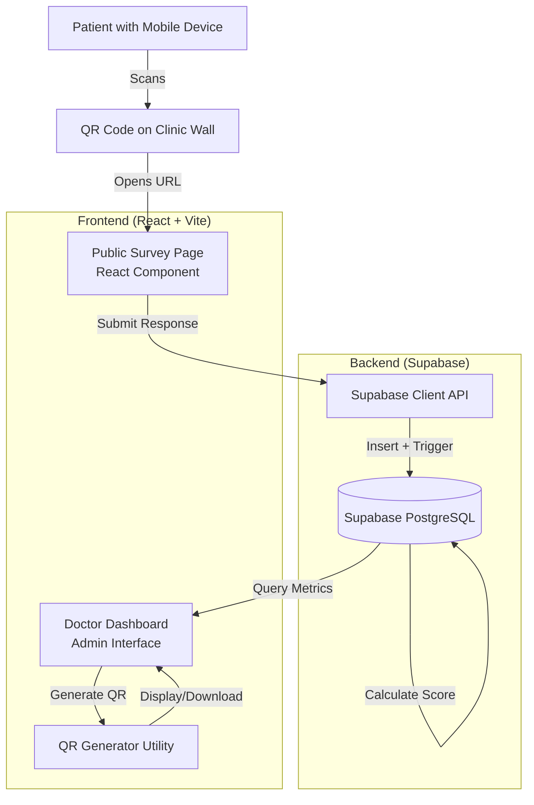

# Design Document: Patient Satisfaction Survey

## Overview

The Patient Satisfaction Survey system is a mobile-optimized feedback collection feature that integrates with the existing RCMC EMR system. It enables patients to provide structured ratings and comments about their clinic experience via QR code-accessible surveys. The system consists of three main components:

1. **Public Survey Interface**: A mobile-responsive web page accessible without authentication
2. **Rating Engine**: Backend logic for storing responses, calculating satisfaction scores, and performing sentiment analysis
3. **Doctor Dashboard Integration**: Administrative views displaying aggregated satisfaction metrics

The system leverages the existing React + Vite frontend architecture and Supabase PostgreSQL backend. It introduces a new `satisfaction_ratings` table while extending the existing `doctors` table with satisfaction metrics. The design prioritizes patient anonymity, review integrity through rate limiting, and real-time metric updates.

Key design decisions:
- Use browser fingerprinting combined with IP address for rate limiting (no authentication required)
- Implement sentiment analysis using keyword matching (simple, no external APIs)
- Generate QR codes client-side using the `qrcode` npm package
- Store satisfaction scores denormalized in the `doctors` table for fast dashboard queries
- Use Supabase Row Level Security (RLS) to enforce privacy constraints

## Architecture

### System Components



### Data Flow

1. **Survey Submission Flow**:
   - Patient scans QR code → Opens survey URL with doctor parameter
   - Patient fills form → Client validates inputs
   - Client generates fingerprint → Checks rate limit via Supabase query
   - If allowed → Insert into `satisfaction_ratings` table
   - Database trigger → Recalculates doctor's satisfaction score
   - Database trigger → Updates `doctors.satisfaction_score` and `doctors.total_reviews`
   - Client displays confirmation message

2. **Dashboard Display Flow**:
   - Admin opens Doctors page → Queries `doctors` table
   - Display satisfaction_score and total_reviews for each doctor
   - Admin can view individual comments (with RLS enforcement)
   - Admin can generate/download QR codes for each doctor

### Technology Stack

- **Frontend**: React 18, Vite, TailwindCSS
- **Backend**: Supabase (PostgreSQL 15, PostgREST API)
- **QR Generation**: `qrcode` npm package (client-side)
- **Fingerprinting**: `@fingerprintjs/fingerprintjs` (browser fingerprinting)
- **State Management**: React Context API (existing pattern)
- **Routing**: React Router v6 (existing)

## Components and Interfaces

### 1. Public Survey Page Component

**File**: `src/pages/PublicSurvey.jsx`

**Purpose**: Mobile-optimized survey form accessible without authentication

**Props**: None (reads URL parameters)

**State**:
```javascript
{
  doctorId: string | null,
  professionalismRating: number | null,
  waitingTimeRating: number | null,
  cleanlinessRating: number | null,
  comments: string,
  isSubmitting: boolean,
  submitSuccess: boolean,
  errorMessage: string | null
}
```

**Key Methods**:
- `handleSubmit()`: Validates form, checks rate limit, submits to Supabase
- `checkRateLimit()`: Queries recent submissions from same fingerprint
- `generateFingerprint()`: Creates unique device identifier

**UI Elements**:
- Doctor dropdown (pre-filled if URL param exists)
- Three 5-star rating inputs (professionalism, waiting time, cleanliness)
- Text area for comments (max 1000 chars)
- Submit button (disabled until valid)
- Success/error message display

**Responsive Design**: Optimized for 320px-768px screen widths

### 2. Rating Engine (Database Layer)

**Database Table**: `satisfaction_ratings`

```sql
CREATE TABLE satisfaction_ratings (
  id UUID PRIMARY KEY DEFAULT uuid_generate_v4(),
  doctor_id UUID NOT NULL REFERENCES doctors(id) ON DELETE CASCADE,
  professionalism_rating INTEGER NOT NULL CHECK (professionalism_rating BETWEEN 1 AND 5),
  waiting_time_rating INTEGER NOT NULL CHECK (waiting_time_rating BETWEEN 1 AND 5),
  cleanliness_rating INTEGER NOT NULL CHECK (cleanliness_rating BETWEEN 1 AND 5),
  comments TEXT,
  sentiment_score INTEGER DEFAULT 0,
  sentiment_classification TEXT CHECK (sentiment_classification IN ('Positive', 'Neutral', 'Negative')),
  submitter_fingerprint TEXT NOT NULL,
  submitter_ip TEXT,
  submission_timestamp TIMESTAMP WITH TIME ZONE DEFAULT NOW() NOT NULL,
  created_at TIMESTAMP WITH TIME ZONE DEFAULT NOW()
);

CREATE INDEX idx_satisfaction_doctor ON satisfaction_ratings(doctor_id);
CREATE INDEX idx_satisfaction_timestamp ON satisfaction_ratings(submission_timestamp);
CREATE INDEX idx_satisfaction_fingerprint ON satisfaction_ratings(submitter_fingerprint, submission_timestamp);
```

**Database Trigger**: `update_doctor_satisfaction_score()`

```sql
CREATE OR REPLACE FUNCTION update_doctor_satisfaction_score()
RETURNS TRIGGER AS $$
BEGIN
  UPDATE doctors
  SET 
    satisfaction_score = (
      SELECT ROUND(AVG(
        (professionalism_rating + waiting_time_rating + cleanliness_rating) / 3.0
      )::numeric, 2)
      FROM satisfaction_ratings
      WHERE doctor_id = NEW.doctor_id
    ),
    total_reviews = (
      SELECT COUNT(*)
      FROM satisfaction_ratings
      WHERE doctor_id = NEW.doctor_id
    )
  WHERE id = NEW.doctor_id;
  
  RETURN NEW;
END;
$$ LANGUAGE plpgsql;

CREATE TRIGGER trigger_update_satisfaction
AFTER INSERT ON satisfaction_ratings
FOR EACH ROW
EXECUTE FUNCTION update_doctor_satisfaction_score();
```

**Sentiment Analysis Function**: `analyze_sentiment()`

```sql
CREATE OR REPLACE FUNCTION analyze_sentiment(comment_text TEXT)
RETURNS TABLE(score INTEGER, classification TEXT) AS $$
DECLARE
  positive_keywords TEXT[] := ARRAY['fast', 'kind', 'excellent', 'professional', 'clean', 'friendly', 'helpful', 'great', 'wonderful', 'amazing'];
  negative_keywords TEXT[] := ARRAY['rude', 'slow', 'dirty', 'unprofessional', 'long wait', 'terrible', 'bad', 'poor', 'awful', 'horrible'];
  positive_count INTEGER := 0;
  negative_count INTEGER := 0;
  sentiment_score INTEGER;
  sentiment_class TEXT;
  keyword TEXT;
BEGIN
  -- Count positive keywords
  FOREACH keyword IN ARRAY positive_keywords LOOP
    IF LOWER(comment_text) LIKE '%' || keyword || '%' THEN
      positive_count := positive_count + 1;
    END IF;
  END LOOP;
  
  -- Count negative keywords
  FOREACH keyword IN ARRAY negative_keywords LOOP
    IF LOWER(comment_text) LIKE '%' || keyword || '%' THEN
      negative_count := negative_count + 1;
    END IF;
  END LOOP;
  
  sentiment_score := positive_count - negative_count;
  
  IF sentiment_score > 0 THEN
    sentiment_class := 'Positive';
  ELSIF sentiment_score < 0 THEN
    sentiment_class := 'Negative';
  ELSE
    sentiment_class := 'Neutral';
  END IF;
  
  RETURN QUERY SELECT sentiment_score, sentiment_class;
END;
$$ LANGUAGE plpgsql;
```

### 3. Doctor Dashboard Integration

**File**: `src/pages/Doctors.jsx` (extend existing)

**New UI Elements**:
- Satisfaction score badge (displayed next to each doctor)
- Total reviews count
- "View Feedback" button (opens modal with comments)
- "Generate QR Code" button (downloads PNG)

**New Methods**:
```javascript
// Add to existing Doctors component
const generateQRCode = async (doctorId, doctorName) => {
  const url = `${window.location.origin}/survey?doc=${doctorId}`;
  const qrDataUrl = await QRCode.toDataURL(url, {
    width: 400,
    margin: 2,
    color: {
      dark: '#000000',
      light: '#FFFFFF'
    }
  });
  
  // Trigger download
  const link = document.createElement('a');
  link.href = qrDataUrl;
  link.download = `qr-${doctorName.replace(/\s+/g, '-')}.png`;
  link.click();
};

const viewFeedback = async (doctorId) => {
  const { data, error } = await supabase
    .from('satisfaction_ratings')
    .select('professionalism_rating, waiting_time_rating, cleanliness_rating, comments, sentiment_classification, submission_timestamp')
    .eq('doctor_id', doctorId)
    .order('submission_timestamp', { ascending: false });
  
  // Display in modal
  setFeedbackData(data);
  setShowFeedbackModal(true);
};
```

### 4. QR Code Generator Utility

**File**: `src/utils/qrGenerator.js`

```javascript
import QRCode from 'qrcode';

export const generateDoctorQR = async (doctorId, doctorName, options = {}) => {
  const baseUrl = window.location.origin;
  const surveyUrl = `${baseUrl}/survey?doc=${doctorId}`;
  
  const qrOptions = {
    width: options.width || 400,
    margin: options.margin || 2,
    color: {
      dark: options.darkColor || '#000000',
      light: options.lightColor || '#FFFFFF'
    },
    errorCorrectionLevel: 'M'
  };
  
  try {
    const dataUrl = await QRCode.toDataURL(surveyUrl, qrOptions);
    return {
      success: true,
      dataUrl,
      url: surveyUrl
    };
  } catch (error) {
    return {
      success: false,
      error: error.message
    };
  }
};

export const generateBatchQRCodes = async (doctors) => {
  const results = await Promise.all(
    doctors.map(doctor => 
      generateDoctorQR(doctor.id, `${doctor.first_name} ${doctor.last_name}`)
    )
  );
  
  return results;
};

export const downloadQRCode = (dataUrl, filename) => {
  const link = document.createElement('a');
  link.href = dataUrl;
  link.download = filename;
  document.body.appendChild(link);
  link.click();
  document.body.removeChild(link);
};
```

### 5. Rate Limiter Service

**File**: `src/services/rateLimiter.js`

```javascript
import FingerprintJS from '@fingerprintjs/fingerprintjs';
import { supabase } from '../lib/supabase';

export const checkRateLimit = async () => {
  // Generate fingerprint
  const fp = await FingerprintJS.load();
  const result = await fp.get();
  const fingerprint = result.visitorId;
  
  // Get IP address (best effort)
  let ipAddress = null;
  try {
    const response = await fetch('https://api.ipify.org?format=json');
    const data = await response.json();
    ipAddress = data.ip;
  } catch (error) {
    console.warn('Could not fetch IP address:', error);
  }
  
  // Check for submissions in last 24 hours
  const twentyFourHoursAgo = new Date(Date.now() - 24 * 60 * 60 * 1000).toISOString();
  
  const { data, error } = await supabase
    .from('satisfaction_ratings')
    .select('id, submission_timestamp')
    .eq('submitter_fingerprint', fingerprint)
    .gte('submission_timestamp', twentyFourHoursAgo)
    .limit(1);
  
  if (error) {
    console.error('Rate limit check error:', error);
    return { allowed: true, fingerprint, ipAddress }; // Fail open
  }
  
  const allowed = !data || data.length === 0;
  
  return {
    allowed,
    fingerprint,
    ipAddress,
    lastSubmission: data && data.length > 0 ? data[0].submission_timestamp : null
  };
};
```

### 6. Database Helper Extensions

**File**: `src/lib/supabase.js` (extend existing `db` object)

```javascript
// Add to existing db object
export const db = {
  // ... existing methods ...
  
  // ==================== SATISFACTION SURVEYS ====================
  async submitSurvey(surveyData) {
    const { data, error } = await supabase
      .from('satisfaction_ratings')
      .insert([{
        doctor_id: surveyData.doctorId,
        professionalism_rating: surveyData.professionalismRating,
        waiting_time_rating: surveyData.waitingTimeRating,
        cleanliness_rating: surveyData.cleanlinessRating,
        comments: surveyData.comments?.trim() || null,
        submitter_fingerprint: surveyData.fingerprint,
        submitter_ip: surveyData.ipAddress
      }])
      .select()
      .single();
    
    if (error) throw error;
    
    // Analyze sentiment if comments provided
    if (surveyData.comments?.trim()) {
      await this.analyzeSentiment(data.id, surveyData.comments);
    }
    
    return data;
  },
  
  async analyzeSentiment(ratingId, commentText) {
    const { data, error } = await supabase
      .rpc('analyze_sentiment', { comment_text: commentText });
    
    if (error) {
      console.error('Sentiment analysis error:', error);
      return;
    }
    
    // Update rating with sentiment
    await supabase
      .from('satisfaction_ratings')
      .update({
        sentiment_score: data[0].score,
        sentiment_classification: data[0].classification
      })
      .eq('id', ratingId);
  },
  
  async getDoctorFeedback(doctorId, limit = 50) {
    const { data, error } = await supabase
      .from('satisfaction_ratings')
      .select('professionalism_rating, waiting_time_rating, cleanliness_rating, comments, sentiment_classification, submission_timestamp')
      .eq('doctor_id', doctorId)
      .order('submission_timestamp', { ascending: false })
      .limit(limit);
    
    if (error) throw error;
    return data || [];
  },
  
  async exportSurveyResponses(doctorId = null) {
    let query = supabase
      .from('satisfaction_ratings')
      .select(`
        *,
        doctor:doctors(first_name, last_name)
      `)
      .order('submission_timestamp', { ascending: false });
    
    if (doctorId) {
      query = query.eq('doctor_id', doctorId);
    }
    
    const { data, error } = await query;
    
    if (error) throw error;
    return data || [];
  }
};
```

## Data Models

### satisfaction_ratings Table

| Column | Type | Constraints | Description |
|--------|------|-------------|-------------|
| id | UUID | PRIMARY KEY | Unique identifier |
| doctor_id | UUID | NOT NULL, FK → doctors(id) | Doctor being rated |
| professionalism_rating | INTEGER | NOT NULL, CHECK (1-5) | Rating for doctor professionalism |
| waiting_time_rating | INTEGER | NOT NULL, CHECK (1-5) | Rating for waiting time |
| cleanliness_rating | INTEGER | NOT NULL, CHECK (1-5) | Rating for facility cleanliness |
| comments | TEXT | NULL | Optional patient feedback |
| sentiment_score | INTEGER | DEFAULT 0 | Calculated sentiment score |
| sentiment_classification | TEXT | CHECK (Positive/Neutral/Negative) | Sentiment category |
| submitter_fingerprint | TEXT | NOT NULL | Browser fingerprint for rate limiting |
| submitter_ip | TEXT | NULL | IP address (best effort) |
| submission_timestamp | TIMESTAMPTZ | NOT NULL, DEFAULT NOW() | When survey was submitted |
| created_at | TIMESTAMPTZ | DEFAULT NOW() | Record creation time |

**Indexes**:
- `idx_satisfaction_doctor` on `doctor_id`
- `idx_satisfaction_timestamp` on `submission_timestamp`
- `idx_satisfaction_fingerprint` on `(submitter_fingerprint, submission_timestamp)`

### doctors Table Extensions

Add new columns to existing `doctors` table:

| Column | Type | Constraints | Description |
|--------|------|-------------|-------------|
| satisfaction_score | DECIMAL(3,2) | NULL, CHECK (1.00-5.00) | Average satisfaction score |
| total_reviews | INTEGER | DEFAULT 0 | Count of survey responses |

**Migration SQL**:
```sql
ALTER TABLE doctors
ADD COLUMN satisfaction_score DECIMAL(3,2) CHECK (satisfaction_score >= 1.00 AND satisfaction_score <= 5.00),
ADD COLUMN total_reviews INTEGER DEFAULT 0;

CREATE INDEX idx_doctors_satisfaction ON doctors(satisfaction_score DESC) WHERE satisfaction_score IS NOT NULL;
```

### Survey Response Object (Frontend)

```typescript
interface SurveyResponse {
  doctorId: string;
  professionalismRating: number; // 1-5
  waitingTimeRating: number; // 1-5
  cleanlinessRating: number; // 1-5
  comments: string; // max 1000 chars
  fingerprint: string;
  ipAddress: string | null;
}
```

### Doctor Satisfaction Metrics (Frontend)

```typescript
interface DoctorSatisfactionMetrics {
  doctorId: string;
  doctorName: string;
  satisfactionScore: number | null; // 1.00-5.00
  totalReviews: number;
  recentFeedback: FeedbackItem[];
}

interface FeedbackItem {
  professionalismRating: number;
  waitingTimeRating: number;
  cleanlinessRating: number;
  comments: string | null;
  sentimentClassification: 'Positive' | 'Neutral' | 'Negative';
  submissionTimestamp: string;
}
```


## Correctness Properties

A property is a characteristic or behavior that should hold true across all valid executions of a system—essentially, a formal statement about what the system should do. Properties serve as the bridge between human-readable specifications and machine-verifiable correctness guarantees.

### Property Reflection

After analyzing all acceptance criteria, I identified several areas where properties can be consolidated:

- **URL Parameter Handling**: Properties 1.3 and 1.4 both test URL parameter parsing and can be combined into a single property about URL parameter processing
- **Rating Validation**: Properties 2.5, 4.4, and 11.2 all test that ratings are 1-5 integers - these can be consolidated
- **Score Calculation**: Properties 5.2, 5.3, 5.4, and 13.3 all relate to satisfaction score calculation and can be combined
- **Sentiment Analysis**: Properties 8.1, 8.2, 8.3, and 8.4 form a cohesive sentiment analysis pipeline and can be consolidated
- **Data Integrity**: Properties 13.2 and 3.1 both test that submitted data is stored correctly - these overlap
- **QR Code Generation**: Properties 6.1, 6.2, and 6.5 all test URL encoding in QR codes and can be combined

### Property 1: URL Parameter Pre-filling

For any doctor ID provided as a URL parameter, the survey form should parse the parameter and pre-fill the doctor selection field with that doctor's information.

**Validates: Requirements 1.3, 1.4**

### Property 2: Form Validation Enables Submission

For any form state where all required fields (doctor selection and at least one rating) are completed with valid values, the submit button should be enabled.

**Validates: Requirements 2.4, 2.5**

### Property 3: Doctor Existence Validation

For any doctor ID submitted in a survey response, the system should verify that the doctor exists in the providers table and is active before accepting the submission.

**Validates: Requirements 2.6, 11.5**

### Property 4: Rating Value Constraints

For any rating value (professionalism, waiting time, or cleanliness), the system should only accept integers between 1 and 5 inclusive, rejecting any values outside this range.

**Validates: Requirements 4.4, 11.2**

### Property 5: Survey Submission Storage

For any valid survey response, submitting it should result in a new record in the satisfaction_ratings table with all submitted values stored correctly and a timestamp automatically set.

**Validates: Requirements 3.1, 4.5, 13.2**

### Property 6: Form Reset After Submission

For any successful survey submission, the form should be cleared and reset to its initial empty state.

**Validates: Requirements 3.3**

### Property 7: Error State Preservation

For any submission that fails due to network error, the form should retain all user-entered data and display an error message.

**Validates: Requirements 3.4**

### Property 8: Submit Button Idempotency

For any form submission attempt, clicking the submit button should disable it immediately to prevent multiple submissions.

**Validates: Requirements 3.5**

### Property 9: NOT NULL Constraint Enforcement

For any insert attempt into satisfaction_ratings without doctor_id or submission_timestamp, the database should reject the insertion.

**Validates: Requirements 4.3**

### Property 10: Satisfaction Score Calculation

For any doctor with survey responses, the satisfaction_score should equal the arithmetic mean of all ratings (professionalism + waiting_time + cleanliness) / 3 across all responses, rounded to two decimal places, and stored in the doctors table.

**Validates: Requirements 5.1, 5.2, 5.3, 5.4, 13.3**

### Property 11: Review Count Accuracy

For any doctor, the total_reviews count should equal the number of satisfaction_ratings records associated with that doctor.

**Validates: Requirements 5.5**

### Property 12: QR Code URL Encoding

For any doctor ID and optional room parameter, the generated QR code should encode a URL containing those parameters in the correct format (e.g., ?doc=ID&room=ROOM).

**Validates: Requirements 6.1, 6.2, 6.5**

### Property 13: QR Code Format Requirements

For any generated QR code, it should be in PNG format with dimensions of at least 200x200 pixels.

**Validates: Requirements 6.3**

### Property 14: Batch QR Generation

For any list of active providers, the QR generator should successfully create QR codes for all providers in the list.

**Validates: Requirements 6.4**

### Property 15: Dashboard Score Display Precision

For any doctor with a satisfaction_score, the dashboard should display that score with exactly two decimal places.

**Validates: Requirements 7.1**

### Property 16: Dashboard Review Count Display

For any doctor, the dashboard should display the total_reviews count.

**Validates: Requirements 7.2**

### Property 17: Dashboard Sorting

For any list of doctors displayed on the dashboard, they should be sorted by satisfaction_score in descending order (highest scores first).

**Validates: Requirements 7.3**

### Property 18: Sentiment Keyword Detection

For any comment text, the sentiment analyzer should correctly count the number of positive keywords (fast, kind, excellent, professional, clean, friendly, helpful, great, wonderful, amazing) and negative keywords (rude, slow, dirty, unprofessional, long wait, terrible, bad, poor, awful, horrible) present in the text.

**Validates: Requirements 8.1, 8.2**

### Property 19: Sentiment Score Calculation

For any comment with counted positive and negative keywords, the sentiment_score should equal (positive_count - negative_count).

**Validates: Requirements 8.3**

### Property 20: Sentiment Classification

For any sentiment_score, the classification should be "Positive" if score > 0, "Neutral" if score = 0, or "Negative" if score < 0.

**Validates: Requirements 8.4**

### Property 21: Sentiment Display

For any doctor with survey responses, the dashboard should display the sentiment classification for each response.

**Validates: Requirements 8.5**

### Property 22: Submitter Identifier Storage

For any survey submission, the system should store both the browser fingerprint and IP address (if available) with the response record.

**Validates: Requirements 9.1, 9.5**

### Property 23: Rate Limit Check

For any submission attempt, the system should query for existing submissions from the same fingerprint within the past 24 hours before allowing the submission.

**Validates: Requirements 9.2**

### Property 24: Duplicate Submission Rejection

For any submission attempt where a submission from the same fingerprint exists within the past 24 hours, the system should reject the submission with the message "You have already submitted feedback today".

**Validates: Requirements 9.3**

### Property 25: Rate Limit Expiration

For any fingerprint that submitted a survey more than 24 hours ago, a new submission from that fingerprint should be allowed.

**Validates: Requirements 9.4**

### Property 26: Doctor Privacy Protection

For any doctor user viewing the dashboard, the system should not display submitter IP addresses or device fingerprints in the feedback view.

**Validates: Requirements 10.2, 10.3**

### Property 27: Admin Access to Raw Data

For any user with admin or owner role, the system should allow viewing of individual survey response records including timestamps and all metadata.

**Validates: Requirements 10.4**

### Property 28: Row-Level Security Enforcement

For any doctor user attempting to query the satisfaction_ratings table directly, the database should enforce RLS policies that prevent access to raw submission data.

**Validates: Requirements 10.5**

### Property 29: XSS Prevention

For any text input containing HTML tags or JavaScript code, the system should sanitize the input to prevent XSS attacks before storage or display.

**Validates: Requirements 11.1**

### Property 30: Whitespace Trimming

For any comment text with leading or trailing whitespace, the system should trim the whitespace before storing in the database.

**Validates: Requirements 11.3**

### Property 31: Validation Error Messages

For any invalid input (missing required fields, out-of-range ratings, non-existent doctor), the system should return a descriptive error message explaining the validation failure.

**Validates: Requirements 11.4**

### Property 32: CSV Export Format

For any set of survey responses exported to CSV, the output should include headers and columns for doctor_name, professionalism_rating, waiting_time_rating, cleanliness_rating, comments, and submission_date.

**Validates: Requirements 12.2, 12.3**

### Property 33: CSV Special Character Escaping

For any comment containing special CSV characters (commas, quotes, newlines), the export function should properly escape these characters to maintain CSV integrity.

**Validates: Requirements 12.4**

### Property 34: Export Functionality

For any request to export survey responses (all or filtered by doctor), the system should generate and return a downloadable CSV file.

**Validates: Requirements 12.5**

### Property 35: Survey Response Round-Trip

For any valid survey response object, converting it to the database format, storing it, retrieving it, and converting back should produce an equivalent object with the same rating values and comment text.

**Validates: Requirements 13.1**

## Error Handling

### Client-Side Error Handling

1. **Network Errors**:
   - Catch all fetch/Supabase API errors
   - Display user-friendly error messages
   - Retain form data for retry
   - Log errors to console for debugging

2. **Validation Errors**:
   - Validate inputs before submission
   - Display inline validation messages
   - Highlight invalid fields
   - Prevent submission until valid

3. **Rate Limit Errors**:
   - Display clear message about 24-hour limit
   - Show time until next submission allowed
   - Provide alternative feedback channels

4. **QR Code Generation Errors**:
   - Catch QRCode library errors
   - Display error message to admin
   - Log error details
   - Provide fallback URL display

### Server-Side Error Handling

1. **Database Constraint Violations**:
   - Foreign key violations (invalid doctor_id)
   - Check constraint violations (invalid ratings)
   - NOT NULL violations
   - Return appropriate HTTP status codes (400 Bad Request)

2. **Rate Limiting**:
   - Query errors during rate limit check
   - Fail open (allow submission) if check fails
   - Log rate limit check failures

3. **Sentiment Analysis Errors**:
   - Catch errors in sentiment analysis function
   - Continue with submission even if sentiment fails
   - Log sentiment analysis errors
   - Set sentiment to NULL if analysis fails

4. **Trigger Errors**:
   - Catch errors in satisfaction score calculation trigger
   - Log trigger errors
   - Alert administrators
   - Ensure survey submission still succeeds

### Error Logging Strategy

```javascript
// Client-side error logging
const logError = (context, error, additionalData = {}) => {
  console.error(`[${context}]`, error, additionalData);
  
  // In production, send to error tracking service
  if (import.meta.env.PROD) {
    // Send to Sentry, LogRocket, etc.
  }
};

// Usage
try {
  await db.submitSurvey(surveyData);
} catch (error) {
  logError('Survey Submission', error, { surveyData });
  setErrorMessage('Failed to submit survey. Please try again.');
}
```

### Graceful Degradation

1. **IP Address Unavailable**: Continue with fingerprint only
2. **Fingerprint Generation Fails**: Use IP address only or generate random ID
3. **Sentiment Analysis Fails**: Store survey without sentiment data
4. **QR Code Generation Fails**: Display URL as text fallback

## Testing Strategy

### Dual Testing Approach

This feature requires both unit tests and property-based tests for comprehensive coverage:

- **Unit Tests**: Verify specific examples, edge cases, UI components, and integration points
- **Property Tests**: Verify universal properties across randomized inputs

### Unit Testing

**Framework**: Vitest (existing in project)

**Test Files**:
- `src/pages/PublicSurvey.test.jsx` - Survey component tests
- `src/services/rateLimiter.test.js` - Rate limiting logic tests
- `src/utils/qrGenerator.test.js` - QR code generation tests
- `src/lib/supabase.survey.test.js` - Database helper tests

**Unit Test Coverage**:

1. **Survey Component Tests**:
   - Renders all form elements (doctor dropdown, 3 rating inputs, comment textarea, submit button)
   - Pre-fills doctor from URL parameter
   - Enables submit button when form is valid
   - Disables submit button when form is invalid
   - Displays success message after submission
   - Displays error message on failure
   - Clears form after successful submission
   - Retains form data on error

2. **Rate Limiter Tests**:
   - Generates fingerprint successfully
   - Fetches IP address (with mock)
   - Allows submission when no recent submissions
   - Blocks submission when recent submission exists
   - Allows submission after 24 hours

3. **QR Generator Tests**:
   - Generates QR code with doctor ID
   - Includes room parameter when provided
   - Returns PNG data URL
   - Handles generation errors gracefully
   - Batch generates for multiple doctors

4. **Database Helper Tests**:
   - Inserts survey response correctly
   - Triggers sentiment analysis
   - Retrieves doctor feedback
   - Exports responses to array

5. **Edge Cases**:
   - Empty comment (should be allowed)
   - Maximum length comment (1000 chars)
   - Special characters in comments
   - Invalid doctor ID
   - Missing required fields
   - Zero reviews (display "No reviews yet")

### Property-Based Testing

**Framework**: fast-check (to be installed)

**Configuration**: Minimum 100 iterations per property test

**Test File**: `src/tests/satisfaction-survey.property.test.js`

**Property Test Coverage**:

Each property test must include a comment tag referencing the design document property:

```javascript
// Feature: patient-satisfaction-survey, Property 4: Rating Value Constraints
test('ratings must be integers between 1 and 5', () => {
  fc.assert(
    fc.property(
      fc.integer({ min: -100, max: 100 }),
      (rating) => {
        const isValid = rating >= 1 && rating <= 5;
        const result = validateRating(rating);
        return result.valid === isValid;
      }
    ),
    { numRuns: 100 }
  );
});
```

**Properties to Test**:

1. **Property 4**: Rating value constraints (1-5)
2. **Property 10**: Satisfaction score calculation (arithmetic mean, 2 decimals)
3. **Property 11**: Review count accuracy
4. **Property 18**: Sentiment keyword detection
5. **Property 19**: Sentiment score calculation
6. **Property 20**: Sentiment classification
7. **Property 30**: Whitespace trimming
8. **Property 33**: CSV special character escaping
9. **Property 35**: Survey response round-trip

**Property Test Generators**:

```javascript
// Generate random survey responses
const surveyResponseArbitrary = fc.record({
  doctorId: fc.uuid(),
  professionalismRating: fc.integer({ min: 1, max: 5 }),
  waitingTimeRating: fc.integer({ min: 1, max: 5 }),
  cleanlinessRating: fc.integer({ min: 1, max: 5 }),
  comments: fc.string({ maxLength: 1000 }),
  fingerprint: fc.hexaString({ minLength: 32, maxLength: 32 }),
  ipAddress: fc.ipV4()
});

// Generate comments with sentiment keywords
const commentWithSentimentArbitrary = fc.oneof(
  fc.constantFrom('fast', 'kind', 'excellent', 'professional', 'clean'),
  fc.constantFrom('rude', 'slow', 'dirty', 'unprofessional', 'long wait'),
  fc.string()
).chain(keyword => 
  fc.tuple(
    fc.string(),
    fc.constant(keyword),
    fc.string()
  ).map(([before, kw, after]) => `${before} ${kw} ${after}`)
);
```

### Integration Testing

**Test Scenarios**:

1. **End-to-End Survey Submission**:
   - Scan QR code → Load survey → Fill form → Submit → Verify database record
   - Verify satisfaction score updated
   - Verify review count incremented

2. **Rate Limiting Flow**:
   - Submit survey → Attempt immediate resubmission → Verify rejection
   - Wait 24 hours (mock time) → Resubmit → Verify acceptance

3. **Dashboard Display**:
   - Submit multiple surveys → Verify dashboard shows correct scores
   - Verify sorting by score
   - Verify sentiment display

4. **Privacy Enforcement**:
   - Login as doctor → Attempt to view raw data → Verify blocked
   - Login as admin → View raw data → Verify allowed

### Database Testing

**Test File**: `database-tests/satisfaction-survey.sql`

**Tests**:

1. **Schema Validation**:
   - Verify satisfaction_ratings table exists with correct columns
   - Verify foreign key constraints
   - Verify check constraints
   - Verify indexes

2. **Trigger Testing**:
   - Insert survey response → Verify satisfaction_score updated
   - Insert multiple responses → Verify score is average
   - Verify total_reviews incremented

3. **Sentiment Analysis Function**:
   - Test with positive keywords → Verify positive classification
   - Test with negative keywords → Verify negative classification
   - Test with mixed keywords → Verify correct score

4. **RLS Policies**:
   - Test doctor role cannot query satisfaction_ratings
   - Test admin role can query satisfaction_ratings

### Test Data Generators

```javascript
// Generate test doctors
export const generateTestDoctor = () => ({
  id: crypto.randomUUID(),
  first_name: faker.person.firstName(),
  last_name: faker.person.lastName(),
  specialization: faker.helpers.arrayElement(['General Practice', 'Pediatrics', 'Internal Medicine']),
  license_number: faker.string.alphanumeric(10),
  contact_number: faker.phone.number(),
  email: faker.internet.email(),
  status: 'Active'
});

// Generate test survey response
export const generateTestSurvey = (doctorId) => ({
  doctorId,
  professionalismRating: faker.number.int({ min: 1, max: 5 }),
  waitingTimeRating: faker.number.int({ min: 1, max: 5 }),
  cleanlinessRating: faker.number.int({ min: 1, max: 5 }),
  comments: faker.lorem.sentence(),
  fingerprint: faker.string.hexadecimal({ length: 32 }),
  ipAddress: faker.internet.ipv4()
});
```

### Testing Checklist

Before marking implementation complete:

- [ ] All unit tests pass
- [ ] All property tests pass (100+ iterations each)
- [ ] Integration tests pass
- [ ] Database tests pass
- [ ] Manual testing on mobile devices (320px-768px)
- [ ] QR codes scan correctly
- [ ] Rate limiting works as expected
- [ ] Dashboard displays correct metrics
- [ ] Privacy policies enforced
- [ ] Error handling works for all scenarios
- [ ] Performance meets requirements (<2s page load, <500ms queries)

## Implementation Notes

### Phase 1: Database Setup
1. Create satisfaction_ratings table
2. Add columns to doctors table
3. Create trigger function
4. Create sentiment analysis function
5. Set up RLS policies
6. Create indexes

### Phase 2: Backend Services
1. Extend Supabase helpers in `src/lib/supabase.js`
2. Implement rate limiter service
3. Implement QR generator utility
4. Add error logging

### Phase 3: Frontend Components
1. Create PublicSurvey page component
2. Add survey route to App.jsx
3. Extend Doctors page with satisfaction metrics
4. Add feedback modal component
5. Add QR code generation UI

### Phase 4: Testing
1. Write unit tests
2. Write property tests
3. Write integration tests
4. Write database tests
5. Manual testing

### Phase 5: Deployment
1. Run database migrations
2. Deploy frontend changes
3. Generate initial QR codes
4. Print and distribute QR codes
5. Monitor for errors

### Dependencies to Install

```json
{
  "dependencies": {
    "qrcode": "^1.5.3",
    "@fingerprintjs/fingerprintjs": "^4.2.0"
  },
  "devDependencies": {
    "fast-check": "^3.15.0",
    "@faker-js/faker": "^8.3.1"
  }
}
```

### Security Considerations

1. **Input Sanitization**: All text inputs must be sanitized to prevent XSS
2. **Rate Limiting**: Prevent review bombing with fingerprint + IP combination
3. **RLS Policies**: Enforce privacy at database level
4. **Anonymous Submissions**: No PII collection
5. **HTTPS Only**: Survey page must be served over HTTPS
6. **CORS Configuration**: Ensure Supabase allows requests from survey domain

### Performance Optimization

1. **Denormalized Scores**: Store satisfaction_score in doctors table for fast queries
2. **Indexed Queries**: Create indexes on frequently queried columns
3. **Lazy Loading**: Load feedback modal data only when opened
4. **QR Code Caching**: Cache generated QR codes in browser
5. **Batch Operations**: Use batch inserts for multiple surveys if needed

### Accessibility

1. **Keyboard Navigation**: All form elements keyboard accessible
2. **Screen Reader Support**: Proper ARIA labels on all inputs
3. **Color Contrast**: Ensure sufficient contrast for ratings
4. **Focus Indicators**: Clear focus states on all interactive elements
5. **Error Announcements**: Screen reader announcements for errors

### Mobile Optimization

1. **Touch Targets**: Minimum 44x44px touch targets for star ratings
2. **Viewport Meta**: Proper viewport configuration
3. **Responsive Typography**: Readable font sizes on small screens
4. **Minimal Scrolling**: Form fits on one screen when possible
5. **Fast Loading**: Optimize assets for mobile networks

