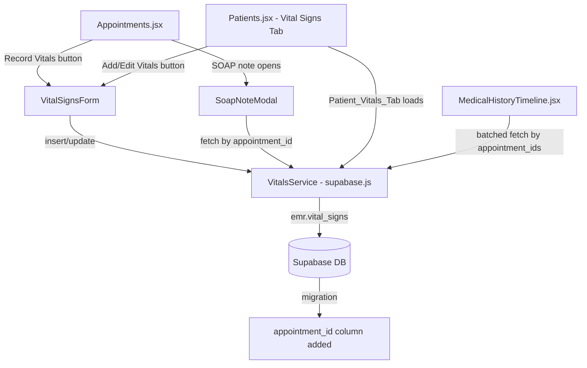

# Design Document: Patient Vital Signs

## Overview

This feature activates the existing but unused `emr.vital_signs` table and integrates structured vital sign recording into the RCMC EMR consultation workflow. Each set of vitals is linked to both a `patient_id` and an `appointment_id`, making vitals per-visit rather than per-patient. The feature surfaces in three display locations (SOAP note, medical history timeline, patient vitals tab) and two entry points (Appointments.jsx primary, Patients.jsx secondary).

The key design constraint is that the `emr.vital_signs` table needs a new `appointment_id` column added via migration. All other table columns already exist in the schema. Height and BMI are explicitly excluded from this feature.

## Architecture



The architecture follows the existing pattern in this codebase: all Supabase interactions go through `db` methods in `rcmc-emr/src/lib/supabase.js`. React components call these methods directly — there is no intermediate service layer. New components follow the existing Tailwind CSS styling conventions.

## Components and Interfaces

### New Files

**`rcmc-emr/src/components/VitalSignsForm.jsx`**

Shared form component used by both entry points. Props:

```js
{
  patientId: string,           // required
  appointmentId: string,       // required from Appointments entry; null from Patients entry (user selects)
  patientAppointments: array,  // required when appointmentId is null (for dropdown)
  initialValues: object,       // pre-populated values when editing existing record
  onSuccess: function,         // called after successful save
  onCancel: function,          // called when user cancels
  mode: 'appointments' | 'patients'  // controls whether appointment dropdown is shown
}
```

Fields rendered: `recorded_at` (datetime-local), `blood_pressure_systolic`, `blood_pressure_diastolic`, `heart_rate`, `temperature`, `respiratory_rate`, `oxygen_saturation`, `weight`, `notes`. No height or BMI fields.

**`rcmc-emr/src/components/VitalSignsBadge.jsx`**

Utility component that wraps a vital sign value and applies abnormal-value styling. Used in all three display locations.

```js
// Props
{ field: string, value: number | null }
// Returns value with amber/red badge if outside normal range, plain text if normal or null
```

### Modified Files

**`rcmc-emr/src/lib/supabase.js`** — new `vitals` section added to the `db` object:

```js
db.vitals = {
  getByPatient(patientId),           // all records for patient, ordered by recorded_at desc
  getByAppointment(appointmentId),   // single record for appointment
  getByAppointmentIds(ids),          // batched fetch: returns map of appointmentId -> record
  upsert(record),                    // insert or update based on appointment_id uniqueness
  update(id, updates),               // update existing record by id
  delete(id),                        // hard delete
}
```

**`rcmc-emr/src/pages/Appointments.jsx`** — adds "Record Vitals" button to each appointment row and a vitals-recorded indicator. Opens `VitalSignsForm` in a modal.

**`rcmc-emr/src/pages/Patients.jsx`** — adds a "Vital Signs" tab to the patient history modal. Renders the vitals history table and "Add Vitals" / edit / delete controls.

**`rcmc-emr/src/components/MedicalHistoryTimeline.jsx`** — augments consultation entries with per-visit vitals fetched via `getByAppointmentIds`. Renders vitals inline using `VitalSignsBadge`.

**`rcmc-emr/src/pages/Appointments.jsx` (SOAP modal)** — replaces the free-text objective pre-population with structured vitals display. Fetches vitals for the current `appointment_id` on modal open; falls back to most recent prior vitals if none exist for this appointment.

### Database Migration

A SQL migration must be run in Supabase before deploying the frontend:

```sql
-- Add appointment_id to emr.vital_signs
ALTER TABLE emr.vital_signs
  ADD COLUMN IF NOT EXISTS appointment_id UUID REFERENCES emr.appointments(id) ON DELETE SET NULL;

CREATE UNIQUE INDEX IF NOT EXISTS idx_vital_signs_appointment
  ON emr.vital_signs(appointment_id)
  WHERE appointment_id IS NOT NULL;

CREATE INDEX IF NOT EXISTS idx_vital_signs_appointment_lookup
  ON emr.vital_signs(appointment_id);
```

The unique index on `appointment_id` enforces the one-record-per-appointment constraint at the database level, making the upsert logic reliable.

## Data Models

### `emr.vital_signs` (extended)

| Column | Type | Notes |
|---|---|---|
| `id` | UUID PK | existing |
| `patient_id` | UUID FK → patients | existing, required |
| `appointment_id` | UUID FK → appointments | **new column**, nullable (legacy records), unique |
| `recorded_at` | TIMESTAMPTZ | existing; user-supplied, not server default |
| `blood_pressure_systolic` | INTEGER | existing |
| `blood_pressure_diastolic` | INTEGER | existing |
| `heart_rate` | INTEGER | existing |
| `temperature` | NUMERIC(4,1) | existing |
| `respiratory_rate` | INTEGER | existing |
| `oxygen_saturation` | INTEGER | existing |
| `weight` | NUMERIC(5,2) | existing |
| `height` | NUMERIC(5,2) | existing but NOT used by this feature |
| `bmi` | NUMERIC(4,2) | existing but NOT used by this feature |
| `notes` | TEXT | existing |
| `recorded_by` | UUID FK → auth.users | existing |
| `created_at` | TIMESTAMPTZ | existing, server-side |

### Validation Ranges (form-level)

| Field | Min | Max | Unit |
|---|---|---|---|
| blood_pressure_systolic | 60 | 250 | mmHg |
| blood_pressure_diastolic | 40 | 150 | mmHg |
| heart_rate | 30 | 250 | bpm |
| temperature | 34.0 | 42.0 | °C |
| respiratory_rate | 8 | 40 | breaths/min |
| oxygen_saturation | 70 | 100 | % |
| weight | 1 | 300 | kg |

### Normal Ranges (abnormal flagging)

| Field | Normal Min | Normal Max |
|---|---|---|
| blood_pressure_systolic | 90 | 139 |
| blood_pressure_diastolic | 60 | 89 |
| heart_rate | 60 | 100 |
| temperature | 36.1 | 37.2 |
| respiratory_rate | 12 | 20 |
| oxygen_saturation | 95 | 100 |
| weight | — | — (not flagged) |

### VitalSignsRecord (JS object shape)

```js
{
  id: string,
  patient_id: string,
  appointment_id: string,
  recorded_at: string,          // ISO datetime, user-supplied
  blood_pressure_systolic: number | null,
  blood_pressure_diastolic: number | null,
  heart_rate: number | null,
  temperature: number | null,
  respiratory_rate: number | null,
  oxygen_saturation: number | null,
  weight: number | null,
  notes: string | null,
  recorded_by: string           // auth user UUID
}
```


## Correctness Properties

*A property is a characteristic or behavior that should hold true across all valid executions of a system — essentially, a formal statement about what the system should do. Properties serve as the bridge between human-readable specifications and machine-verifiable correctness guarantees.*

### Property 1: Upsert idempotence — one record per appointment

*For any* `appointment_id`, calling `db.vitals.upsert` twice with different measurement values should result in exactly one record in `emr.vital_signs` for that `appointment_id`, and the stored values should match the second call's payload.

**Validates: Requirements 1.5, 2.6**

### Property 2: Patient vitals query is ordered newest-first

*For any* patient with multiple vitals records having distinct `recorded_at` timestamps, `db.vitals.getByPatient(patientId)` should return the records in descending `recorded_at` order (newest first).

**Validates: Requirements 1.3, 3.1**

### Property 3: Appointment vitals round-trip

*For any* valid vitals payload with a `patient_id` and `appointment_id`, after calling `db.vitals.upsert`, calling `db.vitals.getByAppointment(appointmentId)` should return a record whose measurement fields match the upserted payload.

**Validates: Requirements 1.1, 1.4**

### Property 4: Validation range enforcement

*For any* measurement field in the `VitalSignsForm` and *for any* numeric value outside that field's defined min/max range, the form should display an inline validation error for that field and the submit button should be disabled. When the value is corrected to within range, the error should clear.

**Validates: Requirements 8.1, 8.2, 8.3, 8.4**

### Property 5: Abnormal value flagging is correct and complete

*For any* vital sign field (excluding weight) and *for any* displayed value, the `VitalSignsBadge` component should apply an abnormal indicator if and only if the value falls outside the defined normal range for that field. Weight values should never receive an abnormal indicator regardless of their value.

**Validates: Requirements 9.1, 9.2, 9.3**

### Property 6: Timeline consultation entries display associated vitals

*For any* consultation entry in the `MedicalHistoryTimeline` that has an associated `Vital_Signs_Record` (matched by `appointment_id`), the rendered entry should display all six labeled vital sign fields (BP systolic/diastolic, heart rate, temperature, respiratory rate, oxygen saturation, weight) with their units. Height and BMI should not appear.

**Validates: Requirements 4.1, 4.2, 4.3**

### Property 7: Edit pre-populates form with existing record values

*For any* `Vital_Signs_Record` displayed in the `Patient_Vitals_Tab`, clicking the edit action should open the `VitalSignsForm` with every field pre-populated with the exact values from that record (including `recorded_at`).

**Validates: Requirements 6.1**

### Property 8: Delete removes record from patient history

*For any* `Vital_Signs_Record` belonging to a patient, after the user confirms deletion, `db.vitals.getByPatient(patientId)` should not contain a record with that `id`.

**Validates: Requirements 10.3**

### Property 9: recorded_at round-trip

*For any* valid datetime value entered in the `recorded_at` field of the `VitalSignsForm`, after form submission, the stored record's `recorded_at` should equal the user-entered value (not the server insert time).

**Validates: Requirements 11.2, 11.3**

### Property 10: Appointment dropdown filtered to current patient

*For any* patient opened in the `Patient_Vitals_Tab`, the appointment dropdown in the `VitalSignsForm` should contain only appointments whose `patient_id` matches the current patient, and they should be ordered by `appointment_date` descending.

**Validates: Requirements 2b.3**

## Error Handling

**VitalsService failures** — All `db.vitals` methods throw on Supabase error. Callers (form components) catch and display an inline error message. Form data is retained in state so the user can retry without re-entering values.

**All-empty submission** — `VitalSignsForm` validates that at least one measurement field is non-empty before enabling submit. This is a client-side check; no network call is made.

**Missing appointment selection** — When `mode === 'patients'`, the form validates that an appointment is selected before enabling submit.

**Missing `recorded_at`** — The form validates that `recorded_at` is non-empty before enabling submit.

**Out-of-range values** — Per-field inline errors are shown immediately on blur. Submit is disabled while any field has an out-of-range value.

**Optimistic UI** — The Appointments page uses optimistic updates for appointment status changes (existing pattern). Vitals recording does not use optimistic UI because the returned `id` is needed for subsequent edit/delete operations.

**SOAP note vitals fetch failure** — If the vitals fetch fails when opening the SOAP modal, the objective section shows an error state with a retry button. The rest of the SOAP note remains functional.

**Batched timeline fetch failure** — If `getByAppointmentIds` fails, the timeline renders consultation entries with "No vitals recorded" indicators rather than failing the entire timeline load.

## Testing Strategy

### Unit Tests (example-based)

Focus on specific behaviors and edge cases:

- `VitalSignsForm` renders all 8 measurement fields and no height/BMI field
- `VitalSignsForm` shows inline error when a field value is out of range
- `VitalSignsForm` disables submit when all measurement fields are empty
- `VitalSignsForm` disables submit when `recorded_at` is cleared
- `VitalSignsForm` disables submit when appointment is not selected (patients mode)
- `VitalSignsBadge` renders without indicator for weight regardless of value
- `VitalSignsBadge` renders without indicator for in-range values
- `Patient_Vitals_Tab` shows "No vitals recorded" when records array is empty
- `Patient_Vitals_Tab` shows loading indicator while fetching
- `Patient_Vitals_Tab` shows confirmation prompt before delete
- `MedicalHistoryTimeline` shows "No vitals recorded" for consultation entries with no linked vitals
- SOAP objective section shows prior vitals reference with date label when no current-appointment vitals exist
- SOAP objective section shows "no vitals on file" when patient has no vitals at all
- `db.vitals.getByAppointmentIds` is called once (not N times) when timeline loads

### Property-Based Tests

Use [fast-check](https://github.com/dubzzz/fast-check) (already compatible with Vitest, the likely test runner for this Vite project). Each property test runs a minimum of 100 iterations.

```
// Tag format: Feature: patient-vital-signs, Property {N}: {property_text}
```

- **Property 1** — Generate random appointment IDs and two sequential vitals payloads; verify upsert results in one record with second payload's values
- **Property 2** — Generate random arrays of vitals records with arbitrary timestamps; verify `getByPatient` returns them newest-first
- **Property 3** — Generate random vitals payloads; verify upsert then getByAppointment returns matching measurement values
- **Property 4** — Generate random field names and out-of-range values (using field-specific arbitraries); verify form shows error and disables submit; generate in-range corrections and verify error clears
- **Property 5** — Generate random vital sign values for each field; verify `VitalSignsBadge` applies indicator iff value is outside normal range; generate random weight values and verify no indicator ever applied
- **Property 6** — Generate random consultation entries with associated vitals records; verify timeline renders all six labeled fields with units and no height/BMI
- **Property 7** — Generate random vitals records; verify clicking edit pre-populates all form fields with exact record values
- **Property 8** — Generate random patient vitals histories; verify that after confirmed delete, the deleted record's ID is absent from subsequent getByPatient results
- **Property 9** — Generate random valid datetime strings; verify stored `recorded_at` matches user input
- **Property 10** — Generate random patients with random appointment sets; verify dropdown contains only the current patient's appointments in descending date order

### Integration Tests

These verify the Supabase RLS policies and database constraints — run against a test Supabase project or local Supabase instance:

- Authenticated user with role `admin`/`doctor`/`receptionist` can insert and update vitals
- Authenticated user with any role can read vitals
- Unauthenticated request to read or write vitals returns authorization error
- Inserting a second vitals record for the same `appointment_id` triggers the unique index constraint (upsert path handles this correctly)
- `appointment_id` FK constraint rejects inserts referencing non-existent appointments
