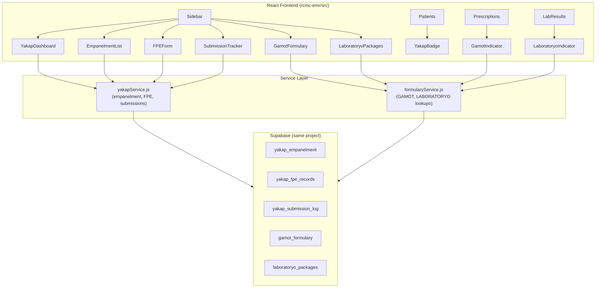

# PhilHealth YAKAP Phase 1 — Technical Design

## Overview

PhilHealth YAKAP (Your Affordable and Accessible Primary Care) is a capitation-based primary care benefit program. Phase 1 integrates YAKAP management directly into the existing RCMC EMR as an **additive module** — no duplicate systems, no separate databases. All new tables live in the same Supabase project. New React pages are added under `src/pages/Yakap/`, new services under `src/services/`, and new components under `src/components/yakap/`.

The integration touches four existing pages (Patients, Prescriptions, LabResults, Sidebar) with minimal, non-breaking additions: a YAKAP badge on patient rows, GAMOT/LABORATORYO coverage indicators on prescription and lab result items, and a new sidebar section.

---

## Architecture



**Key architectural decisions:**
- Single EMR, additive only — existing tables are extended with nullable columns, never replaced
- Reference tables (`gamot_formulary`, `laboratoryo_packages`) are read-only seed data; no UI for editing in Phase 1
- All YAKAP pages are lazy-loaded via `React.lazy()` consistent with the existing pattern in `App.jsx`
- RLS policies follow the same pattern as existing tables: authenticated users can read, admin/doctor can write


---

## Components and Interfaces

### New Pages (`src/pages/Yakap/`)

**`YakapDashboard.jsx`**
```jsx
// Props: none
// State: { stats: { totalEmpaneled, fpeCompletionPct, pendingSubmissions } }
// Renders: 3 stat cards + recent activity list
const YakapDashboard = () => { ... }
```

**`EmpanelmentList.jsx`**
```jsx
// Props: none
// State: { empanelments[], searchTerm, statusFilter, showAddModal, selectedPatient }
// Key functions:
//   handleEmpanel(patientId, doctorId) — calls yakapService.empanelPatient()
//   handleSearch(term) — filters by patient name / patient number
// Renders: searchable table + "Add to YAKAP" modal
const EmpanelmentList = () => { ... }
```

**`FPEForm.jsx`**
```jsx
// Props: { empanelmentId?, patientId?, onSave }
// State: { formData: FPERecord, currentSection, errors }
// Sections: Vitals | Medical History | Risk Factors | Chronic Conditions
// Key functions:
//   validateSection(section) — returns string[] of missing fields
//   handleSubmit() — calls yakapService.saveFPE()
const FPEForm = ({ empanelmentId, patientId, onSave }) => { ... }
```

**`SubmissionTracker.jsx`**
```jsx
// Props: none
// State: { submissions[], typeFilter, statusFilter }
// Key functions:
//   handleStatusUpdate(id, newStatus) — calls yakapService.updateSubmissionStatus()
// Renders: table with status badges, filter dropdowns
const SubmissionTracker = () => { ... }
```

**`GamotFormulary.jsx`**
```jsx
// Props: none
// State: { medicines[], searchTerm, categoryFilter }
// Renders: searchable table of 75 medicines with coverage indicators
const GamotFormulary = () => { ... }
```

**`LaboratoryoPackages.jsx`**
```jsx
// Props: none
// State: { packages[] }
// Renders: table of 13 lab tests with package details
const LaboratoryoPackages = () => { ... }
```

### New Components (`src/components/yakap/`)

**`YakapBadge.jsx`** — shown in `Patients.jsx` patient row
```jsx
// Props: { patientId: string }
// Fetches empanelment status on mount, renders a teal "YAKAP" pill badge if enrolled
const YakapBadge = ({ patientId }) => { ... }
```

**`GamotCoverageIndicator.jsx`** — shown in `Prescriptions.jsx` per medication item
```jsx
// Props: { medicineName: string }
// Calls formularyService.isInGamot(medicineName), renders green "GAMOT ✓" badge if covered
const GamotCoverageIndicator = ({ medicineName }) => { ... }
```

**`LaboratoryoCoverageIndicator.jsx`** — shown in `LabResults.jsx` per result row
```jsx
// Props: { testName: string }
// Calls formularyService.isInLaboratoryo(testName), renders green "LABORATORYO ✓" badge if covered
const LaboratoryoCoverageIndicator = ({ testName }) => { ... }
```

### Integration Points (existing files, minimal changes)

| File | Change |
|------|--------|
| `Sidebar.jsx` | Add "PhilHealth YAKAP" section with 6 sub-nav items |
| `App.jsx` | Add lazy imports + switch cases for 6 new pages |
| `Patients.jsx` | Render `<YakapBadge patientId={patient.id} />` in patient row |
| `Prescriptions.jsx` | Render `<GamotCoverageIndicator medicineName={med.name} />` per medication |
| `LabResults.jsx` | Render `<LaboratoryoCoverageIndicator testName={result.test_name} />` per row |


---

## Data Models

### New Tables

#### `yakap_empanelment`
```sql
CREATE TABLE yakap_empanelment (
  id                  UUID PRIMARY KEY DEFAULT uuid_generate_v4(),
  patient_id          UUID NOT NULL REFERENCES patients(id) ON DELETE CASCADE,
  doctor_id           UUID NOT NULL REFERENCES doctors(id),
  empanelment_date    DATE NOT NULL DEFAULT CURRENT_DATE,
  status              TEXT NOT NULL DEFAULT 'Active'
                        CHECK (status IN ('Active', 'Inactive', 'Transferred', 'Deceased')),
  philhealth_number   TEXT,                        -- denormalized for quick access
  capitation_period   TEXT,                        -- e.g. "2025-Q1"
  notes               TEXT,
  created_at          TIMESTAMPTZ DEFAULT NOW(),
  updated_at          TIMESTAMPTZ DEFAULT NOW(),
  CONSTRAINT uq_yakap_patient UNIQUE (patient_id)  -- one active empanelment per patient
);

CREATE INDEX idx_yakap_empanelment_patient   ON yakap_empanelment(patient_id);
CREATE INDEX idx_yakap_empanelment_doctor    ON yakap_empanelment(doctor_id);
CREATE INDEX idx_yakap_empanelment_status    ON yakap_empanelment(status);
CREATE INDEX idx_yakap_empanelment_period    ON yakap_empanelment(capitation_period);
```

#### `yakap_fpe_records`
```sql
CREATE TABLE yakap_fpe_records (
  id                  UUID PRIMARY KEY DEFAULT uuid_generate_v4(),
  empanelment_id      UUID NOT NULL REFERENCES yakap_empanelment(id) ON DELETE CASCADE,
  patient_id          UUID NOT NULL REFERENCES patients(id) ON DELETE CASCADE,
  -- Vitals
  blood_pressure      TEXT,
  heart_rate          INTEGER,
  respiratory_rate    INTEGER,
  temperature         NUMERIC(4,1),
  weight_kg           NUMERIC(5,1),
  height_cm           NUMERIC(5,1),
  bmi                 NUMERIC(4,1),
  -- Medical History
  past_medical_history  TEXT,
  family_history        TEXT,
  social_history        TEXT,
  -- Risk Factors (stored as boolean flags for quick querying)
  risk_smoking        BOOLEAN DEFAULT FALSE,
  risk_alcohol        BOOLEAN DEFAULT FALSE,
  risk_hypertension   BOOLEAN DEFAULT FALSE,
  risk_diabetes       BOOLEAN DEFAULT FALSE,
  risk_obesity        BOOLEAN DEFAULT FALSE,
  risk_other          TEXT,
  -- Chronic Conditions
  chronic_conditions  JSONB DEFAULT '[]',          -- [{icd10: "I10", name: "Hypertension"}]
  -- Metadata
  fpe_date            DATE NOT NULL DEFAULT CURRENT_DATE,
  completed_by        UUID REFERENCES user_profiles(id),
  is_complete         BOOLEAN DEFAULT FALSE,
  created_at          TIMESTAMPTZ DEFAULT NOW(),
  updated_at          TIMESTAMPTZ DEFAULT NOW()
);

CREATE INDEX idx_fpe_empanelment ON yakap_fpe_records(empanelment_id);
CREATE INDEX idx_fpe_patient     ON yakap_fpe_records(patient_id);
CREATE INDEX idx_fpe_complete    ON yakap_fpe_records(is_complete);
```

#### `yakap_submission_log`
```sql
CREATE TABLE yakap_submission_log (
  id                  UUID PRIMARY KEY DEFAULT uuid_generate_v4(),
  submission_type     TEXT NOT NULL
                        CHECK (submission_type IN ('Empanelment', 'FPE', 'Capitation', 'Utilization')),
  reference_number    TEXT UNIQUE NOT NULL,        -- e.g. "YAKAP-2025-001234"
  patient_id          UUID REFERENCES patients(id),
  empanelment_id      UUID REFERENCES yakap_empanelment(id),
  submission_date     DATE NOT NULL DEFAULT CURRENT_DATE,
  status              TEXT NOT NULL DEFAULT 'Pending'
                        CHECK (status IN ('Pending', 'Submitted', 'Approved', 'Rejected', 'Resubmitted')),
  philhealth_response TEXT,
  submitted_by        UUID REFERENCES user_profiles(id),
  notes               TEXT,
  created_at          TIMESTAMPTZ DEFAULT NOW(),
  updated_at          TIMESTAMPTZ DEFAULT NOW()
);

CREATE INDEX idx_submission_type   ON yakap_submission_log(submission_type);
CREATE INDEX idx_submission_status ON yakap_submission_log(status);
CREATE INDEX idx_submission_date   ON yakap_submission_log(submission_date);
CREATE INDEX idx_submission_patient ON yakap_submission_log(patient_id);
```

#### `gamot_formulary`
```sql
CREATE TABLE gamot_formulary (
  id              UUID PRIMARY KEY DEFAULT uuid_generate_v4(),
  generic_name    TEXT NOT NULL,
  brand_names     TEXT[],                          -- common brand names for fuzzy matching
  dosage_form     TEXT,                            -- tablet, capsule, syrup, etc.
  strength        TEXT,                            -- e.g. "500mg"
  category        TEXT,                            -- therapeutic category
  coverage_notes  TEXT,
  is_active       BOOLEAN DEFAULT TRUE,
  created_at      TIMESTAMPTZ DEFAULT NOW()
);

CREATE INDEX idx_gamot_generic  ON gamot_formulary USING gin(to_tsvector('english', generic_name));
CREATE INDEX idx_gamot_brands   ON gamot_formulary USING gin(brand_names);
CREATE INDEX idx_gamot_category ON gamot_formulary(category);
```

#### `laboratoryo_packages`
```sql
CREATE TABLE laboratoryo_packages (
  id              UUID PRIMARY KEY DEFAULT uuid_generate_v4(),
  test_name       TEXT NOT NULL,
  test_code       TEXT UNIQUE,                     -- PhilHealth test code
  category        TEXT,                            -- Hematology, Chemistry, etc.
  description     TEXT,
  coverage_notes  TEXT,
  is_active       BOOLEAN DEFAULT TRUE,
  created_at      TIMESTAMPTZ DEFAULT NOW()
);

CREATE INDEX idx_lab_pkg_name ON laboratoryo_packages USING gin(to_tsvector('english', test_name));
CREATE INDEX idx_lab_pkg_code ON laboratoryo_packages(test_code);
```

### Additive Migrations on Existing Tables

```sql
-- patients: track YAKAP eligibility flag (computed, not authoritative)
ALTER TABLE patients ADD COLUMN IF NOT EXISTS yakap_enrolled BOOLEAN DEFAULT FALSE;
ALTER TABLE patients ADD COLUMN IF NOT EXISTS yakap_empanelment_id UUID REFERENCES yakap_empanelment(id);

-- consultations: ICD-10 code field for YAKAP reporting
ALTER TABLE consultations ADD COLUMN IF NOT EXISTS icd10_code TEXT;
ALTER TABLE consultations ADD COLUMN IF NOT EXISTS icd10_description TEXT;

-- prescriptions: GAMOT coverage flag (denormalized for performance)
ALTER TABLE prescriptions ADD COLUMN IF NOT EXISTS gamot_covered BOOLEAN DEFAULT FALSE;

-- lab_results: LABORATORYO coverage flag
ALTER TABLE lab_results ADD COLUMN IF NOT EXISTS laboratoryo_covered BOOLEAN DEFAULT FALSE;
```

### RLS Policies

```sql
-- yakap_empanelment: all authenticated users can read; admin/doctor can write
ALTER TABLE yakap_empanelment ENABLE ROW LEVEL SECURITY;
CREATE POLICY "yakap_empanelment_read"  ON yakap_empanelment FOR SELECT TO authenticated USING (true);
CREATE POLICY "yakap_empanelment_write" ON yakap_empanelment FOR ALL    TO authenticated
  USING (auth.uid() IN (SELECT id FROM user_profiles WHERE role IN ('admin','doctor')));

-- yakap_fpe_records: same pattern
ALTER TABLE yakap_fpe_records ENABLE ROW LEVEL SECURITY;
CREATE POLICY "fpe_read"  ON yakap_fpe_records FOR SELECT TO authenticated USING (true);
CREATE POLICY "fpe_write" ON yakap_fpe_records FOR ALL    TO authenticated
  USING (auth.uid() IN (SELECT id FROM user_profiles WHERE role IN ('admin','doctor')));

-- yakap_submission_log: all authenticated can read; admin can write
ALTER TABLE yakap_submission_log ENABLE ROW LEVEL SECURITY;
CREATE POLICY "submission_read"  ON yakap_submission_log FOR SELECT TO authenticated USING (true);
CREATE POLICY "submission_write" ON yakap_submission_log FOR ALL    TO authenticated
  USING (auth.uid() IN (SELECT id FROM user_profiles WHERE role = 'admin'));

-- gamot_formulary / laboratoryo_packages: read-only for all authenticated
ALTER TABLE gamot_formulary ENABLE ROW LEVEL SECURITY;
CREATE POLICY "gamot_read" ON gamot_formulary FOR SELECT TO authenticated USING (true);

ALTER TABLE laboratoryo_packages ENABLE ROW LEVEL SECURITY;
CREATE POLICY "lab_pkg_read" ON laboratoryo_packages FOR SELECT TO authenticated USING (true);
```


---

## Service Layer

### `src/services/yakapService.js`

```js
import { supabase } from '../lib/supabase'

/**
 * Empanel a patient into YAKAP.
 * Throws if patient is already empaneled (UNIQUE constraint on patient_id).
 * @param {string} patientId
 * @param {string} doctorId
 * @param {object} opts - { philhealth_number, capitation_period, notes }
 * @returns {Promise<EmpanelmentRecord>}
 */
export async function empanelPatient(patientId, doctorId, opts = {}) { ... }

/**
 * Get all empanelments with patient and doctor details.
 * @param {{ search?: string, status?: string }} filters
 * @returns {Promise<EmpanelmentRecord[]>}
 */
export async function getEmpanelments(filters = {}) { ... }

/**
 * Get a single empanelment by patient ID.
 * @param {string} patientId
 * @returns {Promise<EmpanelmentRecord|null>}
 */
export async function getEmpanelmentByPatient(patientId) { ... }

/**
 * Save or update an FPE record.
 * Sets is_complete = true when all required sections are filled.
 * @param {FPERecord} fpeData
 * @returns {Promise<FPERecord>}
 */
export async function saveFPE(fpeData) { ... }

/**
 * Get FPE record for an empanelment.
 * @param {string} empanelmentId
 * @returns {Promise<FPERecord|null>}
 */
export async function getFPEByEmpanelment(empanelmentId) { ... }

/**
 * Log a PhilHealth submission.
 * Auto-generates reference_number as "YAKAP-{YYYY}-{6-digit-seq}".
 * @param {SubmissionPayload} payload
 * @returns {Promise<SubmissionRecord>}
 */
export async function logSubmission(payload) { ... }

/**
 * Update submission status.
 * @param {string} id
 * @param {string} newStatus
 * @param {string} [philhealthResponse]
 * @returns {Promise<SubmissionRecord>}
 */
export async function updateSubmissionStatus(id, newStatus, philhealthResponse) { ... }

/**
 * Get all submissions with optional filters.
 * @param {{ type?: string, status?: string }} filters
 * @returns {Promise<SubmissionRecord[]>}
 */
export async function getSubmissions(filters = {}) { ... }

/**
 * Get dashboard stats.
 * @returns {Promise<{ totalEmpaneled: number, fpeCompletionPct: number, pendingSubmissions: number }>}
 */
export async function getYakapStats() { ... }
```

### `src/services/formularyService.js`

```js
import { supabase } from '../lib/supabase'

// In-memory cache to avoid repeated DB calls for coverage lookups
let gamotCache = null
let laboratoryoCache = null

/**
 * Returns true if medicineName matches any generic_name or brand_name in GAMOT formulary.
 * Case-insensitive, partial match.
 * @param {string} medicineName
 * @returns {Promise<boolean>}
 */
export async function isInGamot(medicineName) { ... }

/**
 * Returns true if testName matches any test_name in LABORATORYO packages.
 * @param {string} testName
 * @returns {Promise<boolean>}
 */
export async function isInLaboratoryo(testName) { ... }

/**
 * Get full GAMOT formulary list (with optional search/category filter).
 * @param {{ search?: string, category?: string }} filters
 * @returns {Promise<GamotMedicine[]>}
 */
export async function getGamotFormulary(filters = {}) { ... }

/**
 * Get full LABORATORYO packages list.
 * @returns {Promise<LabPackage[]>}
 */
export async function getLaboratoryoPackages() { ... }

/**
 * Preload both caches. Call once on app init or YAKAP module mount.
 */
export async function preloadFormularyCaches() { ... }
```

**Cache strategy:** Both `isInGamot` and `isInLaboratoryo` load the full list once into module-level variables on first call. Subsequent calls are synchronous Set lookups — O(1). Cache is invalidated on page reload. This avoids N+1 queries when rendering prescription/lab result lists.


---

## Correctness Properties

*A property is a characteristic or behavior that should hold true across all valid executions of a system — essentially, a formal statement about what the system should do. Properties serve as the bridge between human-readable specifications and machine-verifiable correctness guarantees.*

### Property 1: Empanelment uniqueness invariant

*For any* patient already present in `yakap_empanelment`, attempting to empanel the same patient again must result in an error, and the total count of empanelment records for that patient must remain exactly 1.

**Validates: Requirements 1.2**

### Property 2: Empanelment record completeness

*For any* call to `empanelPatient(patientId, doctorId)`, the returned record must have `empanelment_date`, `doctor_id`, `patient_id`, and `status` all set to non-null values, and `status` must equal `'Active'`.

**Validates: Requirements 1.1**

### Property 3: FPE round-trip integrity

*For any* complete FPE record saved via `saveFPE(fpeData)`, querying it back via `getFPEByEmpanelment(empanelmentId)` must return a record where `patient_id` and `empanelment_id` match the submitted values exactly.

**Validates: Requirements 1.4**

### Property 4: FPE validation rejects incomplete records

*For any* FPE submission object missing one or more required fields (blood_pressure, heart_rate, fpe_date, or empanelment_id), `saveFPE()` must throw an error and no record must be persisted.

**Validates: Requirements 1.3**

### Property 5: Submission log completeness

*For any* call to `logSubmission(payload)`, the returned record must have `submission_type`, `submission_date`, `status`, and `reference_number` all set to non-null values.

**Validates: Requirements 1.5**

### Property 6: Coverage lookup correctness

*For any* medicine name that exists in the `gamot_formulary` table, `isInGamot(name)` must return `true`; and for any test name that exists in `laboratoryo_packages`, `isInLaboratoryo(name)` must return `true`. Conversely, names not in the respective tables must return `false`.

**Validates: Requirements 2.1, 2.2**

### Property 7: Dashboard stats reflect current state

*For any* state of the database, `getYakapStats()` must return an object containing `totalEmpaneled` (equal to the count of rows in `yakap_empanelment`), `fpeCompletionPct` (between 0 and 100 inclusive), and `pendingSubmissions` (equal to the count of rows in `yakap_submission_log` where `status = 'Pending'`).

**Validates: Requirements 3.1**

### Property 8: Submission status update round-trip

*For any* valid submission status value (`'Pending'`, `'Submitted'`, `'Approved'`, `'Rejected'`, `'Resubmitted'`), calling `updateSubmissionStatus(id, newStatus)` then querying the record back must return a record where `status` equals `newStatus`.

**Validates: Requirements 3.2**


---

## Error Handling

| Scenario | Handling |
|----------|----------|
| Duplicate empanelment (UNIQUE constraint) | `empanelPatient()` catches Postgres error code `23505`, re-throws as `Error('Patient is already enrolled in YAKAP')` |
| FPE missing required fields | `saveFPE()` validates client-side before insert; throws `Error('FPE incomplete: missing [field list]')` |
| Supabase network error | All service functions propagate the error; UI shows a toast notification via existing `NotificationContext` |
| Coverage lookup on empty cache | `isInGamot` / `isInLaboratoryo` return `false` gracefully if the DB query fails (fail-open for display) |
| Invalid submission status | DB CHECK constraint rejects it; service re-throws with a human-readable message |
| Patient not found | `getEmpanelmentByPatient()` returns `null`; `YakapBadge` renders nothing |

---

## Testing Strategy

### Unit Tests

Focus on specific examples, edge cases, and pure functions:

- `formularyService.isInGamot()` with exact match, partial match, case-insensitive match, and no-match
- `formularyService.isInLaboratoryo()` same patterns
- `yakapService.generateReferenceNumber()` format validation (`YAKAP-YYYY-NNNNNN`)
- FPE validation logic with various combinations of missing fields
- `getYakapStats()` with mocked Supabase responses (0 empanelments, 100% FPE completion, etc.)

### Property-Based Tests

Uses **fast-check** (already consistent with the JS ecosystem; install with `npm install --save-dev fast-check`). Each test runs minimum **100 iterations**.

```js
// Feature: philhealth-yakap-phase1, Property 1: Empanelment uniqueness invariant
fc.assert(fc.asyncProperty(
  fc.uuid(), fc.uuid(),
  async (patientId, doctorId) => {
    await empanelPatient(patientId, doctorId)
    await expect(empanelPatient(patientId, doctorId)).rejects.toThrow()
    const count = await countEmpanelments(patientId)
    return count === 1
  }
), { numRuns: 100 })

// Feature: philhealth-yakap-phase1, Property 2: Empanelment record completeness
fc.assert(fc.asyncProperty(
  fc.uuid(), fc.uuid(),
  async (patientId, doctorId) => {
    const record = await empanelPatient(patientId, doctorId)
    return record.empanelment_date != null
      && record.doctor_id === doctorId
      && record.patient_id === patientId
      && record.status === 'Active'
  }
), { numRuns: 100 })

// Feature: philhealth-yakap-phase1, Property 3: FPE round-trip integrity
fc.assert(fc.asyncProperty(
  arbitraryCompleteFPE(),
  async (fpeData) => {
    const saved = await saveFPE(fpeData)
    const fetched = await getFPEByEmpanelment(fpeData.empanelment_id)
    return fetched.patient_id === fpeData.patient_id
      && fetched.empanelment_id === fpeData.empanelment_id
  }
), { numRuns: 100 })

// Feature: philhealth-yakap-phase1, Property 4: FPE validation rejects incomplete records
fc.assert(fc.asyncProperty(
  arbitraryIncompleteFPE(),
  async (incompleteFPE) => {
    await expect(saveFPE(incompleteFPE)).rejects.toThrow()
    return true
  }
), { numRuns: 100 })

// Feature: philhealth-yakap-phase1, Property 5: Submission log completeness
fc.assert(fc.asyncProperty(
  arbitrarySubmissionPayload(),
  async (payload) => {
    const record = await logSubmission(payload)
    return record.submission_type != null
      && record.submission_date != null
      && record.status != null
      && record.reference_number != null
  }
), { numRuns: 100 })

// Feature: philhealth-yakap-phase1, Property 6: Coverage lookup correctness
fc.assert(fc.asyncProperty(
  fc.oneof(arbitraryGamotMedicineName(), fc.string()),
  async (name) => {
    const inDB = await isNameInGamotDB(name)
    const result = await isInGamot(name)
    return result === inDB
  }
), { numRuns: 100 })

// Feature: philhealth-yakap-phase1, Property 8: Submission status update round-trip
fc.assert(fc.asyncProperty(
  fc.uuid(),
  fc.constantFrom('Pending','Submitted','Approved','Rejected','Resubmitted'),
  async (id, newStatus) => {
    await updateSubmissionStatus(id, newStatus)
    const record = await getSubmissionById(id)
    return record.status === newStatus
  }
), { numRuns: 100 })
```

Property 7 (dashboard stats) is validated as a unit test with mocked DB state rather than property-based, since it requires precise control over row counts.


---

## Seed Data SQL

### GAMOT Formulary (75 medicines — representative sample shown; full list in migration file)

```sql
INSERT INTO gamot_formulary (generic_name, brand_names, dosage_form, strength, category) VALUES
  ('Amoxicillin',         ARRAY['Amoxil','Trimox'],          'capsule',  '500mg',    'Antibiotic'),
  ('Amlodipine',          ARRAY['Norvasc'],                  'tablet',   '5mg',      'Antihypertensive'),
  ('Atorvastatin',        ARRAY['Lipitor'],                  'tablet',   '20mg',     'Antilipemic'),
  ('Metformin',           ARRAY['Glucophage'],               'tablet',   '500mg',    'Antidiabetic'),
  ('Losartan',            ARRAY['Cozaar'],                   'tablet',   '50mg',     'Antihypertensive'),
  ('Omeprazole',          ARRAY['Prilosec','Losec'],         'capsule',  '20mg',     'GI'),
  ('Salbutamol',          ARRAY['Ventolin'],                 'inhaler',  '100mcg',   'Bronchodilator'),
  ('Paracetamol',         ARRAY['Biogesic','Tylenol'],       'tablet',   '500mg',    'Analgesic'),
  ('Ibuprofen',           ARRAY['Advil','Motrin'],           'tablet',   '400mg',    'NSAID'),
  ('Cetirizine',          ARRAY['Zyrtec'],                   'tablet',   '10mg',     'Antihistamine'),
  -- ... 65 more entries in full migration SQL
  ('Metoprolol',          ARRAY['Lopressor'],                'tablet',   '50mg',     'Beta-blocker'),
  ('Furosemide',          ARRAY['Lasix'],                    'tablet',   '40mg',     'Diuretic'),
  ('Insulin Glargine',    ARRAY['Lantus'],                   'injection','100U/mL',  'Antidiabetic'),
  ('Azithromycin',        ARRAY['Zithromax'],                'tablet',   '500mg',    'Antibiotic'),
  ('Ciprofloxacin',       ARRAY['Cipro'],                    'tablet',   '500mg',    'Antibiotic');
```

### LABORATORYO Packages (13 tests)

```sql
INSERT INTO laboratoryo_packages (test_name, test_code, category, description) VALUES
  ('Complete Blood Count',          'CBC',    'Hematology',   'Full blood panel including WBC, RBC, Hgb, Hct, platelets'),
  ('Fasting Blood Sugar',           'FBS',    'Chemistry',    'Glucose level after 8-hour fast'),
  ('Lipid Profile',                 'LIPID',  'Chemistry',    'Total cholesterol, LDL, HDL, triglycerides'),
  ('Urinalysis',                    'UA',     'Urinalysis',   'Physical, chemical, microscopic urine exam'),
  ('Chest X-Ray',                   'CXR',    'Radiology',    'PA view chest radiograph'),
  ('ECG / 12-Lead',                 'ECG',    'Cardiology',   '12-lead electrocardiogram'),
  ('HbA1c',                         'HBA1C',  'Chemistry',    'Glycated hemoglobin — 3-month glucose average'),
  ('Creatinine',                    'CREAT',  'Chemistry',    'Kidney function marker'),
  ('SGPT / ALT',                    'SGPT',   'Chemistry',    'Liver enzyme alanine aminotransferase'),
  ('Uric Acid',                     'UA2',    'Chemistry',    'Gout and kidney stone risk marker'),
  ('Thyroid Stimulating Hormone',   'TSH',    'Endocrine',    'Thyroid function screening'),
  ('Hepatitis B Surface Antigen',   'HBSAG',  'Serology',     'HBV infection screening'),
  ('Pap Smear',                     'PAP',    'Cytology',     'Cervical cancer screening');
```

