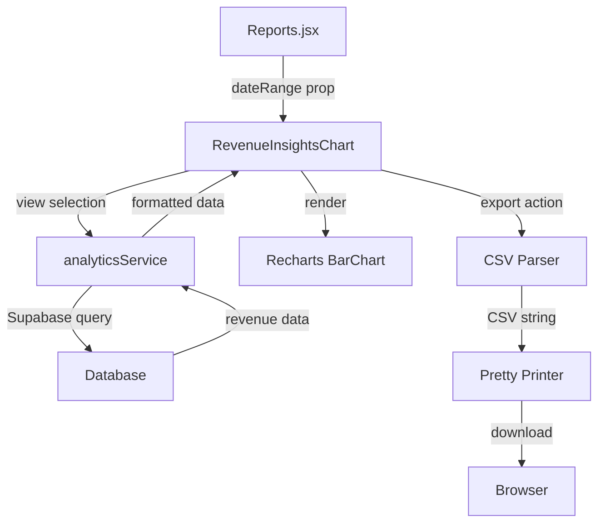

# Design Document: Revenue Insights Dashboard Component

## Overview

The Revenue Insights Dashboard is a comprehensive analytics component that provides multi-dimensional revenue analysis through six distinct views. It integrates into the existing Reports page Analytics tab and displays revenue data using interactive horizontal bar charts with Recharts library. The component fetches all data from Supabase, supports CSV export with proper parsing and formatting, and includes period-over-period comparison functionality.

### Key Features

- Six tabbed views for different revenue perspectives (Department, Service Type, Payment Method, Doctor Performance, Inventory Costs, Patient Types)
- Horizontal bar chart visualization with Recharts
- Total revenue display with period-over-period comparison
- CSV export functionality with parser and pretty printer
- Date range filtering integration
- Responsive design for all devices
- Performance optimization with caching
- Accessibility compliance with ARIA attributes

### Integration Points

- Integrates into `Reports.jsx` within the `AnalyticsDashboard` component
- Uses existing `useAnalytics` hook for data fetching patterns
- Leverages `analyticsService.js` for database queries
- Utilizes `exportService.js` for CSV generation
- Applies Tailwind CSS for consistent styling with dashboard

## Architecture

### Component Hierarchy

```
RevenueInsightsChart (Main Component)
├── Header Section
│   ├── Title with Icon
│   ├── Three-Dot Menu Button
│   └── Export Menu Dropdown
├── View Selector (Tab Navigation)
│   └── Six View Tab Buttons
├── Metrics Display
│   ├── Total Revenue Display
│   └── Period Comparison Indicator
├── Chart Section
│   ├── Horizontal Bar Chart (Recharts)
│   │   ├── XAxis (Revenue amounts)
│   │   ├── YAxis (Category names)
│   │   ├── CartesianGrid
│   │   ├── Bar with Custom Labels
│   │   └── Custom Tooltip
│   └── No Data State (Conditional)
└── Legend Section
    └── Category Grid (up to 6 items)
```

### Data Flow




### State Management

The component manages the following state:

- `activeView`: Current selected view (department, service, payment, doctor, inventory, patient)
- `isMenuOpen`: Export menu visibility state
- `viewData`: Cached data for each view to avoid redundant queries
- `loading`: Loading state for data fetching
- `error`: Error state for failed queries

### Performance Considerations

- **Caching Strategy**: Cache data for each view during the current session to avoid redundant database queries
- **Query Optimization**: Use indexed columns, aggregate functions in database, and LIMIT clauses
- **Lazy Loading**: Fetch data only when a view is selected for the first time
- **Debouncing**: Debounce date range changes to avoid excessive queries
- **Memoization**: Use React.memo and useMemo for expensive computations

## Components and Interfaces

### RevenueInsightsChart Component

**File**: `src/components/analytics/RevenueInsightsChart.jsx`

**Props Interface**:
```javascript
{
  dateRange: {
    startDate: Date,    // Start of date range filter
    endDate: Date       // End of date range filter
  },
  className?: string    // Optional additional CSS classes
}
```

**Internal State**:
```javascript
{
  activeView: 'department' | 'service' | 'payment' | 'doctor' | 'inventory' | 'patient',
  isMenuOpen: boolean,
  viewDataCache: {
    department: Array<RevenueDataPoint>,
    service: Array<RevenueDataPoint>,
    payment: Array<RevenueDataPoint>,
    doctor: Array<RevenueDataPoint>,
    inventory: Array<RevenueDataPoint>,
    patient: Array<RevenueDataPoint>
  },
  loading: boolean,
  error: Error | null
}
```

### View Configuration

**File**: `src/config/revenueViewConfig.js`

```javascript
export const REVENUE_VIEWS = [
  {
    id: 'department',
    label: 'Department Revenue',
    icon: Building2,
    dataKey: 'departmentRevenue',
    queryFunction: 'getDepartmentRevenue',
    tooltip: 'Revenue breakdown by hospital departments'
  },
  {
    id: 'service',
    label: 'Service Types',
    icon: Stethoscope,
    dataKey: 'serviceTypeRevenue',
    queryFunction: 'getServiceTypeRevenue',
    tooltip: 'Revenue breakdown by service categories'
  },
  {
    id: 'payment',
    label: 'Payment Methods',
    icon: CreditCard,
    dataKey: 'paymentMethodDistribution',
    queryFunction: 'getPaymentMethodDistribution',
    tooltip: 'Revenue distribution by payment methods'
  },
  {
    id: 'doctor',
    label: 'Doctor Performance',
    icon: UserCheck,
    dataKey: 'doctorPerformance',
    queryFunction: 'getDoctorPerformance',
    tooltip: 'Revenue generated by each doctor'
  },
  {
    id: 'inventory',
    label: 'Inventory Costs',
    icon: Package,
    dataKey: 'inventoryCosts',
    queryFunction: 'getInventoryCosts',
    tooltip: 'Cost analysis of inventory items'
  },
  {
    id: 'patient',
    label: 'Patient Types',
    icon: Users,
    dataKey: 'patientTypeRevenue',
    queryFunction: 'getPatientTypeRevenue',
    tooltip: 'Revenue breakdown by patient categories'
  }
]
```

### Custom Chart Components

**CustomLabel Component**:
```javascript
/**
 * Renders currency-formatted labels at the end of each bar
 * @param {Object} props - Recharts label props
 * @returns {JSX.Element} Text element with formatted currency
 */
const CustomLabel = ({ x, y, width, value }) => (
  <text
    x={x + width + 10}
    y={y + 12}
    fill="#475569"
    fontSize={13}
    fontWeight={600}
  >
    {formatCurrency(value)}
  </text>
)
```

**CustomTooltip Component**:
```javascript
/**
 * Renders custom tooltip with category details
 * @param {Object} props - Recharts tooltip props
 * @returns {JSX.Element} Tooltip with name, amount, percentage, and optional metrics
 */
const CustomTooltip = ({ active, payload }) => {
  if (!active || !payload?.length) return null
  
  const data = payload[0].payload
  
  return (
    <div className="bg-white border border-slate-200 rounded-lg shadow-lg p-3">
      <p className="text-sm font-semibold text-slate-900 mb-1">
        {data.name || data.category}
      </p>
      <p className="text-sm text-slate-600">
        Amount: {formatCurrency(data.value || data.amount)}
      </p>
      {data.percentage !== undefined && (
        <p className="text-sm text-slate-600">
          Percentage: {data.percentage.toFixed(1)}%
        </p>
      )}
      {data.count !== undefined && (
        <p className="text-sm text-slate-600">
          Count: {data.count}
        </p>
      )}
    </div>
  )
}
```


## Data Models

### RevenueDataPoint

```typescript
interface RevenueDataPoint {
  name: string;           // Category name (department, service type, etc.)
  value: number;          // Revenue amount in PHP
  percentage: number;     // Percentage of total revenue
  count?: number;         // Optional: Number of transactions/patients
  color?: string;         // Optional: Custom bar color
  category?: string;      // Alternative to name for some views
  amount?: number;        // Alternative to value for some views
}
```

### ViewData

```typescript
interface ViewData {
  data: RevenueDataPoint[];
  totalRevenue: number;
  previousPeriodTotal: number;
  lastFetched: Date;
}
```

### DateRange

```typescript
interface DateRange {
  startDate: Date;
  endDate: Date;
}
```

### ExportData

```typescript
interface ExportData {
  headers: string[];      // ['Name', 'Amount', 'Percentage']
  rows: string[][];       // Data rows
  totalRow: string[];     // Total summary row
  filename: string;       // Generated filename with date
}
```

## Database Queries

### Department Revenue Query

**Function**: `analyticsService.getDepartmentRevenue(startDate, endDate)`

**SQL Logic**:
```sql
SELECT 
  c.department,
  COUNT(DISTINCT c.id) as consultation_count,
  COALESCE(SUM(p.total_amount), 0) as total_revenue
FROM emr.consultations c
LEFT JOIN emr.billing p ON c.id = p.consultation_id
WHERE c.consultation_date >= $1 
  AND c.consultation_date <= $2
  AND p.payment_status IN ('Paid', 'Partial')
GROUP BY c.department
ORDER BY total_revenue DESC
LIMIT 10
```

**Returns**:
```javascript
[
  {
    name: 'Emergency',
    value: 125000.00,
    percentage: 35.5,
    count: 45
  },
  // ... more departments
]
```

### Service Type Revenue Query

**Function**: `analyticsService.getServiceTypeRevenue(startDate, endDate)`

**SQL Logic**:
```sql
SELECT 
  CASE 
    WHEN bi.item_name LIKE '%Consultation%' THEN 'Consultations'
    WHEN bi.item_name LIKE '%Lab%' OR bi.item_name LIKE '%Test%' THEN 'Laboratory Tests'
    WHEN bi.item_name LIKE '%X-Ray%' OR bi.item_name LIKE '%Imaging%' THEN 'Imaging'
    WHEN bi.item_name LIKE '%Procedure%' THEN 'Procedures'
    WHEN bi.item_name LIKE '%Medicine%' OR bi.item_name LIKE '%Drug%' THEN 'Medications'
    WHEN bi.item_name LIKE '%Room%' OR bi.item_name LIKE '%Bed%' THEN 'Room Charges'
    ELSE 'Other Services'
  END as service_type,
  COUNT(*) as service_count,
  SUM(bi.amount) as total_revenue
FROM emr.billing b
CROSS JOIN LATERAL jsonb_array_elements(b.items) as bi(item)
WHERE b.bill_date >= $1 
  AND b.bill_date <= $2
  AND b.payment_status IN ('Paid', 'Partial')
GROUP BY service_type
ORDER BY total_revenue DESC
```

**Returns**:
```javascript
[
  {
    name: 'Consultations',
    value: 85000.00,
    percentage: 42.5,
    count: 120,
    color: '#14b8a6'
  },
  // ... more service types
]
```

### Payment Method Distribution Query

**Function**: `analyticsService.getPaymentMethodDistribution(startDate, endDate)`

**SQL Logic**:
```sql
SELECT 
  payment_method,
  COUNT(*) as transaction_count,
  SUM(amount_paid) as total_revenue
FROM emr.billing
WHERE bill_date >= $1 
  AND bill_date <= $2
  AND payment_status IN ('Paid', 'Partial')
  AND payment_method IS NOT NULL
GROUP BY payment_method
ORDER BY total_revenue DESC
```

**Returns**:
```javascript
[
  {
    name: 'Cash',
    value: 95000.00,
    percentage: 55.2,
    count: 85
  },
  // ... more payment methods
]
```

### Doctor Performance Query

**Function**: `analyticsService.getDoctorPerformance(startDate, endDate)`

**SQL Logic**:
```sql
SELECT 
  d.id,
  d.first_name || ' ' || d.last_name as doctor_name,
  COUNT(DISTINCT c.id) as patient_count,
  COALESCE(SUM(b.total_amount), 0) as total_revenue
FROM emr.doctors d
INNER JOIN emr.consultations c ON d.id = c.doctor_id
LEFT JOIN emr.billing b ON c.id = b.consultation_id
WHERE c.consultation_date >= $1 
  AND c.consultation_date <= $2
  AND b.payment_status IN ('Paid', 'Partial')
  AND d.status = 'Active'
GROUP BY d.id, doctor_name
ORDER BY total_revenue DESC
LIMIT 10
```

**Returns**:
```javascript
[
  {
    name: 'Dr. Juan Dela Cruz',
    value: 45000.00,
    percentage: 28.5,
    count: 32
  },
  // ... more doctors
]
```

### Inventory Costs Query

**Function**: `analyticsService.getInventoryCosts(startDate, endDate)`

**SQL Logic**:
```sql
SELECT 
  i.item_name,
  i.category,
  COUNT(*) as usage_count,
  SUM(bi.quantity * i.unit_price) as total_cost
FROM emr.inventory i
INNER JOIN emr.billing b ON TRUE
CROSS JOIN LATERAL jsonb_array_elements(b.items) as bi(item)
WHERE b.bill_date >= $1 
  AND b.bill_date <= $2
  AND bi.item_name = i.item_name
GROUP BY i.id, i.item_name, i.category
ORDER BY total_cost DESC
LIMIT 10
```

**Returns**:
```javascript
[
  {
    name: 'Paracetamol 500mg',
    value: 12500.00,
    percentage: 18.5,
    count: 250
  },
  // ... more inventory items
]
```

### Patient Type Revenue Query

**Function**: `analyticsService.getPatientTypeRevenue(startDate, endDate)`

**SQL Logic**:
```sql
WITH patient_categories AS (
  SELECT 
    p.id,
    b.id as billing_id,
    b.total_amount,
    CASE 
      WHEN COUNT(c.id) OVER (PARTITION BY p.id) = 1 THEN 'New Patients'
      ELSE 'Returning Patients'
    END as patient_type,
    CASE 
      WHEN EXISTS (
        SELECT 1 FROM emr.inpatients ip 
        WHERE ip.patient_id = p.id 
        AND ip.admission_date <= b.bill_date
        AND (ip.discharge_date IS NULL OR ip.discharge_date >= b.bill_date)
      ) THEN 'Inpatients'
      ELSE 'Outpatients'
    END as care_type,
    CASE 
      WHEN a.appointment_type = 'Emergency' THEN 'Emergency Patients'
      ELSE NULL
    END as emergency_type
  FROM emr.patients p
  INNER JOIN emr.consultations c ON p.id = c.patient_id
  LEFT JOIN emr.appointments a ON c.appointment_id = a.id
  INNER JOIN emr.billing b ON c.id = b.consultation_id
  WHERE b.bill_date >= $1 
    AND b.bill_date <= $2
    AND b.payment_status IN ('Paid', 'Partial')
)
SELECT 
  COALESCE(emergency_type, care_type, patient_type) as category,
  COUNT(DISTINCT billing_id) as patient_count,
  SUM(total_amount) as total_revenue
FROM patient_categories
GROUP BY category
ORDER BY total_revenue DESC
```

**Returns**:
```javascript
[
  {
    name: 'Returning Patients',
    value: 78000.00,
    percentage: 52.3,
    count: 65
  },
  // ... more patient types
]
```


## Correctness Properties

*A property is a characteristic or behavior that should hold true across all valid executions of a system—essentially, a formal statement about what the system should do. Properties serve as the bridge between human-readable specifications and machine-verifiable correctness guarantees.*

### Property Reflection

After analyzing all acceptance criteria, I identified the following redundancies and consolidations:

**Redundancy Analysis**:
1. Properties 3.4, 4.4, 5.4, 6.5, 7.4, 8.4 all test "data sorted by revenue descending" - these can be combined into one universal property
2. Properties 3.8, 4.6, 5.6, 6.7, 7.6, 8.5 all test "total equals sum of items" - these can be combined into one calculation property
3. Properties 9.2, 9.3, 9.4 all test currency formatting - these can be combined into one formatting property
4. Properties 11.3, 11.4, 11.7 all test chart label formatting - these can be combined into one property
5. Properties 15.3, 15.4, 15.5 all test date filtering - these can be combined into one property
6. Properties 21.4, 21.5 test CSV number formatting - these can be combined into one property
7. Properties 22.2, 22.3, 22.4 test CSV structure - these can be combined into one property

**Consolidated Properties**: After removing redundancies, we have 18 unique testable properties instead of 40+ individual criteria.

### Property 1: View Tab State Management

*For any* view tab click, the active view state should update to match the clicked tab, and exactly one tab should be marked as active.

**Validates: Requirements 2.3**

**Test Strategy**: Generate random tab selections and verify state updates correctly with only one active tab.

### Property 2: Data Sorting Invariant

*For any* revenue view data (department, service, payment, doctor, inventory, patient), the displayed items should always be sorted by revenue value in descending order.

**Validates: Requirements 3.4, 4.4, 5.4, 6.5, 7.4, 8.4**

**Test Strategy**: Generate random revenue datasets and verify output is always sorted descending by value.

### Property 3: Total Revenue Calculation

*For any* set of revenue data points in a view, the total revenue display should equal the sum of all individual item values.

**Validates: Requirements 3.8, 4.6, 5.6, 6.7, 7.6, 8.5**

**Test Strategy**: Generate random revenue datasets and verify total equals sum of all values.

### Property 4: Currency Formatting Consistency

*For any* revenue amount, the display should format it as Philippine Peso (₱) with thousands separators and exactly 2 decimal places.

**Validates: Requirements 9.2, 9.3, 9.4**

**Test Strategy**: Generate random revenue amounts (including edge cases like 0, 0.01, 999.99, 1000, 1000000) and verify formatting.

### Property 5: Period Comparison Calculation

*For any* current period revenue and previous period revenue, the percentage change should be calculated as ((current - previous) / previous) × 100, with special handling when previous is zero.

**Validates: Requirements 10.1, 10.2**

**Test Strategy**: Generate random current and previous values and verify percentage calculation, including edge case where previous = 0.

### Property 6: Period Comparison Visual Indicator

*For any* percentage change value, if positive show green upward arrow, if negative show red downward arrow, if previous period is zero show amber "Significant Change".

**Validates: Requirements 10.3, 10.4, 10.5**

**Test Strategy**: Generate random percentage changes (positive, negative, zero, and division by zero case) and verify correct indicator.

### Property 7: Chart Label Formatting

*For any* revenue value displayed on the chart (axis labels or bar labels), amounts >= 1,000,000 should show as "₱XM", amounts >= 1,000 should show as "₱XK", and smaller amounts should show full value with ₱ symbol.

**Validates: Requirements 11.3, 11.4, 11.7**

**Test Strategy**: Generate random revenue values across different magnitudes and verify abbreviation logic.

### Property 8: Top 10 Limiting

*For any* revenue dataset with more than 10 items, only the top 10 items by revenue value should be displayed in the chart.

**Validates: Requirements 11.8**

**Test Strategy**: Generate datasets with varying sizes (0, 5, 10, 15, 100 items) and verify only top 10 are displayed.

### Property 9: Tooltip Content Completeness

*For any* data point in the chart, the tooltip should display the category name, revenue amount, percentage of total, and any additional metrics (count) if available.

**Validates: Requirements 12.1, 12.2, 12.3**

**Test Strategy**: Generate random data points with and without optional fields and verify tooltip contains all available information.

### Property 10: Date Range Filtering

*For any* valid date range (startDate, endDate), all database queries should include WHERE clauses that filter records where the date column is >= startDate AND <= endDate (inclusive on both ends).

**Validates: Requirements 15.3, 15.4, 15.5**

**Test Strategy**: Generate random date ranges and verify query includes correct date filters with inclusive bounds.

### Property 11: View Data Reactivity

*For any* change to the active view or date range, the component should re-fetch data and update the display within 500ms.

**Validates: Requirements 9.5, 9.6, 15.2, 17.1**

**Test Strategy**: Measure time from state change to data update completion for various view and date range changes.

### Property 12: Cache Hit Behavior

*For any* previously viewed tab, when switching back to it with the same date range, the component should use cached data instead of re-fetching from the database.

**Validates: Requirements 17.3, 17.4**

**Test Strategy**: Track database query calls and verify no query occurs when returning to a cached view.

### Property 13: Error Isolation

*For any* single view that fails to load, the other views should continue to function normally and display their data.

**Validates: Requirements 18.5**

**Test Strategy**: Simulate query failure for one view and verify other views still work.

### Property 14: CSV Export Completeness

*For any* revenue view data, the exported CSV should include all data points (not just the top 10 displayed), with columns for Name, Amount, and Percentage, plus a total row at the bottom.

**Validates: Requirements 14.4, 14.5, 14.6**

**Test Strategy**: Generate datasets of various sizes and verify CSV contains all items plus total row.

### Property 15: CSV Filename Generation

*For any* view and export date, the CSV filename should follow the pattern "{ViewLabel}_{YYYY-MM-DD}.csv" where ViewLabel has spaces replaced with underscores.

**Validates: Requirements 14.7**

**Test Strategy**: Export from different views on different dates and verify filename format.

### Property 16: CSV Number Formatting

*For any* numeric value in the CSV export, currency amounts should have exactly 2 decimal places, and percentages should have exactly 2 decimal places with a "%" suffix.

**Validates: Requirements 21.4, 21.5**

**Test Strategy**: Generate random numeric values and verify CSV formatting.

### Property 17: CSV Special Character Escaping

*For any* category name containing special characters (commas, quotes, newlines), the CSV parser should properly escape or quote the field to maintain CSV validity.

**Validates: Requirements 21.2, 22.4**

**Test Strategy**: Generate category names with special characters and verify CSV output is valid.

### Property 18: CSV Round-Trip Property

*For any* valid revenue data object, exporting to CSV then parsing the CSV should produce an equivalent data structure (name, amount, percentage values match).

**Validates: Requirements 23.2**

**Test Strategy**: Generate random revenue datasets, export to CSV, parse CSV, and verify data equivalence.


## Error Handling

### Query Errors

**Strategy**: Graceful degradation with user feedback

```javascript
try {
  const data = await analyticsService.getDepartmentRevenue(startDate, endDate)
  setViewData(prev => ({ ...prev, department: data }))
  setError(null)
} catch (err) {
  console.error('Failed to fetch department revenue:', err)
  setError({
    view: 'department',
    message: 'Unable to load department revenue data',
    type: 'query_error'
  })
  // Display No Data State instead of crashing
  setViewData(prev => ({ ...prev, department: [] }))
}
```

**Error Types**:
- `query_error`: Database query failed
- `timeout_error`: Query exceeded timeout threshold
- `network_error`: Network connection issue
- `validation_error`: Invalid data received from database

### Timeout Handling

**Strategy**: Automatic retry with exponential backoff

```javascript
async function fetchWithRetry(queryFn, maxRetries = 1) {
  let lastError
  
  for (let attempt = 0; attempt <= maxRetries; attempt++) {
    try {
      const result = await Promise.race([
        queryFn(),
        new Promise((_, reject) => 
          setTimeout(() => reject(new Error('Query timeout')), 5000)
        )
      ])
      return result
    } catch (err) {
      lastError = err
      if (attempt < maxRetries) {
        await new Promise(resolve => setTimeout(resolve, 1000 * (attempt + 1)))
      }
    }
  }
  
  throw lastError
}
```

### Export Errors

**Strategy**: User notification with error details

```javascript
const handleExport = async () => {
  try {
    const csvData = generateCSV(viewData)
    validateCSV(csvData)
    downloadCSV(csvData, filename)
  } catch (err) {
    console.error('Export failed:', err)
    setExportError('Failed to export data. Please try again.')
    setTimeout(() => setExportError(null), 5000)
  }
}
```

### Data Validation

**Strategy**: Validate data structure before rendering

```javascript
function validateRevenueData(data) {
  if (!Array.isArray(data)) {
    throw new Error('Revenue data must be an array')
  }
  
  for (const item of data) {
    if (!item.name && !item.category) {
      throw new Error('Each item must have a name or category')
    }
    if (typeof item.value !== 'number' && typeof item.amount !== 'number') {
      throw new Error('Each item must have a numeric value or amount')
    }
  }
  
  return true
}
```

### Error Boundaries

**Strategy**: Prevent component crashes from affecting parent

```javascript
// Wrap component in ErrorBoundary
<ErrorBoundary fallback={<RevenueInsightsErrorFallback />}>
  <RevenueInsightsChart dateRange={dateRange} />
</ErrorBoundary>
```

## Testing Strategy

### Dual Testing Approach

This feature requires both unit tests and property-based tests for comprehensive coverage:

**Unit Tests**: Focus on specific examples, edge cases, and integration points
- Component rendering with different props
- User interactions (tab clicks, menu actions)
- Error states and loading states
- Accessibility attributes
- Responsive behavior at specific breakpoints

**Property Tests**: Focus on universal properties across all inputs
- Data sorting invariants
- Calculation correctness (totals, percentages)
- Formatting consistency (currency, numbers)
- CSV round-trip integrity
- Date filtering logic

### Property-Based Testing Configuration

**Library**: Use `fast-check` for JavaScript property-based testing

**Configuration**:
```javascript
import fc from 'fast-check'

// Minimum 100 iterations per property test
const testConfig = {
  numRuns: 100,
  verbose: true
}
```

**Example Property Test**:
```javascript
describe('Revenue Insights Properties', () => {
  test('Property 2: Data Sorting Invariant', () => {
    fc.assert(
      fc.property(
        fc.array(fc.record({
          name: fc.string(),
          value: fc.float({ min: 0, max: 1000000 })
        })),
        (revenueData) => {
          const sorted = sortRevenueData(revenueData)
          
          // Verify sorted in descending order
          for (let i = 0; i < sorted.length - 1; i++) {
            expect(sorted[i].value).toBeGreaterThanOrEqual(sorted[i + 1].value)
          }
        }
      ),
      testConfig
    )
  })
  
  // Tag: Feature: revenue-insights-dashboard, Property 2: Data Sorting Invariant
})
```

### Unit Test Examples

**Component Rendering**:
```javascript
describe('RevenueInsightsChart Component', () => {
  test('renders with default department view', () => {
    const { getByText } = render(
      <RevenueInsightsChart dateRange={mockDateRange} />
    )
    
    expect(getByText('Revenue Insights')).toBeInTheDocument()
    expect(getByText('Department Revenue')).toHaveClass('bg-teal-500')
  })
  
  test('displays no data state when data is empty', () => {
    const { getByText } = render(
      <RevenueInsightsChart dateRange={mockDateRange} />
    )
    
    expect(getByText('No data available')).toBeInTheDocument()
    expect(getByText('Data will appear here once available')).toBeInTheDocument()
  })
})
```

**User Interactions**:
```javascript
describe('View Tab Navigation', () => {
  test('switches view when tab is clicked', async () => {
    const { getByText } = render(
      <RevenueInsightsChart dateRange={mockDateRange} />
    )
    
    const serviceTab = getByText('Service Types')
    fireEvent.click(serviceTab)
    
    await waitFor(() => {
      expect(serviceTab).toHaveClass('bg-teal-500')
    })
  })
})
```

**CSV Export**:
```javascript
describe('CSV Export', () => {
  test('generates CSV with correct structure', () => {
    const data = [
      { name: 'Emergency', value: 125000, percentage: 35.5 },
      { name: 'Cardiology', value: 85000, percentage: 24.1 }
    ]
    
    const csv = generateCSV(data, 'Department Revenue')
    const lines = csv.split('\n')
    
    expect(lines[0]).toBe('Name,Amount,Percentage')
    expect(lines[1]).toContain('Emergency,125000.00,35.50%')
    expect(lines[lines.length - 1]).toContain('Total')
  })
})
```

### Test Coverage Goals

- **Unit Test Coverage**: Minimum 80% code coverage
- **Property Test Coverage**: All 18 correctness properties must have corresponding property tests
- **Integration Test Coverage**: All 6 views must have end-to-end tests
- **Accessibility Test Coverage**: All ARIA attributes and keyboard navigation must be tested

### Testing Tools

- **Unit Testing**: Jest + React Testing Library
- **Property Testing**: fast-check
- **Accessibility Testing**: jest-axe
- **Visual Regression**: Chromatic (optional)
- **Performance Testing**: React DevTools Profiler


## Implementation Details

### File Structure

```
src/
├── components/
│   └── analytics/
│       ├── RevenueInsightsChart.jsx          (Main component)
│       ├── CustomLabel.jsx                    (Bar label component)
│       └── CustomTooltip.jsx                  (Tooltip component)
├── services/
│   └── analyticsService.js                    (Add new query functions)
├── utils/
│   ├── csvParser.js                           (CSV parsing logic)
│   ├── csvPrettyPrinter.js                    (CSV formatting)
│   └── metricCalculations.js                  (Existing - use for formatting)
├── config/
│   └── revenueViewConfig.js                   (View configurations)
└── tests/
    ├── components/
    │   └── RevenueInsightsChart.test.jsx      (Unit tests)
    └── properties/
        └── revenueInsights.property.test.js   (Property-based tests)
```

### Key Implementation Steps

1. **Create View Configuration** (`src/config/revenueViewConfig.js`)
   - Define all 6 views with icons, labels, and query functions
   - Export as constant for use in component

2. **Extend Analytics Service** (`src/services/analyticsService.js`)
   - Add 6 new query functions (one per view)
   - Implement caching logic for performance
   - Add timeout and retry logic

3. **Create CSV Utilities** (`src/utils/csvParser.js`, `src/utils/csvPrettyPrinter.js`)
   - Implement CSV generation with proper escaping
   - Add validation for CSV structure
   - Implement round-trip parsing for testing

4. **Build Main Component** (`src/components/analytics/RevenueInsightsChart.jsx`)
   - Implement state management for active view and menu
   - Add data fetching with caching
   - Implement tab navigation
   - Add export functionality

5. **Create Chart Subcomponents** (`CustomLabel.jsx`, `CustomTooltip.jsx`)
   - Implement custom label rendering
   - Implement custom tooltip with conditional fields

6. **Integrate into Reports Page** (`src/pages/Reports.jsx`)
   - Replace ExpenseBreakdownChart with RevenueInsightsChart
   - Pass dateRange prop from parent
   - Ensure proper layout and spacing

7. **Write Tests**
   - Unit tests for component rendering and interactions
   - Property tests for all 18 correctness properties
   - Integration tests for data flow

### CSV Parser Implementation

**File**: `src/utils/csvParser.js`

```javascript
/**
 * Parse revenue data into CSV format
 * @param {Array<RevenueDataPoint>} data - Revenue data points
 * @param {number} totalRevenue - Total revenue amount
 * @returns {string} CSV formatted string
 */
export function parseToCSV(data, totalRevenue) {
  const headers = ['Name', 'Amount', 'Percentage']
  
  const rows = data.map(item => [
    escapeCSVField(item.name || item.category),
    (item.value || item.amount).toFixed(2),
    item.percentage ? `${item.percentage.toFixed(2)}%` : 'N/A'
  ])
  
  // Add total row
  rows.push(['Total', totalRevenue.toFixed(2), '100.00%'])
  
  return [headers, ...rows]
    .map(row => row.join(','))
    .join('\n')
}

/**
 * Escape special characters in CSV fields
 * @param {string} field - Field value
 * @returns {string} Escaped field
 */
function escapeCSVField(field) {
  if (typeof field !== 'string') {
    return field
  }
  
  // If field contains comma, quote, or newline, wrap in quotes and escape quotes
  if (field.includes(',') || field.includes('"') || field.includes('\n')) {
    return `"${field.replace(/"/g, '""')}"`
  }
  
  return field
}

/**
 * Parse CSV string back to data structure (for round-trip testing)
 * @param {string} csv - CSV string
 * @returns {Array<Object>} Parsed data
 */
export function parseFromCSV(csv) {
  const lines = csv.split('\n')
  const headers = lines[0].split(',')
  
  return lines.slice(1, -1).map(line => {
    const values = parseCSVLine(line)
    return {
      name: values[0],
      amount: parseFloat(values[1]),
      percentage: parseFloat(values[2].replace('%', ''))
    }
  })
}

/**
 * Parse a single CSV line handling quoted fields
 * @param {string} line - CSV line
 * @returns {Array<string>} Parsed values
 */
function parseCSVLine(line) {
  const values = []
  let current = ''
  let inQuotes = false
  
  for (let i = 0; i < line.length; i++) {
    const char = line[i]
    
    if (char === '"') {
      if (inQuotes && line[i + 1] === '"') {
        current += '"'
        i++
      } else {
        inQuotes = !inQuotes
      }
    } else if (char === ',' && !inQuotes) {
      values.push(current)
      current = ''
    } else {
      current += char
    }
  }
  
  values.push(current)
  return values
}
```

### CSV Pretty Printer Implementation

**File**: `src/utils/csvPrettyPrinter.js`

```javascript
/**
 * Format CSV with consistent structure and UTF-8 encoding
 * @param {string} csv - Raw CSV string
 * @returns {Blob} CSV blob ready for download
 */
export function prettyPrintCSV(csv) {
  // Ensure UTF-8 encoding with BOM for Excel compatibility
  const BOM = '\uFEFF'
  const csvWithBOM = BOM + csv
  
  return new Blob([csvWithBOM], { 
    type: 'text/csv;charset=utf-8;' 
  })
}

/**
 * Trigger browser download of CSV file
 * @param {Blob} blob - CSV blob
 * @param {string} filename - Desired filename
 */
export function downloadCSV(blob, filename) {
  const link = document.createElement('a')
  const url = URL.createObjectURL(blob)
  
  link.setAttribute('href', url)
  link.setAttribute('download', filename)
  link.style.visibility = 'hidden'
  
  document.body.appendChild(link)
  link.click()
  document.body.removeChild(link)
  
  // Clean up object URL
  URL.revokeObjectURL(url)
}
```

### Analytics Service Extensions

**File**: `src/services/analyticsService.js` (additions)

```javascript
/**
 * Get revenue insights for all views
 * @param {DateRange} dateRange - Date range filter
 * @returns {Promise<Object>} Revenue insights data for all views
 */
export async function getRevenueInsights(dateRange) {
  const { startDate, endDate } = dateRange
  
  // Check cache first
  const cacheKey = `revenue_insights_${startDate}_${endDate}`
  const cached = getCachedData(cacheKey)
  if (cached) return cached
  
  try {
    const [
      departmentRevenue,
      serviceTypeRevenue,
      paymentMethodDistribution,
      doctorPerformance,
      inventoryCosts,
      patientTypeRevenue
    ] = await Promise.all([
      getDepartmentRevenue(startDate, endDate),
      getServiceTypeRevenue(startDate, endDate),
      getPaymentMethodDistribution(startDate, endDate),
      getDoctorPerformance(startDate, endDate),
      getInventoryCosts(startDate, endDate),
      getPatientTypeRevenue(startDate, endDate)
    ])
    
    const result = {
      departmentRevenue,
      serviceTypeRevenue,
      paymentMethodDistribution,
      doctorPerformance,
      inventoryCosts,
      patientTypeRevenue
    }
    
    // Cache for 5 minutes
    setCachedData(cacheKey, result, 5 * 60 * 1000)
    
    return result
  } catch (error) {
    console.error('Error fetching revenue insights:', error)
    throw error
  }
}

// Individual query functions follow the same pattern as shown in Data Models section
```

### Responsive Design Breakpoints

```javascript
// Tailwind CSS breakpoints used in component
const breakpoints = {
  sm: '640px',   // Show tab labels
  md: '768px',   // 3-column legend grid
  lg: '1024px',  // Optimal chart width
  xl: '1280px'   // Maximum chart width
}
```

**Responsive Classes**:
- Tab labels: `hidden sm:inline` (hide on mobile, show on sm+)
- Legend grid: `grid-cols-2 md:grid-cols-3` (2 columns mobile, 3 on md+)
- Chart container: `w-full` (always full width of container)

### Performance Optimizations

1. **Memoization**:
```javascript
const sortedData = useMemo(() => {
  return [...viewData].sort((a, b) => (b.value || b.amount) - (a.value || a.amount))
}, [viewData])
```

2. **Debounced Date Range**:
```javascript
const debouncedDateRange = useDebounce(dateRange, 500)

useEffect(() => {
  fetchData(debouncedDateRange)
}, [debouncedDateRange])
```

3. **Lazy View Loading**:
```javascript
const [loadedViews, setLoadedViews] = useState(new Set(['department']))

const handleViewChange = async (viewId) => {
  setActiveView(viewId)
  
  if (!loadedViews.has(viewId)) {
    await fetchViewData(viewId)
    setLoadedViews(prev => new Set([...prev, viewId]))
  }
}
```

4. **Chart Rendering Optimization**:
```javascript
// Use ResponsiveContainer with debounced resize
<ResponsiveContainer width="100%" height={350} debounce={200}>
  <BarChart data={sortedData}>
    {/* Chart configuration */}
  </BarChart>
</ResponsiveContainer>
```


## Accessibility Implementation

### ARIA Attributes

**View Tabs**:
```jsx
<button
  onClick={() => setActiveView(view.id)}
  className={/* ... */}
  aria-label={`${view.label} view`}
  aria-pressed={activeView === view.id}
  role="tab"
  aria-selected={activeView === view.id}
>
  <Icon className="w-4 h-4" aria-hidden="true" />
  <span className="hidden sm:inline">{view.label}</span>
</button>
```

**Export Menu**:
```jsx
<button
  ref={buttonRef}
  onClick={() => setIsMenuOpen(!isMenuOpen)}
  aria-label="Revenue insights chart options"
  aria-expanded={isMenuOpen}
  aria-haspopup="true"
  aria-controls="export-menu"
>
  <MoreVertical className="w-5 h-5" aria-hidden="true" />
</button>

{isMenuOpen && (
  <div
    id="export-menu"
    role="menu"
    aria-labelledby="menu-button"
  >
    <button
      onClick={handleExport}
      role="menuitem"
      tabIndex={0}
    >
      <Download className="w-4 h-4" aria-hidden="true" />
      Export Data
    </button>
  </div>
)}
```

**Chart**:
```jsx
<ResponsiveContainer 
  width="100%" 
  height={350}
  role="img"
  aria-label={`${activeViewLabel} revenue bar chart showing ${sortedData.length} categories`}
>
  <BarChart data={sortedData}>
    {/* Chart configuration */}
  </BarChart>
</ResponsiveContainer>
```

**No Data State**:
```jsx
<div 
  className="py-12 text-center"
  role="status"
  aria-live="polite"
>
  <CurrentViewIcon className="w-12 h-12 mx-auto text-slate-300 mb-3" aria-hidden="true" />
  <p className="text-slate-600 font-medium">No data available</p>
  <p className="text-sm text-slate-500 mt-1">Data will appear here once available</p>
</div>
```

### Keyboard Navigation

**Tab Navigation**:
- Tab key moves focus between view tabs
- Enter or Space activates selected tab
- Arrow keys navigate between tabs (optional enhancement)

**Menu Navigation**:
- Tab key moves focus to menu button
- Enter or Space opens menu
- Arrow keys navigate menu items
- Escape closes menu
- Enter activates menu item

**Implementation**:
```javascript
const handleKeyDown = (e, viewId) => {
  if (e.key === 'Enter' || e.key === ' ') {
    e.preventDefault()
    setActiveView(viewId)
  }
}

const handleMenuKeyDown = (e) => {
  if (e.key === 'Escape') {
    setIsMenuOpen(false)
    buttonRef.current?.focus()
  } else if (e.key === 'Enter' || e.key === ' ') {
    e.preventDefault()
    handleExport()
  }
}
```

### Focus Management

**Focus Trap in Menu**:
```javascript
useEffect(() => {
  if (isMenuOpen && menuRef.current) {
    const focusableElements = menuRef.current.querySelectorAll(
      'button, [href], input, select, textarea, [tabindex]:not([tabindex="-1"])'
    )
    
    if (focusableElements.length > 0) {
      focusableElements[0].focus()
    }
  }
}, [isMenuOpen])
```

**Return Focus on Close**:
```javascript
const closeMenu = () => {
  setIsMenuOpen(false)
  buttonRef.current?.focus()
}
```

### Color Contrast

All text and interactive elements meet WCAG 2.1 Level AA standards (4.5:1 contrast ratio):

- Primary text (slate-900): #0f172a on white (#ffffff) = 18.7:1 ✓
- Secondary text (slate-600): #475569 on white (#ffffff) = 8.6:1 ✓
- Teal active state: #14b8a6 with white text = 4.5:1 ✓
- Green increase indicator: #10b981 on white = 4.5:1 ✓
- Red decrease indicator: #ef4444 on white = 5.9:1 ✓

### Screen Reader Announcements

**Loading State**:
```jsx
{loading && (
  <div role="status" aria-live="polite" className="sr-only">
    Loading revenue data...
  </div>
)}
```

**Error State**:
```jsx
{error && (
  <div role="alert" aria-live="assertive" className="sr-only">
    Error loading data: {error.message}
  </div>
)}
```

**Data Update**:
```jsx
<div role="status" aria-live="polite" aria-atomic="true" className="sr-only">
  {`${activeViewLabel} showing ${sortedData.length} categories with total revenue of ${formatCurrency(totalRevenue)}`}
</div>
```

## Integration Guide

### Step 1: Add to Reports Page

**File**: `src/pages/Reports.jsx`

```jsx
import RevenueInsightsChart from '../components/analytics/RevenueInsightsChart'

// Inside AnalyticsDashboard component, replace ExpenseBreakdownChart:
<div className="grid grid-cols-1 lg:grid-cols-2 gap-6">
  <RevenueTrendChart data={chartData?.revenueTrend || []} />
  <RevenueInsightsChart dateRange={dateRange} />
</div>
```

### Step 2: Update Analytics Service

Add the new query functions to `src/services/analyticsService.js` as shown in the Implementation Details section.

### Step 3: Test Integration

```javascript
// Verify component receives correct props
console.log('Date Range:', dateRange)

// Verify data fetching works
const insights = await analyticsService.getRevenueInsights(dateRange)
console.log('Revenue Insights:', insights)

// Verify export works
// Click export button and check downloaded CSV file
```

### Step 4: Performance Monitoring

```javascript
// Add performance marks
performance.mark('revenue-insights-start')
// ... component renders
performance.mark('revenue-insights-end')
performance.measure('revenue-insights-render', 'revenue-insights-start', 'revenue-insights-end')

const measure = performance.getEntriesByName('revenue-insights-render')[0]
console.log('Render time:', measure.duration, 'ms')
```

## Migration Notes

### Replacing ExpenseBreakdownChart

The Revenue Insights component replaces the ExpenseBreakdownChart with enhanced functionality:

**Before**:
```jsx
<ExpenseBreakdownChart data={chartData?.expenseBreakdown || []} />
```

**After**:
```jsx
<RevenueInsightsChart dateRange={dateRange} />
```

**Key Differences**:
- ExpenseBreakdownChart showed only expense categories
- RevenueInsightsChart shows 6 different revenue perspectives
- New component fetches its own data instead of receiving it as prop
- Export functionality is built-in
- Period comparison is included

### Database Index Requirements

Ensure these indexes exist for optimal query performance:

```sql
-- Consultations table
CREATE INDEX IF NOT EXISTS idx_consultations_date_department 
ON emr.consultations(consultation_date, department);

CREATE INDEX IF NOT EXISTS idx_consultations_doctor_date 
ON emr.consultations(doctor_id, consultation_date);

-- Billing table
CREATE INDEX IF NOT EXISTS idx_billing_date_status 
ON emr.billing(bill_date, payment_status);

CREATE INDEX IF NOT EXISTS idx_billing_payment_method 
ON emr.billing(payment_method, bill_date);

CREATE INDEX IF NOT EXISTS idx_billing_consultation 
ON emr.billing(consultation_id);

-- Inventory table
CREATE INDEX IF NOT EXISTS idx_inventory_name 
ON emr.inventory(item_name);
```

### Environment Variables

No new environment variables required. Uses existing Supabase configuration.

## Security Considerations

### SQL Injection Prevention

All queries use parameterized queries through Supabase client:

```javascript
const { data, error } = await supabase
  .from('consultations')
  .select('*')
  .gte('consultation_date', startDate)  // Parameterized
  .lte('consultation_date', endDate)    // Parameterized
```

### Data Access Control

Respect existing RLS (Row Level Security) policies:

```javascript
// Queries automatically respect user's role and permissions
// No additional security layer needed in component
```

### Export Data Sanitization

Sanitize data before export to prevent CSV injection:

```javascript
function sanitizeForCSV(value) {
  if (typeof value !== 'string') return value
  
  // Remove formula injection characters
  if (value.startsWith('=') || value.startsWith('+') || 
      value.startsWith('-') || value.startsWith('@')) {
    return `'${value}`  // Prefix with single quote
  }
  
  return value
}
```

### Rate Limiting

Implement client-side rate limiting for export:

```javascript
const [lastExport, setLastExport] = useState(null)

const handleExport = () => {
  const now = Date.now()
  if (lastExport && now - lastExport < 5000) {
    alert('Please wait before exporting again')
    return
  }
  
  setLastExport(now)
  // ... proceed with export
}
```

## Future Enhancements

### Phase 2 Features (Not in Current Scope)

1. **Drill-Down Capability**: Click on a bar to see detailed breakdown
2. **Custom Date Ranges**: Allow users to select custom date ranges within the component
3. **Comparison Mode**: Compare two different time periods side-by-side
4. **Export to Excel**: Generate formatted Excel files with charts
5. **Scheduled Reports**: Email reports automatically on a schedule
6. **Forecasting**: Show projected revenue based on trends
7. **Filters**: Filter by specific departments, doctors, or services
8. **Annotations**: Add notes to specific data points
9. **Share Links**: Generate shareable links to specific views
10. **Print Optimization**: Optimize layout for printing

### Technical Debt

- Consider moving to a more robust charting library if Recharts limitations are encountered
- Implement server-side caching for frequently accessed date ranges
- Add WebSocket support for real-time updates
- Optimize database queries with materialized views for large datasets

## Appendix

### Color Palette

```javascript
export const REVENUE_COLORS = {
  primary: '#14b8a6',      // Teal - default bar color
  success: '#10b981',      // Green - positive growth
  danger: '#ef4444',       // Red - negative growth
  warning: '#f59e0b',      // Amber - significant change
  slate: {
    900: '#0f172a',        // Primary text
    700: '#334155',        // Secondary text
    600: '#475569',        // Tertiary text
    500: '#64748b',        // Muted text
    300: '#cbd5e1',        // Disabled/placeholder
    200: '#e2e8f0',        // Borders
    100: '#f1f5f9',        // Backgrounds
  }
}
```

### Chart Configuration Reference

```javascript
export const CHART_CONFIG = {
  height: 350,
  margin: { top: 5, right: 80, left: 20, bottom: 5 },
  barRadius: [0, 8, 8, 0],
  gridStroke: '#e2e8f0',
  gridDasharray: '3 3',
  axisStroke: '#64748b',
  axisFontSize: 12,
  labelFontSize: 13,
  labelFontWeight: 600,
  yAxisWidth: 150,
  topItemsLimit: 10,
  legendMaxItems: 6
}
```

### Utility Functions Reference

```javascript
// From src/utils/metricCalculations.js
export function formatCurrency(amount) {
  return new Intl.NumberFormat('en-PH', {
    style: 'currency',
    currency: 'PHP',
    minimumFractionDigits: 2,
    maximumFractionDigits: 2
  }).format(amount)
}

export function formatPercentage(value) {
  return `${value.toFixed(1)}%`
}

export function calculatePercentageChange(current, previous) {
  if (previous === 0) return "Significant Change"
  return ((current - previous) / previous) * 100
}

export function abbreviateNumber(value) {
  if (value >= 1000000) {
    return `₱${(value / 1000000).toFixed(1)}M`
  } else if (value >= 1000) {
    return `₱${(value / 1000).toFixed(0)}K`
  }
  return `₱${value}`
}
```

---

**Document Version**: 1.0  
**Last Updated**: 2025-01-15  
**Author**: Kiro AI Assistant  
**Status**: Ready for Implementation
